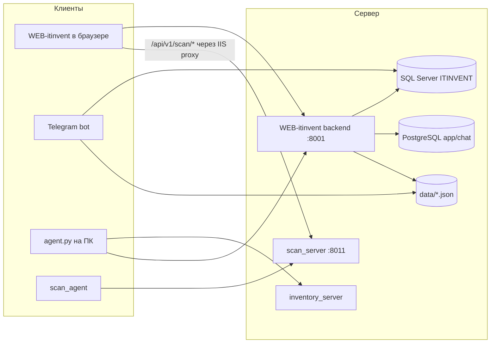

# AGENTS.md — карта репозитория HUB-IT

Этот файл — **единая точка входа** для AI-агентов и разработчиков: что за проект, где что лежит, как запускать и куда смотреть дальше.

> Человекочитаемый обзор для людей: [README.md](./README.md)  
> **Язык домена (термины):** [CONTEXT.md](./CONTEXT.md)  
> **PostgreSQL:** [POSTGRES_APP_SCHEMA.md](./documentation/technical/POSTGRES_APP_SCHEMA.md) · [DDL snapshot](./documentation/technical/POSTGRES_APP_SCHEMA_DDL.md)  
> Детали web-приложения: [WEB-itinvent/CLAUDE.md](./WEB-itinvent/CLAUDE.md)  
> Техдолг и рефакторинг: [TECH_DEBT_AUDIT.md](./TECH_DEBT_AUDIT.md)

---

## О проекте

**HUB-IT** (`Image_scan/`) — монорепозиторий внутренней платформы учёта и обслуживания IT-инфраструктуры.

| Подсистема | Назначение |
|------------|------------|
| **WEB-itinvent** | Web UI + FastAPI: оборудование, сети, hub/tasks, почта, чат, tickets, Scan Center |
| **bot** | Telegram-бот: поиск, акты, OCR, экспорты, регистрация работ |
| **agent** + **agent.py** | Windows inventory-agent (MSI, Scheduled Task) |
| **scan_agent** | Sidecar: поиск чувствительных документов на ПК |
| **scan_server** | Очередь задач, инциденты, OCR/PDF pipeline |
| **inventory_server** | Ingest/очередь inventory на отдельном порту |
| **data/** | Общие JSON-файлы (web + bot) |
| **shared/llm** | Единый OpenRouter LLM gateway (chat, mail, markdown, act parse, bot OCR) |
| **documentation/** | Пользовательские и технические гайды |
| **scripts/** | PM2, миграции, install/uninstall, утилиты |
| **tests/** | Python-тесты backend, bot, scan, inventory |

**Клиенты в репозитории:** браузерный web (адаптивный UI, PWA/web-push где включено), **Expo Android** (`mobile-hub/`), Telegram-бот, Windows-агенты. Удалённый `mobile-android/` / Capacitor не восстанавливать.

**Стек:** Python, FastAPI, React 18 + Vite, MUI, SQL Server (`pyodbc`), PostgreSQL (app/chat runtime), Telegram API, PM2 (Windows-сервер), PowerShell (агенты).

---

## Карта репозитория

```text
Image_scan/
├── shared/
│   └── llm/              # Единый OpenRouter gateway (все LLM-вызовы)
├── WEB-itinvent/
│   ├── backend/          # FastAPI, порт dev ~8001
│   │   ├── main.py       # Точка входа, include_router
│   │   ├── api/v1/       # REST-роутеры
│   │   ├── services/     # Бизнес-логика
│   │   ├── models/       # Pydantic
│   │   └── database/     # SQL Server connection
│   └── frontend/         # React + Vite, порт dev 5173
│       └── src/
│           ├── pages/    # Страницы (Database, ScanCenter, Mail, Chat, …)
│           ├── api/      # HTTP-клиенты (модули по доменам)
│           ├── components/
│           └── contexts/
├── bot/                  # python -m bot.main
│   ├── handlers/         # Telegram-сценарии
│   └── services/         # OCR, PDF, Excel, validation
├── agent/                # MSI, GPO, packaging, docs
├── agent.py              # Inventory-agent runtime (корень)
├── agent_installer.py    # MSI install/uninstall logic
├── scan_agent/           # scan sidecar (agent.py)
├── scan_server/          # python -m scan_server.app (:8011)
├── inventory_server/     # python -m inventory_server
├── mobile-hub/           # Expo React Native (Android), см. mobile-hub/README.md
├── data/                 # JSON-хранилища (см. data/README.md)
├── documentation/        # user-guides + technical
├── scripts/              # pm2/, миграции, деплой
├── templates/            # DOCX-шаблоны актов
├── tests/                # pytest
└── .env.example          # Шаблон конфигурации (копировать в .env)
```

---

## Как связаны сервисы



**Scan Center:** frontend ходит на `/scan/*` (через тот же origin). В production IIS проксирует `/api/v1/scan/*` → `scan_server` (`127.0.0.1:8011`). Подробнее: [documentation/technical/SCAN_ARCHITECTURE.md](./documentation/technical/SCAN_ARCHITECTURE.md).

---

## Подсистемы (куда лезть в код)

### WEB-itinvent — backend

| Что | Где |
|-----|-----|
| Точка входа | `WEB-itinvent/backend/main.py` |
| Роутеры | `WEB-itinvent/backend/api/v1/*.py` |
| Auth deps | `WEB-itinvent/backend/api/deps.py` |
| Конфиг | `WEB-itinvent/backend/config.py`, корневой `.env` |
| SQL Server | `WEB-itinvent/backend/database/connection.py` |
| Сервисы | `WEB-itinvent/backend/services/` |

**Префиксы API** (`/api/v1/…`): `auth`, `equipment`, `database`, `json`, `settings`, `networks`, `discovery`, `inventory`, `kb`, `mfu`, `hub`, `departments`, `ad-users`, `mail`, `vcs`, `ai-bots`, `tickets`, `address-book`, `chat` (если включён).

OpenAPI в dev: `http://localhost:8001/docs`

### WEB-itinvent — frontend

| Что | Где |
|-----|-----|
| Роутинг | `WEB-itinvent/frontend/src/App.jsx` |
| Страницы | `WEB-itinvent/frontend/src/pages/` |
| API-модули | `WEB-itinvent/frontend/src/api/` (домены разбиты: `scanOverview.js`, `hubTasks.js`, `mail*.js`, …) |
| Совместимость | `client.js` — re-export/legacy; новый код — отдельные файлы в `api/` |
| Auth | `contexts/AuthContext.jsx` |
| Тема | `theme/index.js` |
| Платформа (только web) | `lib/platform.js` — `IS_CAPACITOR_*` / `isNativeShellRuntime()` всегда `false` |
| WebAuthn / passkey | `lib/useWebAuthnAvailability.js` — без native WebView-обёртки |

Ключевые маршруты: `/dashboard`, `/tasks`, `/tickets`, `/chat`, `/database`, `/networks`, `/scan-center`, `/mail`, `/computers`, `/settings`, …

**Не искать в репо:** `mobile-android/`, `@capacitor/*` в `package.json`, Gradle/APK-сборку. Мобильный UX — responsive web + PWA, не native shell.

### Telegram-бот

| Что | Где |
|-----|-----|
| Entry | `bot/main.py` |
| Handlers | `bot/handlers/` (`search`, `transfer`, `work`, `export`, …) |
| Конфиг | `bot/config.py` |
| SQL | `bot/database_manager.py`, `bot/universal_database.py` |
| JSON store | `bot/local_json_store.py` → `data/` |

### Windows-агенты

| Компонент | Entry | Runtime на ПК |
|-----------|-------|----------------|
| Inventory | `agent.py` | `C:\ProgramData\IT-Invent\Agent\` |
| Scan sidecar | `scan_agent/agent.py` | `C:\ProgramData\IT-Invent\ScanAgent\` |
| MSI / GPO | `agent/`, `agent_installer.py` | см. `agent/README.md`, `agent/docs/` |

### scan_server

| Что | Где |
|-----|-----|
| API | `scan_server/app.py` |
| Worker | `scan_server/worker.py`, `worker_main.py` |
| БД | SQLite `data/scan_server/scan_server.db` |
| OCR/PDF | `scan_server/ocr.py`, `pdf_spool.py` |

### inventory_server

| Что | Где |
|-----|-----|
| API | `inventory_server/app.py` |
| Worker | `inventory_server/worker.py` |

---

## Хранилища данных

| Хранилище | Назначение | Путь / переменные |
|-----------|------------|-------------------|
| **SQL Server** | Основная БД оборудования (legacy ITINVENT) | `SQL_SERVER_*`, `DB_{ID}_*` |
| **PostgreSQL** | App-owned runtime (production) | `APP_DATABASE_URL`, `CHAT_DATABASE_URL` |
| **JSON** | Перемещения, работы, кэши | `data/*.json` — [data/README.md](./data/README.md) |
| **SQLite** | Scan server | `data/scan_server/scan_server.db` |

**Важно:** `data/*.json` общие для **bot** и **web**. При записи учитывать гонки (атомарная запись, блокировки — смотреть существующие паттерны в `bot/local_json_store.py` и backend JSON API).

В production (`APP_ENV=production`) JSON runtime **не** должен silently откатываться на SQLite — нужен PostgreSQL и миграция (`scripts/migrate_json_store_sqlite_to_postgres.py`).

---

## Конфигурация

- Шаблон: [`.env.example`](./.env.example) → скопировать в `.env` (в git не коммитить).
- Секреты: Telegram, OpenRouter, SQL, API keys агентов/scan, JWT, SMTP.
- Web backend может читать доп. настройки через `services/env_settings_service.py` и admin settings API.

**Не делать:** коммитить `.env`, реальные токены, `LLM_PROJECT_CONTEXT.md` (в `.gitignore` — только локально при необходимости).

---

## Запуск (разработка, Windows)

Из корня репозитория, после `python -m venv .venv` и `pip install -r requirements.txt -c constraints.txt`:

```powershell
# Web backend
cd WEB-itinvent\backend
python -m uvicorn main:app --reload --port 8001

# Web frontend (Node 18+)
cd WEB-itinvent\frontend
npm install
npm run dev

# Telegram bot
cd C:\Project\Image_scan
python -m bot.main

# Scan server
python -m scan_server.app

# Inventory server
python -m inventory_server

# Inventory agent (один прогон)
python agent.py --once

# Mobile (Expo, Android)
cd mobile-hub
npm install
npx expo start
```

**Production / сервер:** PM2 — [scripts/pm2/README.md](./scripts/pm2/README.md). Процессы: `itinvent-backend`, `itinvent-inventory`, `itinvent-scan`, `itinvent-bot`. Frontend на IIS, не под PM2.

Для перезапуска backend использовать штатный скрипт:

```powershell
powershell -ExecutionPolicy Bypass -File scripts\pm2\restart-backend.ps1
```

Если `pm2.cmd` падает с ошибкой `node is not recognized`, запускать тот же скрипт с проектным Node в PATH:

```powershell
$env:PATH='C:\Project\Image_scan\tools\node-v24.14.0-win-x64-full;' + $env:PATH
powershell -ExecutionPolicy Bypass -File scripts\pm2\restart-backend.ps1
```

Не заменять его прямым `pm2 restart itinvent-backend`: скрипт чистит orphan `start_server.py`, освобождает порт `8001`, стартует из ecosystem-конфига и перезапускает связанные scan-процессы. Для полного контура использовать `scripts\pm2\restart-all.ps1`, для проверки — `scripts\pm2\health-check.ps1`.

---

## Тесты

```powershell
# Python (корень)
pytest -q tests

# Только bot
pytest -q -c pytest.bot.ini

# Frontend
cd WEB-itinvent\frontend
npm test
npm run build
```

Именование: `tests/test_<area>_<feature>.py`. Перед крупным рефакторингом API client — см. `WEB-itinvent/frontend/src/api/client.test.js`.

---

## Правила для AI-агентов

1. **Минимальный diff** — менять только то, что нужно для задачи; не трогать `.cursor/skills`, несвязанные подсистемы.
2. **Следовать стилю** — смотреть соседний код (именование, слои handler → service → store).
3. **SQL** — только параметризованные запросы (`?` для pyodbc).
4. **Секреты** — никогда в код и коммиты; только `.env.example` с плейсхолдерами.
5. **Коммиты** — только по явной просьбе пользователя.
6. **Язык ответов пользователю** — русский (если не попросили иное).
7. **Web API client** — новые эндпоинты в отдельные файлы `frontend/src/api/`; не раздувать `client.js` без необходимости (см. TECH_DEBT_AUDIT).
8. **LLM / OpenRouter** — все вызовы только через `shared/llm` (не создавать локальные `OpenAI()` клиенты в services/bot).
9. **Scan vs inventory** — не смешивать: scan — отдельный сервис и прокси; inventory-agent — `agent.py` / `inventory_server`.
10. **Без native APK** — каталог `mobile-android/` и Capacitor/APK-пайплайн удалены; не добавлять обратно «для симметрии». Backend может содержать FCM/native-push API (`native_push_service.py`) — это не означает наличие Android-приложения в этом репозитории.
11. **Перезапуск backend** — после backend-изменений использовать `powershell -ExecutionPolicy Bypass -File scripts\pm2\restart-backend.ps1`, при необходимости предварительно добавить `C:\Project\Image_scan\tools\node-v24.14.0-win-x64-full` в `PATH`, затем проверять `scripts\pm2\health-check.ps1` или `/health`.

---

## Куда смотреть по типу задачи

| Задача | Первые файлы |
|--------|----------------|
| Страница / UI web | `frontend/src/pages/`, `App.jsx` |
| REST endpoint | `backend/api/v1/`, затем `backend/services/` |
| Права / JWT | `api/deps.py`, `services/authorization_service.py` |
| Оборудование, акты | `equipment.py`, `json_operations.py`, `data/equipment_transfers.json` |
| Hub / задачи | `hub.py`, `services/hub_service.py`, `frontend/src/api/hub*.js` |
| Почта | `mail.py`, `services/mail_*.py` |
| Чат / AI | `shared/llm` (OpenRouter gateway), `WEB-itinvent/backend/ai_chat/`, `frontend/src/api/chat*.js` |
| Scan Center | `ScanCenter.jsx`, `api/scan*.js`, `scan_server/`, SCAN_ARCHITECTURE.md |
| Telegram сценарий | `bot/handlers/<name>.py` |
| Агент на ПК | `agent.py`, `scan_agent/agent.py`, `agent/docs/` |
| JSON-данные | `data/`, `data/README.md` |
| Деплой / PM2 | `scripts/pm2/` |
| Безопасность auth | `documentation/technical/AUTH_SECURITY_STACK.md` |
| Пользовательская инструкция | `documentation/user-guides/` |
| Web на телефоне (UI, не APK) | `frontend/src/pages/`, `lib/platform.js`, Login/Settings responsive layout |
| Passkey / WebAuthn в браузере | `useWebAuthnAvailability.js`, `documentation/technical/AUTH_SECURITY_STACK.md` |

**Устарело (удалено из репо):** `mobile-android/`, чеклисты сборки APK, Capacitor-обёртка frontend.

---

## Связанная документация

| Документ | Содержание |
|----------|------------|
| [README.md](./README.md) | Обзор, быстрый старт, логи |
| [WEB-itinvent/CLAUDE.md](./WEB-itinvent/CLAUDE.md) | Web: архитектура, data JSON, design system |
| [WEB-itinvent/README.md](./WEB-itinvent/README.md) | Кратко про web |
| [documentation/README.md](./documentation/README.md) | Оглавление документации |
| [documentation/technical/SCAN_ARCHITECTURE.md](./documentation/technical/SCAN_ARCHITECTURE.md) | Scan pipeline |
| [documentation/technical/AUTH_SECURITY_STACK.md](./documentation/technical/AUTH_SECURITY_STACK.md) | Auth / 2FA / passkeys |
| [agent/README.md](./agent/README.md) | MSI, install, troubleshooting |
| [bot/README.md](./bot/README.md) | Telegram-бот |
| [scan_server/README.md](./scan_server/README.md) | Scan API |
| [data/README.md](./data/README.md) | Схемы JSON-файлов |
| [TECH_DEBT_AUDIT.md](./TECH_DEBT_AUDIT.md) | Backlog рефакторинга |
| [docs/adr/0001-remove-unfound-equipment.md](./docs/adr/0001-remove-unfound-equipment.md) | Снятие контура unfound |

---

## Обновление этого файла

При добавлении **новой подсистемы**, **сервиса** или **смене точек входа** — обновить разделы «Карта репозитория», «Как связаны сервисы» и таблицу «Куда смотреть». Детальную реализацию по-прежнему держать в README подсистем и `documentation/technical/`.

При удалении крупных частей (как native APK) — убрать упоминания из этого файла и не ссылаться на несуществующие пути.
