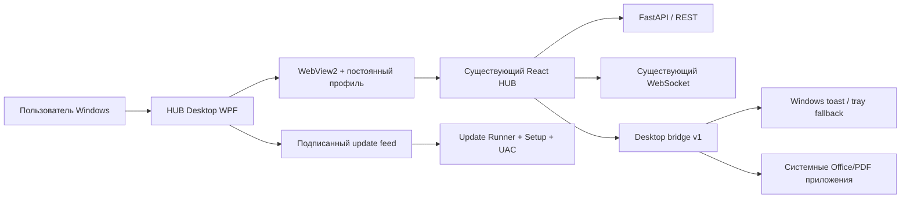

# HUB Desktop — полная дорожная карта развития

Статус документа: рабочая дорожная карта после выпуска bootstrap-версии `0.1.6`  
Область: `desktop/`, связанные части React, упаковка, выпуск и ограниченные backend-изменения  
Главный принцип: HUB Desktop остаётся тонкой Windows-оболочкой над существующим React/FastAPI HUB

---

## 1. Цель

Довести HUB Desktop от рабочего корпоративного клиента `0.1.6` до поддерживаемого продукта,
который можно безопасно устанавливать на все рабочие станции организации, централизованно
обновлять, диагностировать и сопровождать без копирования web-бизнес-логики в C#.

Desktop должен улучшать только те сценарии, где Windows-интеграция действительно полезна:

- постоянная HUB-сессия и работа в tray;
- системные уведомления и переход к нужному экрану;
- безопасное открытие скачанных документов в локальных приложениях;
- установка, обновление и централизованное управление;
- диагностика WebView2, сети и процесса приложения;
- в перспективе — подтверждённый Windows SSO, но не доверие к одному имени пользователя.

## 2. Неподвижные архитектурные правила

Эти решения действуют для всех этапов roadmap:

1. React остаётся единственным основным интерфейсом HUB.
2. FastAPI, существующие API, авторизация, 2FA, trusted device, session policy и WebSocket не
   дублируются в Desktop.
3. C# не хранит AD-пароль, access token, refresh token или cookies самостоятельно.
4. WebView2 использует постоянный профиль, а существующая HUB-сессия продолжает жить в браузерном
   контексте.
5. Desktop bridge содержит только явные версионированные команды. Универсального выполнения
   команд, shell-строк или произвольных URL не будет.
6. Production origin остаётся закреплённым на `https://hubit.zsgp.ru/`.
7. Ошибки TLS не игнорируются.
8. Web Push браузерной версии не удаляется ради Desktop.
9. Новая native-функция появляется только тогда, когда web-вариант не решает задачу достаточно
   хорошо.
10. Каждая версия — отдельный вертикальный срез, который можно протестировать и откатить.

## 3. Текущее состояние: HUB Desktop 0.1.6

| Область | Что уже работает | Главные ограничения |
|---|---|---|
| Оболочка | WPF/.NET 8, WebView2, собственная тематическая рамка | `MainWindow.xaml.cs` уже содержит много разных обязанностей |
| Сессия | Постоянный профиль WebView2, cookies и silent refresh сохраняются | Нет пользовательского экрана состояния профиля и runtime |
| Login | Web-форма HUB, сохранённый логин и безопасная подсказка Windows username | Это не SSO; Windows username нельзя считать подтверждённой личностью |
| Realtime | Существующий React WebSocket продолжает работать при скрытом окне | Нет отдельной диагностики соединения для пользователя |
| Tray | Левый клик открывает окно, X скрывает, есть autostart и выход | Нет пунктов «О программе», «Проверить обновления», «Диагностика» |
| Single instance | Второй процесс активирует первый через per-user named pipe | Нужны стресс-тесты после обновления и при зависшем первом процессе |
| Уведомления | Native/fallback путь используется для chat, HUB/task/feed и mail-событий | Дедупликация между отдельным Chrome и Desktop ещё не формализована |
| Файлы | В Desktop доступны «Скачать» и «Открыть в приложении» для Office/PDF | Намерение «открыть следующий download» надо сделать устойчивым к параллельным загрузкам |
| VNC | Разрешён существующий `vnc:` flow | Нужна отдельная регрессионная матрица URI и ошибок системного обработчика |
| Обновления | Подписанный manifest, SHA-256, `.partial`, Update Runner, UAC, defer 24 часа | Не проведён реальный цикл `0.1.6 → 0.1.7` на Win10/Win11 |
| Установщик | WiX MSI + Burn Setup с WebView2, Windows App SDK и VC++ Runtime | Нет Authenticode; Windows показывает неизвестного издателя |
| Логи | Локальная ротация 5 × 2 МБ без содержимого сообщений и секретов | Нет безопасного support bundle и понятной диагностики для пользователя |
| Deployment | Отдельный IIS feed `/desktop-updates/` | Нет CI/release gate, GPO/ADMX и управляемых политик |

### Текущая схема



## 4. Приоритеты

| Приоритет | Значение | Темы |
|---|---|---|
| P0 | Без этого нельзя массово разворачивать | подпись manifest сертификатом HTTPS, проверка 0.1.6→0.1.7, release gate, ротация сертификата, аварийное отключение |
| P1 | Нужно для нормальной поддержки пользователей | статус обновлений, диагностика, recovery WebView2, support bundle |
| P2 | Заметно улучшает ежедневную работу | уведомления, download UX, открытие файлов, Windows-интеграция |
| P3 | Enterprise и долгосрочная архитектура | GPO/ADMX, staged rollout, Windows SSO, оценка MSIX |

Если ресурсов мало, выполняются строго P0 → P1. P2 и P3 не должны задерживать безопасный rollout.

## 5. План версий

Версии ниже — границы работ, а не календарные обещания.

| Версия | Назначение | Backend changes |
|---|---|---|
| `0.1.7` | Первый доказанный автоматический update и безопасный release process | Нет |
| `0.1.8` | «О программе», настройки Desktop и понятный статус обновлений | Нет |
| `0.1.9` | Надёжность WebView2, сети, lifecycle и диагностика | Нет или только использование существующего health endpoint |
| `0.2.0` | Единая платформа системных уведомлений и проект дедупликации | Возможны минимальные endpoints presence после отдельного design review |
| `0.2.1` | Полноценный download/file UX и безопасная Windows-интеграция | Нет |
| `0.2.2` | Enterprise deployment: GPO/ADMX, политики, offline bundle | Нет |
| `0.3.0` | Пилот device-bound повторного входа; Kerberos SSO отложен | Да, только после ADR и threat model |
| `1.0.0` | Массовая поддерживаемая версия | Только стабилизация утверждённых контрактов |

---

# Этап A — Release gate перед 0.1.7

## A1. Подпись update manifest сертификатом HTTPS `hubit.zsgp.ru`

### Принятое решение и границы

Владелец продукта 11 августа 2026 года осознанно принял риск совместного использования TLS-ключа:
update manifest подписывается закрытым RSA-ключом сертификата, которым HTTPS endpoint
`https://hubit.zsgp.ru/` фактически обслуживается в production.

На дату решения endpoint использует сертификат `CN=*.zsgp.ru`, выданный `GlobalSign RSA OV SSL CA
2018`, thumbprint `0A9CFEF49EB1E11819D81A351978BAFA05EF7CBE`, срок действия — до 7 ноября 2026 года. На
сервере также есть отдельный self-signed `CN=hubit.zsgp.ru` с thumbprint
`9AE510F4D96DCED106B48D20D1BAE213B1090266`; он не является сертификатом, который публичный
endpoint отдаёт клиентам, и не должен случайно выбираться release-скриптом.

Подпись остаётся прикладной подписью `RSA-PSS-SHA256` строгого manifest. Хэш Setup входит в
подписанные данные, поэтому изменение пакета обнаруживается updater. Это не является Authenticode
подписью самого EXE/MSI и не меняет поведение Windows при ручном запуске установщика.

Приняты следующие риски:

- компрометация TLS private key одновременно затрагивает HTTPS и канал обновлений;
- private key находится на машине, обслуживающей HTTPS, а не на отдельной release-станции;
- при перевыпуске TLS-сертификата с новым ключом старые Desktop-клиенты не смогут проверить новый
  manifest, пока новый public key не будет заранее добавлен в доверенный набор;
- текущий TLS-сертификат не имеет EKU Code Signing, поэтому не создаёт доверенную Authenticode
  подпись и не убирает предупреждение «Неизвестный издатель».

### Что сделать

1. Экспортировать из сертификата только публичную часть и встроить её в Desktop с отдельным
   `key_id`; рекомендуемое значение — `hubit-zsgp-ru-tls-2026-04`.
2. Пересобрать bootstrap `0.1.6`, переустановить её на пилотных ПК и только затем выпускать `0.1.7`.
3. Изменить release-скрипт: сертификат выбирается только из `Cert:\LocalMachine\My` по явно
   заданному thumbprint и дополнительно проверяются subject/SAN, RSA public key и срок действия.
4. Не экспортировать private key в PFX, Git, release archive, IIS content root или временные файлы.
   Release-процесс получает только право выполнить операцию подписи через Windows certificate store.
5. Выдать доступ к private key отдельной release-учётной записи по минимуму прав; IIS application
   pool и обычные интерактивные пользователи не должны получать это право без необходимости.
6. Сначала подписать canonical payload manifest через `RSA-PSS-SHA256`, затем проверить подпись
   клиентским `UpdateCore`, и только после этого публиковать version folder и `latest.json`.
7. Не позднее чем за 30 дней до замены TLS-сертификата выпустить Desktop-версию, доверяющую обоим
   public keys. После достаточного rollout переключить manifest signer на новый сертификат.
8. При компрометации немедленно убрать `latest.json`, заменить/отозвать TLS-сертификат и выпустить
   ручной bootstrap, если новый public key не был заранее доставлен клиентам.

### Файлы

- изменить `desktop/Hub.Desktop.UpdateCore/DesktopUpdateTrust.cs`;
- расширить `desktop/Hub.Desktop.UpdateCore/DesktopUpdateManifestVerifier.cs` поддержкой строго
  ограниченного списка активных `key_id`, только если нужна ротация;
- изменить `desktop/Hub.Desktop.Tests/DesktopUpdateManifestVerifierTests.cs`;
- изменить `scripts/desktop/publish-update.ps1` для `LocalMachine` certificate store и строгого
  выбора production TLS-сертификата;
- создать `documentation/technical/HUB_DESKTOP_RELEASE_RUNBOOK.md`;
- создать `documentation/technical/HUB_DESKTOP_UPDATE_KEY_ROTATION.md`.

### Критерии готовности

- private key отсутствует в Git, IIS content root, artifacts, логах и временных файлах;
- release-скрипт подписывает manifest через private key выбранного production TLS-сертификата;
- клиент принимает встроенный public key TLS-сертификата и отклоняет неизвестный `key_id`;
- release gate отклоняет просроченный сертификат, неверный thumbprint и ошибочно выбранный
  self-signed `CN=hubit.zsgp.ru`;
- документирована процедура потери/компрометации ключа;
- тестовый manifest, подписанный старым или чужим ключом, отклоняется;
- до 7 октября 2026 года проведена ротация либо заранее доставлен следующий public key.

## A2. Authenticode — принятое временное ограничение

### Что подписывать

- `HUB.Desktop.exe`;
- `HUB.Desktop.UpdateRunner.exe`;
- MSI;
- Burn Setup EXE;
- при необходимости — собственные DLL, если это требуется корпоративной политикой AppLocker.

### Текущее решение

- production TLS-сертификат `*.zsgp.ru` имеет только EKU Server Authentication и Client
  Authentication; его нельзя считать валидным Authenticode Code Signing сертификатом;
- не пытаться обходить проверку EKU и не отмечать такую подпись как доверенную подпись Windows;
- для `0.1.7` допускаются EXE/MSI без Authenticode: пользователь увидит «Неизвестный издатель»;
- целостность автоматически загружаемого Setup обеспечивается размером, SHA-256 и подписью manifest
  через TLS-сертификат; вручную скачанный отдельно Setup этой защитой не покрывается;
- отдельный корпоративный или публичный Code Signing сертификат остаётся будущим улучшением и не
  блокирует выпуск `0.1.7` по принятому владельцем продукта исключению.

### Файлы

- изменить `scripts/desktop/build-installer.ps1`;
- изменить `scripts/desktop/publish.ps1`;
- изменить `scripts/desktop/publish-update.ps1`;
- создать `scripts/desktop/validate-release.ps1`;
- обновить `desktop/README.md` и `desktop/package/README.txt`.

После получения настоящего Code Signing сертификата создать `scripts/desktop/sign-artifacts.ps1`,
добавить RFC 3161 timestamp и вернуть обязательную Authenticode-проверку в release gate.

### Критерии готовности

- release gate явно фиксирует ожидаемый статус `NotSigned`, а не выдаёт его за успешный
  Authenticode;
- UAC-предупреждение «Неизвестный издатель» внесено в инструкцию установки;
- модификация одного байта Setup приводит к несовпадению SHA-256 и отклонению updater;
- после появления Code Signing сертификата `Get-AuthenticodeSignature` должен возвращать `Valid`
  для EXE/MSI/Runner, а UAC — показывать ожидаемого издателя.

## A3. Reproducible release gate

### Pipeline

1. Проверить чистое получение зависимостей из закреплённых источников.
2. Выполнить `.NET` unit/integration tests.
3. Выполнить выбранную frontend-регрессию Desktop bridge/auth/session/WebSocket/files.
4. Выполнить production frontend build без публикации frontend из Desktop job.
5. Собрать publish, Runner, MSI и Setup.
6. Проверить состав MSI и отсутствие `.pdb`, временных файлов и private keys.
7. Проверить и зафиксировать ожидаемое отсутствие Authenticode по принятому исключению.
8. Сформировать SHA-256 и подписать update manifest private key production TLS-сертификата.
9. Проверить manifest тем же `UpdateCore`, который используется клиентом.
10. Только после всех gate загрузить version folder и заменить `latest.json`.

### Новые файлы

- `scripts/desktop/test-release.ps1` — единая локальная команда gate;
- `scripts/desktop/inspect-msi.ps1` — версия, ProductCode, UpgradeCode, обязательные файлы;
- `scripts/desktop/verify-update-manifest.ps1` или маленький .NET verifier на базе `UpdateCore`;
- pipeline-файл выбранной CI-системы после определения реального CI провайдера.

### Не делать

- не добавлять фиктивный GitHub Actions workflow, если проект реально выпускается другой системой;
- не загружать Setup до завершения подписи и проверок;
- не перезаписывать уже опубликованный version folder;
- не собирать две разные бинарные сборки с одинаковой версией.

---

# Версия 0.1.7 — первый реальный автоматический update

## Цель

Доказать полный production-цикл `0.1.6 → 0.1.7` без потери HUB-сессии, WebView2-профиля,
autostart, уведомлений и пользовательских настроек.

## Scope

- только исправления updater/release;
- никаких новых bridge-команд;
- никаких изменений backend/auth;
- signed stable manifest;
- пилот 2–3 ПК, затем ручное разрешение массовой публикации.

## Обязательные сценарии

1. Desktop открыт и пользователь работает.
2. Desktop свёрнут.
3. Desktop скрыт в tray.
4. Пользователь нажимает «Позже» и перезапускает Windows.
5. UAC подтверждён.
6. UAC отменён.
7. Setup возвращает ошибку.
8. Сеть обрывается в середине загрузки.
9. На диске недостаточно места.
10. `latest.json` удалён как kill switch.
11. IIS случайно отвечает redirect/HTML/слишком большим manifest.
12. Опубликована равная или меньшая версия.

## Файлы

- `desktop/Hub.Desktop/Updates/DesktopUpdateService.cs`;
- `desktop/Hub.Desktop/Updates/DesktopUpdatePackage.cs`;
- `desktop/Hub.Desktop.UpdateCore/*`;
- `desktop/Hub.Desktop.UpdateRunner/*`;
- `desktop/Hub.Desktop/MainWindow.xaml`;
- `desktop/Hub.Desktop/MainWindow.xaml.cs`;
- `desktop/Hub.Desktop.Tests/DesktopUpdateServiceTests.cs`;
- `desktop/Hub.Desktop.Tests/UpdateRunnerWorkflowTests.cs`;
- `scripts/desktop/publish-update.ps1`;
- `scripts/iis/setup_desktop_update_feed.ps1`.

## Критерии готовности

- 0.1.6 сам скачивает 0.1.7;
- баннер не забирает фокус;
- после успешного UAC запускается ровно один процесс 0.1.7 без elevation;
- `/auth/me`, refresh, WebSocket и текущий маршрут продолжают работать;
- после отмены UAC запускается установленная 0.1.6;
- нет оставшегося `.partial`;
- обновление скрытого tray-приложения обнаруживается;
- артефакты и manifest сохранены в release archive;
- результат отдельно записан для Windows 10 и Windows 11.

---

# Версия 0.1.8 — настройки, About и управление обновлениями

## Пользовательский результат

Пользователь и поддержка могут без поиска логов увидеть:

- установленную версию;
- WebView2 Runtime version;
- Windows App SDK Runtime status;
- режим уведомлений: Windows toast или fallback;
- включён ли autostart;
- время последней успешной проверки обновлений;
- состояние updater: проверка, загрузка, готово, отложено, ошибка;
- кнопку «Проверить обновления»;
- release notes загруженной версии.

## UI

Добавить пункты tray:

- `Проверить обновления`;
- `О программе и обновления`;
- `Диагностика` — можно включить в 0.1.9, если scope становится слишком большим.

Окно должно наследовать тему HUB, быть доступным с клавиатуры, не блокировать основное окно и не
показывать пользователю stack trace.

## State model updater

Создать явную модель состояний:

```text
Disabled | Idle | Checking | Downloading | Ready | Deferred | Installing | Error
```

Для `Downloading` хранить только безопасные данные:

- версия;
- загружено байт;
- полный размер;
- процент;
- без URL с query, cookies и headers.

## Файлы

### Новые

- `desktop/Hub.Desktop/Updates/DesktopUpdateState.cs`;
- `desktop/Hub.Desktop/Updates/DesktopUpdateCoordinator.cs`;
- `desktop/Hub.Desktop/Views/AboutWindow.xaml`;
- `desktop/Hub.Desktop/Views/AboutWindow.xaml.cs`;
- `desktop/Hub.Desktop/ViewModels/AboutViewModel.cs`;
- `desktop/Hub.Desktop/Configuration/DesktopSettingsStore.cs`;
- `desktop/Hub.Desktop.Tests/DesktopUpdateCoordinatorTests.cs`;
- `desktop/Hub.Desktop.Tests/DesktopSettingsStoreTests.cs`.

### Изменить

- `desktop/Hub.Desktop/Updates/DesktopUpdateService.cs` — отдавать progress/state, не управлять UI;
- `desktop/Hub.Desktop/MainWindow.xaml.cs` — только подписка на coordinator;
- `desktop/Hub.Desktop/UI/HubTrayContextMenu.cs` — новые пункты;
- `desktop/Hub.Desktop/Configuration/DesktopPaths.cs` — путь безопасных настроек;
- `desktop/Hub.Desktop/Diagnostics/DesktopLog.cs` — события ручной проверки без URL/секретов.

## Хранилище настроек

Разрешённые настройки:

- autostart preference;
- отложить update до;
- положение/размер окна, если это действительно нужно;
- выбранная пользователем тема только как fallback до React handshake;
- согласие на диагностический export.

Запрещено хранить:

- пароли;
- cookies;
- access/refresh tokens;
- содержимое уведомлений;
- абсолютные URL скачанных документов;
- произвольные команды запуска.

## Критерии готовности

- повторный клик не запускает параллельные проверки;
- manual check использует тот же verifier и ограничения, что фоновый;
- окно корректно читается Narrator;
- все действия доступны Tab/Enter/Space/Escape;
- сбой чтения settings восстанавливается на безопасные defaults;
- удаление settings не удаляет WebView2 profile.

---

# Версия 0.1.9 — надёжность, производительность и диагностика

## 0.1.9A. Разделение MainWindow без переписывания приложения

`MainWindow.xaml.cs` постепенно разделить по обязанностям. Это не должен быть большой одномоментный
рефакторинг.

### Новые компоненты

- `WebView/DesktopWebViewHost.cs` — создание, настройка и замена WebView2;
- `WebView/WebViewRecoveryPolicy.cs` — backoff и лимиты восстановления;
- `Downloads/DesktopDownloadCoordinator.cs` — download intent и завершение;
- `Lifecycle/DesktopWindowController.cs` — show/hide/maximize/foreground;
- `Lifecycle/DesktopApplicationController.cs` — явный exit и shutdown;
- `Diagnostics/DesktopRuntimeInfo.cs` — версии runtime и render tier.

### Порядок выделения

1. Сначала download coordinator с существующими тестами.
2. Затем WebView configuration/recovery.
3. Затем window lifecycle.
4. Только после этого упрощать constructor/MainWindow.

Каждый шаг должен сохранять внешний UI и bridge v1.

## 0.1.9B. WebView2 recovery

Обрабатывать отдельно:

- browser process exited;
- renderer process exited;
- frame process exited;
- initialization failure;
- navigation timeout;
- временную потерю сети;
- повреждение runtime, которое нельзя лечить циклическим restart.

Политика:

1. Первая ошибка — одна автоматическая попытка пересоздать WebView с тем же UserDataFolder.
2. Повторные ошибки — exponential backoff с jitter и ограничением.
3. После лимита — понятный экран и ручная кнопка retry.
4. Никогда автоматически не удалять WebView2 profile.
5. Отдельная кнопка сброса профиля возможна только в Diagnostics с предупреждением о logout.

## 0.1.9C. Диагностическое окно

Показывать:

- Desktop version и install path;
- Windows version/build и process architecture;
- elevated/non-elevated;
- WebView2 Runtime version;
- Windows App SDK status;
- WPF Render Tier;
- configured origin без query;
- последний navigation status;
- время последнего bridge handshake;
- режим системных уведомлений;
- autostart status;
- updater status;
- доступное место только для update volume;
- путь к логам.

### Support bundle

Создавать ZIP только по явному нажатию пользователя. Включать:

- rolling logs;
- `diagnostics.json` с версиями и статусами;
- сведения об установке;
- результат локальных self-checks.

Не включать:

- каталог WebView2;
- cookies/localStorage/IndexedDB;
- dump памяти;
- содержимое писем, сообщений или документов;
- токены, headers и полные URL с query;
- список файлов пользователя.

### Файлы

- `desktop/Hub.Desktop/Views/DiagnosticsWindow.xaml`;
- `desktop/Hub.Desktop/ViewModels/DiagnosticsViewModel.cs`;
- `desktop/Hub.Desktop/Diagnostics/DesktopDiagnosticsCollector.cs`;
- `desktop/Hub.Desktop/Diagnostics/DesktopSupportBundleExporter.cs`;
- `desktop/Hub.Desktop/Diagnostics/DesktopRedaction.cs`;
- `desktop/Hub.Desktop.Tests/DesktopDiagnosticsCollectorTests.cs`;
- `desktop/Hub.Desktop.Tests/DesktopSupportBundleExporterTests.cs`.

## 0.1.9D. Производительность

Измерять до оптимизации:

- время process start → WebView initialized;
- время WebView initialized → React bridge ready;
- количество UI thread stalls длиннее выбранного порога;
- частоту WebView process failures;
- WPF Render Tier и наличие software rendering;
- размер WebView2 profile и update cache.

Не делать:

- не отключать GPU глобально;
- не включать экспериментальные Chromium flags на всех ПК;
- не выгружать WebView при скрытии в tray, потому что это оборвёт realtime;
- не очищать browser cache на каждом запуске;
- не добавлять polling вместо WebSocket.

## Критерии готовности 0.1.9

- recovery не создаёт бесконечный restart loop;
- скрытие/открытие окна не пересоздаёт WebView;
- diagnostics export не содержит cookie/token fixtures в тестах;
- UI остаётся отзывчивым при скачивании update;
- software rendering определяется и объясняется пользователю;
- лог остаётся ограниченным по размеру.

---

# Версия 0.2.0 — единая платформа уведомлений

## Текущее положение

Native bridge уже умеет показывать безопасный payload `id/title/body/route`. React уже использует
его для chat, HUB/task/feed и mail-сценариев. Следующий шаг — не создавать новые способы показа, а
свести все каналы к одному контракту и гарантировать дедупликацию.

## 0.2.0A. Единый frontend notification envelope

Ввести внутреннюю React-модель:

```text
id
channel: chat | mention | task | feed | mail | ticket | scan
title
body
route
created_at
urgency
```

До bridge по-прежнему передавать только разрешённый минимум. `channel`, action buttons и другие поля
не добавлять в bridge v1 без отдельной необходимости.

### Файлы

- создать `WEB-itinvent/frontend/src/lib/systemNotificationEnvelope.js`;
- создать `WEB-itinvent/frontend/src/lib/systemNotificationRouter.js`;
- изменить `WEB-itinvent/frontend/src/lib/chatNotifications.js`;
- изменить `WEB-itinvent/frontend/src/lib/windowsNotifications.js`;
- изменить соответствующие `*.test.js`;
- обновить `WEB-itinvent/frontend/src/lib/desktopBridge.js` только если меняется capability, но не
  расширять протокол автоматически.

## 0.2.0B. Настройки каналов

Использовать существующую серверную/React-модель notification preferences. Desktop не должен иметь
второй независимый набор настроек, который расходится с web.

Пользователь должен отдельно понимать:

- включены ли системные уведомления вообще;
- какие каналы включены в HUB;
- почему toast недоступен и используется fallback;
- будет ли сообщение показано, если окно открыто или находится в foreground.

## 0.2.0C. Дедупликация Chrome + Desktop

До backend-изменений создать:

- `documentation/technical/DESKTOP_NOTIFICATION_DEDUP.md`;
- ADR в `docs/adr/` после выбора модели;
- threat model идентификаторов устройства и heartbeat.

### Рекомендуемая модель

- presence привязана к подтверждённой HUB-сессии, а не к Windows username;
- heartbeat примерно раз в 60 секунд;
- TTL примерно 150–180 секунд;
- disconnect ускоряет очистку, но correctness не зависит от graceful disconnect;
- multiple PCs учитываются отдельно;
- отдельный Chrome на другом ПК продолжает получать push;
- если нельзя надёжно связать конкретную Web Push subscription с конкретным Desktop device,
  предпочтительнее редкий дубль, чем пропущенное уведомление.

### Возможные backend-файлы после утверждения design

- новый router `WEB-itinvent/backend/api/v1/desktop_presence.py` или методы в существующем
  notification router, если это лучше соответствует текущей доменной границе;
- новый service `WEB-itinvent/backend/services/desktop_presence_service.py`;
- модели в `WEB-itinvent/backend/appdb/models.py`;
- Alembic migration `WEB-itinvent/backend/alembic/versions/*_desktop_presence.py`;
- точечные изменения в `WEB-itinvent/backend/chat/notification_planner.py` и
  `WEB-itinvent/backend/chat/push_service.py`;
- frontend API — отдельный `WEB-itinvent/frontend/src/api/desktopPresence.js`, не раздувать
  `api/client.js`.

### Запрещённые упрощения

- boolean `desktop_online` без TTL;
- suppression всех push пользователя при одном online Desktop;
- доверие к `Environment.UserName`;
- новый WebSocket только ради heartbeat, если существующий connection lifecycle можно использовать;
- отправка device secret через bridge в логируемом виде.

## 0.2.0D. Native notification UX

Проверить:

- последняя fallback-плашка остаётся на экране до действия пользователя;
- повтор одного `id` не создаёт второй toast;
- click скрытого приложения поднимает правильный route;
- только последнее pending navigation хранится до React ready;
- длинные title/body корректно сокращаются;
- screen reader объявляет fallback без перехвата keyboard focus.

Action buttons «Прочитано», «Ответить», «Закрыть задачу» не входят в первый срез: они требуют
дополнительной авторизации команд и защиты от replay.

## Критерии готовности

- каждый поддерживаемый канал имеет unit-тест route и dedupe ID;
- одно событие не даёт два уведомления внутри Desktop;
- отдельный Chrome не теряет push из-за устаревшего presence;
- ни один notification payload не попадает в native logs;
- browser-only режим не зависит от наличия Desktop-кода.

---

# Версия 0.2.1 — файлы, загрузки и локальные приложения

## Цель

Сделать работу с файлами предсказуемой при одиночных, параллельных, отменённых и неуспешных
загрузках, сохранив web-поведение в браузере.

## 0.2.1A. Надёжный download intent

Текущая команда `file.openDownloaded` относится к следующей загрузке. Улучшить её без передачи
произвольного download URL в C#:

- intent одноразовый;
- intent имеет короткий TTL;
- одновременно допускается только один open-intent;
- второй запрос получает контролируемый отказ/занято;
- отмена download очищает intent;
- обычная параллельная загрузка не может случайно открыться;
- файл открывается только после `DownloadState.Completed`;
- extension проверяется на frontend и native стороне;
- путь берётся только из события WebView2 download, не из JavaScript payload.

## 0.2.1B. Download center

Минимальная native-панель текущей сессии:

- имя файла;
- прогресс;
- завершено/ошибка/отменено;
- `Открыть`;
- `Показать в папке`;
- `Повторить` только через исходный web action, если безопасно и возможно.

Историю содержимого между сессиями не хранить по умолчанию.

## 0.2.1C. Поддерживаемые форматы

- Word: `doc/docx/docm/dot*`;
- Excel: `xls/xlsx/xlsm/xlt*`;
- PowerPoint: `ppt/pptx/pptm/pps*`;
- OpenDocument: `odt/ods/odp`;
- `rtf`, `csv`, `pdf`.

Открывать системным registered application. Если обработчика нет — показать понятное сообщение и
оставить скачанный файл.

Не встраивать Microsoft Office engine в WPF: это создаёт лицензионные, COM-lifecycle,
совместимые и security-проблемы. Предпросмотр Office/PDF остаётся web-функцией, а полноценное
редактирование/печать выполняет установленное приложение.

## Файлы

### Desktop

- создать `desktop/Hub.Desktop/Downloads/DesktopDownloadCoordinator.cs`;
- создать `desktop/Hub.Desktop/Downloads/DesktopDownloadItem.cs`;
- создать `desktop/Hub.Desktop/Downloads/DesktopFileLauncher.cs`;
- создать `desktop/Hub.Desktop/Views/DownloadsWindow.xaml`;
- изменить `desktop/Hub.Desktop/MainWindow.xaml.cs`;
- изменить `desktop/Hub.Desktop/Interop/DesktopBridgeProtocol.cs` только при необходимости ответа
  `accepted/busy`; предпочтительно сохранить v1 и добавить безопасную host response;
- добавить `desktop/Hub.Desktop.Tests/DesktopDownloadCoordinatorTests.cs`;
- добавить `desktop/Hub.Desktop.Tests/DesktopFileLauncherTests.cs`.

### Frontend

- изменить `WEB-itinvent/frontend/src/components/fileActions/FileActionsContextMenu.jsx`;
- изменить `WEB-itinvent/frontend/src/components/documentPreview/DocumentPreviewDialog.jsx`;
- изменить `WEB-itinvent/frontend/src/lib/desktopBridge.js`;
- расширить соответствующие тесты;
- подключать единый `FileActionsContextMenu` во всех доменах постепенно, без копирования меню.

## Security

- никогда не передавать C# произвольную локальную команду;
- никогда не открывать `exe`, `msi`, `bat`, `cmd`, `ps1`, `js`, `lnk`;
- проверять extension case-insensitively после завершения загрузки;
- не логировать полный путь документа;
- не открывать неполный `.crdownload/.partial`;
- не обходить Windows Attachment Manager/Defender.

## Критерии готовности

- параллельные downloads не путают open intent;
- cancel не запускает приложение;
- Office/PDF открывается только после успешного download;
- отсутствие Word/PDF handler не падает и не удаляет файл;
- browser получает только `Скачать`, Desktop — `Скачать` и `Открыть в приложении`;
- контекстное меню работает mouse, ContextMenu key и Shift+F10.

---

# Версия 0.2.2 — Enterprise deployment и политики

## Цель

Дать администраторам предсказуемое массовое развёртывание без ручной настройки каждого ПК.

## MSI/Setup

- документированный silent install/uninstall/repair;
- логирование MSI по явному параметру поддержки;
- offline bundle с закреплёнными Microsoft prerequisites;
- detection rules для Intune/SCCM/GPO;
- upgrade и downgrade policy;
- repair без удаления `%LOCALAPPDATA%`;
- отдельная административная процедура полного удаления профиля пользователя.

## Policies

Предлагаемый registry root:

```text
HKLM\Software\Policies\HUB-IT\Desktop
```

Разрешённые политики:

- `AutostartMode`: user choice / forced on / forced off;
- `UpdatesEnabled`: только аварийное административное отключение;
- `UpdateDeferralHours`: ограниченный диапазон;
- `DiagnosticsExportEnabled`;
- `NotificationFallbackEnabled`;
- `ReleaseChannel`: не добавлять, пока реально существует только stable.

Запрещённые policies:

- произвольный BaseUrl в production;
- отключение TLS validation;
- произвольный update feed URL;
- произвольный executable для открытия файла;
- передача AD credentials.

## Файлы

- создать `desktop/Hub.Desktop/Configuration/DesktopPolicy.cs`;
- создать `desktop/Hub.Desktop/Configuration/RegistryDesktopPolicyProvider.cs`;
- создать `desktop/Hub.Desktop.Tests/RegistryDesktopPolicyProviderTests.cs`;
- создать `desktop/policy/HUBDesktop.admx`;
- создать `desktop/policy/ru-RU/HUBDesktop.adml`;
- изменить `desktop/Hub.Desktop.Installer/Package.wxs`;
- изменить `desktop/Hub.Desktop.Setup/Bundle.wxs`;
- создать `documentation/user-guides/HUB_DESKTOP_ADMIN_DEPLOYMENT.md`;
- создать `documentation/technical/HUB_DESKTOP_GPO.md`.

## Inventory

Версия уже доступна в `HKLM\Software\HUB-IT\Desktop\InstallerVersion`. Если нужна серверная
видимость, существующий inventory-agent может читать это значение отдельным изменением. Не добавлять
в Desktop новый inventory client.

## Критерии готовности

- install/upgrade/uninstall проверены под обычным пользователем и администратором;
- policy precedence документирован: machine policy → user preference → safe default;
- обычный пользователь не может переопределить security policy через JSON;
- GPO удаление возвращает поведение к user preference;
- обновление не меняет ранее выбранный autostart без policy.

---

# Версия 0.3.0 — постоянный Desktop-вход; Kerberos SSO отложен

## Уточнённые условия инфраструктуры

- рабочие станции смешанные: домен `zsgp.corp` и недоменные ПК;
- HUB-сервер не входит в домен, поэтому сам не может подтвердить Kerberos identity;
- основной путь `0.3.0` — привязка существующего HUB-профиля после первого обычного входа к
  неэкспортируемому ключу конкретного Windows-профиля;
- после истечения обычной сессии клиент проходит одноразовый cryptographic challenge и получает
  новую обычную отзывную HUB-сессию;
- `Environment.UserName` и domain join используются только для eligibility/UX. Они не являются
  доказательством личности и не передаются как доверенный login assertion;
- настоящий Kerberos/Negotiate SSO остаётся будущим вариантом только через отдельный доменный
  identity gateway.

Подробности: `documentation/technical/WINDOWS_SSO_FUTURE.md`, threat model и ADR-0005.

## Что нельзя делать

- отправлять `Environment.UserName` и считать пользователя вошедшим;
- извлекать Windows password;
- хранить AD credentials в Credential Manager от имени Desktop;
- ослаблять 2FA/session policy;
- добавлять скрытый общий service account в клиент.

## Утверждённые design-документы

- `documentation/technical/WINDOWS_SSO_FUTURE.md`;
- `documentation/technical/WINDOWS_SSO_THREAT_MODEL.md`;
- ADR `docs/adr/0005-windows-sso-boundary.md`.

## Отложенные варианты настоящего SSO

1. Kerberos/Negotiate через доменный reverse proxy или auth gateway.
2. Отдельный доменный identity gateway, который выдаёт короткоживущий подписанный assertion для
   FastAPI.
3. Entra ID/OIDC, если инфраструктура организации реально его использует.
4. WebAuthn/Windows Hello остаётся браузерным способом входа в существующую HUB identity.

## Утверждённый поток `0.3.0`

```text
первый обычный HUB login + действующая 2FA policy
→ регистрация public key текущего Windows-профиля
→ CNG/TPM хранит неэкспортируемый private key
→ короткоживущий одноразовый challenge после истечения сессии
→ FastAPI проверяет signature и active device binding
→ обычная HUB session
→ существующие refresh/idle/absolute expiry/2FA rules
```

## Go/no-go условия

Код device-bound reauthentication можно начинать только если:

- утверждены canonical payload, алгоритм и TTL challenge;
- есть атомарная защита от replay и purpose/device/origin mismatch;
- server-side binding создаётся только из текущего подтверждённого `user_id`;
- совпадение Windows login и HUB username проверяется только как eligibility регистрации;
- logout/revocation/session expiry остаются серверными;
- есть fallback на текущий login;
- закрыты Critical/High угрозы из `WINDOWS_SSO_THREAT_MODEL.md`.

---

# Версия 1.0.0 — критерии массовой готовности

## Product readiness

- успешное использование минимум на согласованной пилотной группе;
- две последовательные автоматические версии без ручного ремонта;
- документированный SLA поддержки и владелец release process;
- понятный user/admin guide;
- нет известных P0/P1 дефектов;
- измерены startup, crash и update success rates.

## Security readiness

- до появления Code Signing сертификата явно действует утверждённое исключение для отсутствия
  Authenticode; получение настоящей подписи Windows остаётся рекомендуемой целью до `1.0.0`;
- update manifest подписывается production TLS-сертификатом по принятому исключению; ACL private
  key, аудит операций, аварийное отключение и ротация проверены;
- threat model bridge/update/notification presence актуален;
- проверены URL schemes и external navigation;
- DevTools/remote debugging закрыты в Release;
- support bundle redaction протестирован fixtures с секретами;
- dependency vulnerability scan включён в release gate;
- SBOM сохраняется рядом с release archive.

## Compatibility matrix

- Windows 10 22H2 x64;
- актуальные поддерживаемые Windows 11 builds x64;
- обычная локальная сессия;
- RDP;
- VMware/Hyper-V с рабочим и отсутствующим hardware acceleration;
- system language RU и минимум один non-RU locale;
- scaling 100/125/150/200%;
- несколько мониторов с разным DPI;
- обновление при окне open/minimized/hidden;
- установленный и отсутствующий Office/PDF handler.

## MSIX decision

Решение зафиксировано в ADR-0006: до и для 1.0 сохраняются WiX MSI + offline Burn Setup. Сравнение
охватывает:

- миграция существующего MSI install;
- autostart;
- app identity и notifications;
- update model;
- enterprise deployment;
- сертификаты;
- WebView2 profile migration;
- rollback/uninstall.

Переходить на MSIX только при измеримом преимуществе, доверенном Code Signing и готовом migration
plan. MSI/Setup не удалять «для чистоты архитектуры». Матрица приёмки 1.0 находится в
`documentation/technical/HUB_DESKTOP_COMPATIBILITY_MATRIX.md`.

---

# 6. Целевая структура файлов

Структура вводится постепенно; пустые слои заранее не создавать.

```text
desktop/
├── ROADMAP.md
├── README.md
├── Hub.Desktop/
│   ├── App.xaml(.cs)
│   ├── MainWindow.xaml(.cs)
│   ├── Assets/
│   ├── Autostart/
│   ├── Configuration/
│   │   ├── DesktopOptions.cs
│   │   ├── DesktopPaths.cs
│   │   ├── DesktopSettingsStore.cs          # 0.1.8
│   │   └── RegistryDesktopPolicyProvider.cs # 0.2.2
│   ├── Diagnostics/
│   │   ├── DesktopLog.cs
│   │   ├── DesktopDiagnosticsCollector.cs   # 0.1.9
│   │   └── DesktopSupportBundleExporter.cs  # 0.1.9
│   ├── Downloads/
│   │   ├── DesktopDownloadCoordinator.cs    # 0.2.1
│   │   └── DesktopFileLauncher.cs           # 0.2.1
│   ├── Interop/
│   │   ├── DesktopBridgeProtocol.cs
│   │   └── DesktopBridgeHost.cs
│   ├── Lifecycle/
│   ├── Notifications/
│   ├── Updates/
│   │   ├── DesktopUpdateService.cs
│   │   ├── DesktopUpdateState.cs            # 0.1.8
│   │   └── DesktopUpdateCoordinator.cs      # 0.1.8
│   ├── Views/
│   │   ├── AboutWindow.xaml                 # 0.1.8
│   │   ├── DiagnosticsWindow.xaml           # 0.1.9
│   │   └── DownloadsWindow.xaml             # 0.2.1
│   ├── ViewModels/
│   └── WebView/
│       ├── DesktopWebViewHost.cs            # 0.1.9
│       └── WebViewRecoveryPolicy.cs         # 0.1.9
├── Hub.Desktop.UpdateCore/
├── Hub.Desktop.UpdateRunner/
├── Hub.Desktop.Installer/
├── Hub.Desktop.Setup/
├── Hub.Desktop.Tests/
└── policy/                                  # 0.2.2

scripts/desktop/
├── publish.ps1
├── build-installer.ps1
├── publish-update.ps1
├── sign-artifacts.ps1                       # Release gate
├── validate-release.ps1                     # Release gate
└── test-release.ps1                         # Release gate
```

---

# 7. Полная тестовая стратегия

## Unit tests Desktop

- bridge strict schema, unknown fields, malformed JSON, routes и limits;
- navigation allowlist и URL schemes;
- update manifest schema/signature/path/version/size/hash;
- update state transitions и concurrent check suppression;
- `.partial`, retry, insufficient disk, cleanup;
- UAC cancel, Setup failure/success и restart;
- autostart preference/policy precedence;
- download intent TTL/concurrency/cancel;
- log/support bundle redaction;
- WebView recovery backoff.

## Frontend regression

- `src/pages/Login.test.jsx`;
- `src/contexts/AuthContext.test.jsx`;
- `src/lib/desktopBridge.test.js`;
- `src/lib/chatSocket.test.js`;
- `src/lib/chatNotifications.test.js`;
- `src/lib/windowsNotifications*.test.js`;
- `src/components/layout/DesktopNavigationBootstrap.test.jsx`;
- `src/components/fileActions/FileActionsContextMenu.test.jsx`;
- tests document preview/download call sites.

## Installer tests

- clean install;
- upgrade previous version;
- repair;
- uninstall;
- downgrade rejected;
- process open during upgrade;
- profile remains;
- autostart remains;
- Start menu icon/branding;
- required runtime already installed/missing;
- MSI and Setup silent exit codes;
- signatures and ProductCode/UpgradeCode.

## Manual end-to-end

| Сценарий | Win10 | Win11 | RDP | Ожидаемый результат |
|---|---:|---:|---:|---|
| Fresh login + 2FA | Required | Required | Recommended | Обычная HUB session |
| Session restore | Required | Required | Recommended | Login не спрашивается до server expiry |
| WebSocket reconnect | Required | Required | Required | Без reload и дублей |
| X → tray → открыть | Required | Required | Required | Один WebView/process |
| Native notification hidden | Required | Required | Required | Toast/fallback и правильный route |
| Office/PDF open | Required | Required | Optional | Default application |
| VNC URI | Required | Required | Required | Existing handler flow |
| Automatic update | Required | Required | Required | Профиль и autostart сохранены |
| UAC cancel | Required | Required | Optional | Старая версия снова открывается |
| Software rendering | Recommended | Recommended | Required | Диагностика, без forced flags |

## Release regression commands

```powershell
tools\dotnet-sdk-8\dotnet.exe test desktop\Hub.Desktop.Tests\Hub.Desktop.Tests.csproj -c Release
tools\dotnet-sdk-8\dotnet.exe build desktop\Hub.Desktop.sln -c Release --no-restore

cd WEB-itinvent\frontend
npx vitest run <desktop-regression-files>
npm run build

cd C:\Project\Image_scan
powershell -ExecutionPolicy Bypass -File scripts\desktop\build-installer.ps1 -NoRestore
powershell -ExecutionPolicy Bypass -File scripts\desktop\validate-release.ps1
```

---

# 8. Метрики успеха

Метрики не должны содержать пользовательский контент или идентификаторы документов.

## P0

- update success rate;
- update download verification failures;
- UAC cancellation rate отдельно от technical failure;
- crash-free launch rate;
- доля устройств на поддерживаемой версии.

## P1

- median/P95 startup → bridge ready;
- WebView process failure/recovery rate;
- количество offline overlay показов;
- toast primary vs fallback;
- доля diagnostics bundles, созданных только по явному действию.

## Не собирать автоматически

- title/body уведомлений;
- route с query IDs;
- логины;
- имена файлов;
- URL документов;
- cookies/tokens;
- снимки экрана;
- содержимое WebView2 profile.

---

# 9. Release process после 0.1.7

1. Выбрать один небольшой release scope.
2. Обновить версию и release notes.
3. Прогнать unit/frontend/installer gate.
4. Собрать артефакты один раз.
5. Проверить ожидаемый Authenticode status; до получения Code Signing сертификата допускается
   только явно задокументированный `NotSigned`.
6. Проверить артефакты и создать release archive/SBOM без private keys.
7. На сервере сертификата подписать update manifest private key фактически активного production
   TLS-сертификата `hubit.zsgp.ru`/`*.zsgp.ru`.
8. Загрузить immutable version folder.
9. Проверить HTTPS HEAD/GET без redirect.
10. Проверить manifest клиентским `UpdateCore`.
11. Атомарно заменить `stable/latest.json`.
12. Проверить 2–3 pilot devices.
13. Зафиксировать результат rollout.
14. При аварии убрать `latest.json`; не подменять его downgrade-версией.

---

# 10. Что сознательно не входит в roadmap ближайших версий

- переписывание React на WPF;
- отдельная Desktop auth/session система;
- хранение AD-пароля;
- доверие к Windows username как к authentication proof;
- Electron/Tauri;
- второй WebSocket;
- отдельный Desktop backend;
- автоматическое удаление WebView2 profile;
- встроенный Microsoft Office engine;
- generic shell bridge;
- обязательные блокирующие update без отдельного product/security решения;
- автоматический переход на MSIX;
- silent downgrade через update feed;
- скрытая отправка crash dumps или пользовательских документов.

---

# 11. Рекомендуемый порядок задач

## Следующие 10 задач

1. Встроить public key активного production TLS-сертификата и переиздать bootstrap `0.1.6`.
2. Перевести `publish-update.ps1` на строгий выбор сертификата в `LocalMachine` store и добавить
   безопасную процедуру его ротации.
3. Создать `validate-release.ps1` и release runbook.
4. Выпустить и проверить `0.1.7` на Win10/Win11.
5. Добавить update state model и ручную проверку.
6. Добавить About/Update окно.
7. Добавить Diagnostics/support bundle с redaction tests.
8. Выделить download coordinator из `MainWindow`.
9. Спроектировать notification dedup документом и ADR.
10. Только после стабильности начинать GPO или SSO discovery.

## Зависимости

```text
Production TLS certificate public key in bootstrap
→ manifest signing/release gate
→ 0.1.7 pilot update
→ update UI/diagnostics
→ reliability refactor
→ notifications/files
→ enterprise policies
→ SSO pilot
→ 1.0
```

---

# 12. Definition of Done для любой Desktop-версии

Версия готова только если одновременно выполнено:

- scope описан и не включает несвязанный backend/frontend рефакторинг;
- `.NET` tests зелёные;
- выбранная frontend regression зелёная;
- production build зелёный;
- bridge contracts совместимы или версионированы;
- Setup/MSI собраны и проверены;
- SHA-256 и подпись manifest production TLS-сертификатом валидны;
- Authenticode имеет ожидаемый документированный статус: `NotSigned` по принятому исключению либо
  `Valid` после появления настоящего Code Signing сертификата;
- update manifest проверен клиентским verifier;
- нет секретов в Git/artifacts/logs;
- upgrade с предыдущей поддерживаемой версии проверен;
- WebView2 profile/session/autostart сохранены;
- документация и release notes обновлены;
- rollback/kill-switch понятен поддержке;
- изменения проверены минимум на одной реальной Windows-машине, а release-кандидат — по матрице
  соответствующего этапа.

---

# 13. Решение по ближайшему релизу

Ближайший релиз должен быть `0.1.7` и содержать только production-hardening updater/release.
Добавлять в него settings, новый bridge, notification presence, GPO или SSO не следует. Главный
результат `0.1.7` — доказательство, что вручную установленная `0.1.6` безопасно обновляется сама.
