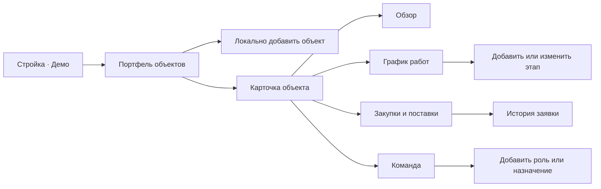
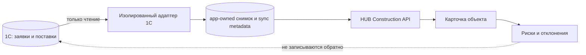

# HUB Стройка — PRD и архитектурный черновик

> - Статус: **Draft / обсуждение**
> - Дата: **2026-08-13**
> - Владелец продукта: **требует назначения со стороны строительного блока**
> - Область: **WEB-itinvent, объекты строительства, ПТО, снабжение, будущая read-only интеграция с 1С**
> - Текущий этап: **проектирование кликабельного прототипа на вымышленных данных**

## Краткое решение

В HUB-IT появляется отдельный модуль **«Стройка»** — информационная система управления строительными проектами (ИСУП / PMIS), в которой строительный объект становится самостоятельной управленческой единицей. Руководитель открывает объект и сразу видит его команду, готовность, плановые и прогнозные сроки, отставание, ближайшие работы, критические риски, заявки на закупку и прогноз поставок.

Первый результат — **кликабельный администраторский прототип** на полностью вымышленных данных. Он не обращается к backend, PostgreSQL или 1С, не изменяет существующие задачи и после обновления страницы возвращается к исходному состоянию. Цель прототипа — проверить состав данных, понятность экранов и реальные рабочие сценарии руководства, ПТО и снабжения до проектирования постоянной модели хранения.

В первом реальном контуре HUB-IT хранит только собственные данные объекта, команды и графика работ. Заявки на закупку, их исходные статусы и факты движения остаются в 1С. HUB получает их **только для чтения**, явно указывает источник и время обновления, рассчитывает управленческие признаки риска, но не создаёт, не согласовывает и не изменяет документы 1С.

## Проблема и ценность

Данные, необходимые для управления строительством, находятся в разных местах: ответственные известны из переписки и организационных договорённостей, сроки ведутся в таблицах или отдельных графиках, заявки на закупку проходят в 1С, а фактическое состояние объекта собирается вручную. Из-за этого руководителю трудно быстро ответить на четыре базовых вопроса:

1. Кто сейчас отвечает за объект и конкретное направление?
2. Что должно выполняться сейчас и где появилось отставание?
3. Какие материалы или оборудование не успевают к требуемой дате?
4. Какое решение необходимо принять сегодня, чтобы не увеличить задержку?

> «Хотим открыть объект и сразу увидеть, кто отвечает, что строим сейчас, насколько отстаём и на каком этапе находятся закупки и поставки».

Ожидаемая ценность модуля:

- единая точка обзора портфеля строительных объектов;
- прозрачная персональная ответственность по объекту и роли;
- единый план-факт сроков вместо ручного сопоставления таблиц;
- раннее выявление поставок, которые угрожают графику работ;
- сокращение ручных уточнений между руководителем проекта, ПТО и снабжением;
- подготовленная основа для будущих документов, журналов, качества, бюджета и исполнительной документации без попытки реализовать их все в первом релизе.

## Класс системы и внешние ориентиры

**PMIS (Project Management Information System)** — система, которая собирает, объединяет и распространяет результаты процессов управления проектом. Для строительной организации такой контур обычно называют **строительной ИСУП**, **construction project management system** или **системой управления строительными объектами**.

Модуль «Стройка» не является:

- CRM для продаж и отношений с заказчиками;
- BIM/CDE-системой для полноценной работы с информационной моделью и проектной документацией;
- заменой бухгалтерского, складского и закупочного учёта 1С;
- простой доской задач без связей между объектом, графиком и материальным обеспечением.

Внешние продукты задают полезные ориентиры, но не определяют объём первого этапа:

| Ориентир | Полезная практика | Что берём в концепцию HUB Стройка |
|---|---|---|
| [PMI: Project Management Information System](https://www.pmi.org/-/media/pmi/documents/registered/pdf/pmbok-standards/pmi-lexicon-pm-terms.pdf) | Объединение результатов процессов управления проектом в одной информационной системе | Единый объектный обзор, согласованные термины и измеримые отклонения |
| [1С:ERP Управление строительной организацией](https://solutions.1c.ru/catalog/uso2) | Календарно-сетевое планирование, закупки, поставки, выполнение СМР и план-фактная аналитика по объектам | Не дублировать учёт 1С; показывать связанный управленческий срез и риски |
| [Autodesk Construction](https://construction.autodesk.com/workflows/construction-project-management/) | Связь графика, корреспонденции, RFI, документов, качества, безопасности и стоимости | Сразу предусмотреть расширяемые связи, но отложить тяжёлые контуры после прототипа |
| [Procore Scheduling](https://www.procore.com/project-management/schedule) | Единый график, зависимости, краткосрочные планы, ответственные и связь задержек с событиями проекта | План/прогноз/факт, ответственный, зависимости и двухнедельный lookahead |

Главный продуктовый принцип: **сначала обеспечить достоверный контроль объектов, сроков и поставок; затем добавлять специализированные строительные процессы по одному, после проверки их владельцев и источников истины**.

## Термины и границы домена

| Термин | Черновое имя в модели | Значение |
|---|---|---|
| **Строительный объект** | `ConstructionObject` | Верхнеуровневая управленческая единица портфеля: площадка, здание, сооружение или самостоятельный объект договора со своей командой, графиком и закупками. |
| **Фаза объекта** | `phase` | Укрупнённое состояние жизненного цикла: подготовка, строительство, пусконаладка, сдача, завершён. Не заменяет готовность и здоровье объекта. |
| **Состояние объекта** | `health` | Рассчитанный управленческий сигнал: `normal`, `attention`, `critical`. |
| **Роль на объекте** | `ObjectRole` | Настраиваемая должность/функция, например руководитель проекта или начальник ПТО. |
| **Назначение роли** | `ObjectRoleAssignment` | Связь роли, объекта и конкретного сотрудника с периодом действия и признаком основного ответственного. |
| **Этап работ** | `ScheduleActivity` | Работа или группа работ в графике с плановыми, прогнозными и фактическими датами, готовностью и ответственным. |
| **Контрольная точка** | `milestone` | Этап нулевой длительности, фиксирующий значимое событие: готовность контура, подача тепла, ввод, сдача документации. |
| **Зависимость работ** | `ScheduleDependency` | Направленная связь между этапами. Для прототипа поддерживается визуализация Finish-to-Start без расчёта полноценного CPM. |
| **Двухнедельный план** | `lookahead` | Срез незавершённых работ, которые начинаются, заканчиваются или уже просрочены в ближайшие 14 календарных дней. |
| **Заявка на закупку** | `ProcurementRequest` | Внешняя заявка из 1С с собственным стабильным идентификатором, номером, автором, объектом, позициями, статусом и событиями. |
| **Позиция заявки** | `ProcurementRequestItem` | Материал, оборудование, работа или услуга с количеством, единицей измерения и связанными датами. |
| **Поставка** | `ProcurementDelivery` | Отдельная ожидаемая или фактическая поставка. Одна заявка и одна позиция могут иметь несколько частичных поставок. |
| **Дата потребности на объекте** | `required_on_site_date` | Дата, к которой материал или оборудование должны физически находиться на объекте для выполнения связанной работы. |
| **Прогноз поставки** | `forecast_delivery_date` | Последняя известная ожидаемая дата доставки. Не подменяет фактическую дату. |
| **Исходный статус 1С** | `source_status` | Точное значение статуса, полученное из 1С без переименования HUB-IT. |
| **Нормализованный этап HUB** | `normalized_stage` | Управленческая группировка разных статусов 1С для общей воронки закупок. |
| **Риск/отклонение** | `ObjectRisk` | Сигнал о возможном или уже наступившем влиянии на срок, поставку или результат объекта. |

### Важная граница с существующими задачами HUB

В текущем HUB-IT существуют **Hub task project** и **Hub task object** — справочники группировки операционных задач. Они не содержат паспорт строительного объекта, проектную команду, базовый график, поставки и строительный план-факт.

Поэтому:

- строительный объект не создаётся как скрытое расширение существующей строки `hub_task_projects` или `hub_task_objects`;
- прототип использует полностью изолированные фикстуры;
- постоянная модель проектируется отдельно после согласования прототипа;
- будущая задача HUB может получить явную необязательную ссылку `construction_object_id`, но остаётся задачей со своим workflow;
- названия объекта, проекта или сотрудника не используются как технические ключи интеграции.

## Источники истины

| Данные | Прототип | Первый реальный контур |
|---|---|---|
| Паспорт строительного объекта | Frontend-фикстуры | HUB-IT / app-owned PostgreSQL |
| Роли и назначения | Frontend-фикстуры | HUB-IT / app-owned PostgreSQL и справочник пользователей HUB |
| График работ | Frontend-фикстуры | Источник определяется после прототипа; нормализованное представление хранится в HUB |
| Заявки, исходные статусы, позиции и факты поставки | Frontend-фикстуры с маркировкой «Демо 1С» | 1С, только read-only отображение в HUB |
| Нормализованный этап и управленческий риск поставки | Frontend-селекторы | HUB-IT на основе версионируемого отображения статусов 1С |
| Пользователи и вход | Текущая HUB-сессия; вымышленные люди внутри фикстур | Существующие пользователи HUB-IT и корпоративные источники идентичности |
| Операционные задачи | Не связываются | Существующий Hub task domain; связь с объектом добавляется отдельно при необходимости |

HUB не должен выдавать локально рассчитанное или отсутствующее значение за факт 1С. Любые внешние сведения отображаются с названием источника, временем последнего успешного обновления и состоянием `актуально / устарело / недоступно / не сопоставлено`.

## Пользователи и потребности

| Пользователь | Главный вопрос | Необходимые действия |
|---|---|---|
| Руководство организации | Какие объекты отстают и почему? | Открыть портфель, отфильтровать критичные объекты, увидеть отклонения и ответственных |
| Руководитель проекта | Что угрожает сроку объекта? | Проверить график, lookahead, закупочные риски и назначить владельца действия |
| Менеджер проекта | Какие решения и координация нужны сейчас? | Следить за контрольными точками, статусами и событиями объекта |
| Начальник участка | Что должно выполняться на площадке в ближайшие две недели? | Открыть краткосрочный план, увидеть последовательность работ и обеспечение |
| Начальник ПТО | Соответствует ли фактическое выполнение базовому графику? | Сравнить план, прогноз и факт; уточнить этапы и причины отклонений |
| Координатор УМТО | Какие данные, сроки и ответственные необходимо актуализировать? | Поддерживать карточки работ, роли и полноту сведений |
| Снабжение | Какие заявки и поставки угрожают производственному плану? | Фильтровать заявки по этапу и риску, видеть дату потребности и связанную работу |
| Администратор HUB-IT | Кто имеет доступ и корректно ли работает модуль? | Управлять доступом, контролировать интеграцию и диагностировать актуальность данных |
| Специалист 1С | Какие объекты и статусы нужно безопасно предоставить HUB? | Согласовать контракт чтения, стабильные ссылки и карту статусов |

## Цели и не-цели

### Цели прототипа

- показать портфель строительных объектов и быстро выделить отклонения;
- показать паспорт одного объекта и его проектную команду;
- дать настраиваемый справочник ролей и локальное назначение вымышленных сотрудников;
- показать график работ с плановыми, прогнозными и фактическими датами;
- показать двухнедельный план и причины отклонений;
- показать read-only воронку закупок и прогноз поставок на объект;
- связать риск поставки с датой потребности и, где указано, с этапом работ;
- проверить desktop, планшет, телефон, светлую и тёмную темы;
- собрать конкретную обратную связь по полям, показателям и сценариям до создания БД и API.

### Цели первого реального контура после прототипа

- создать app-owned модель строительных объектов, ролей и графика;
- обеспечить backend RBAC и аудит изменений;
- получить заявки и поставки из фактической конфигурации 1С только для чтения;
- хранить нормализованный снимок для быстрого отображения и истории актуальности;
- исключить ручное угадывание связей между объектами HUB и 1С;
- дать наблюдаемость синхронизации и явные состояния ошибок.

### Не-цели прототипа

- реальные вызовы backend и 1С;
- создание пользователей, заявок, заказов или поставок;
- бухгалтерский и налоговый учёт;
- управление складскими остатками;
- бюджеты, платежи, казначейство, сметы и формы КС-2/КС-3;
- договоры с заказчиками, подрядчиками и поставщиками;
- полноценный CPM/критический путь и ресурсное выравнивание;
- импорт Excel, MS Project, Primavera или 1С;
- BIM, 3D/4D/5D, хранение проектных моделей;
- постоянное хранение пользовательских изменений;
- production deployment, миграции и изменение инфраструктуры.

### Не-цели первого read-only подключения к 1С

- согласование заявки из HUB;
- изменение статуса, сроков, поставщика или состава документа 1С;
- автоматическое проведение документов;
- двусторонняя синхронизация;
- сопоставление объектов только по названию;
- скрытый fallback на данные HUB при недоступности 1С.

## Пользовательские истории

### Руководство

- Как руководитель, я хочу видеть все активные объекты и их состояние, чтобы начинать день с объектов, требующих решения.
- Как руководитель, я хочу за два перехода открыть причину отставания, чтобы не собирать объяснение по телефону и из нескольких таблиц.
- Как руководитель, я хочу видеть конкретного ответственного рядом с отклонением, чтобы понимать, кому адресовать решение.

### Руководитель проекта и ПТО

- Как руководитель проекта, я хочу сравнить плановую и прогнозную дату этапа, чтобы видеть ожидаемое отклонение до фактического срыва.
- Как начальник ПТО, я хочу видеть иерархию работ и контрольные точки, чтобы оценивать объект не как плоский список задач.
- Как координатор ПТО, я хочу добавить или исправить этап в прототипе, чтобы проверить удобство будущей формы ввода.
- Как начальник участка, я хочу открыть двухнедельный план, чтобы видеть ближайшие работы, ответственных и препятствия.

### Снабжение

- Как сотрудник снабжения, я хочу видеть заявки по объекту и нормализованному этапу, чтобы быстро находить зависшие заявки.
- Как сотрудник снабжения, я хочу сравнить прогноз поставки с датой потребности, чтобы приоритизировать опасные позиции.
- Как сотрудник снабжения, я хочу видеть точный исходный статус и время обновления из 1С, чтобы не принимать расчёт HUB за учётный факт.

### Администратор

- Как администратор, я хочу открыть прототип только для администраторов, чтобы незавершённый модуль не попал в рабочий процесс сотрудников.
- Как администратор, я хочу добавить вымышленный объект, роль и назначение локально, чтобы продемонстрировать ключевые сценарии без backend.
- Как администратор, я хочу после обновления получить исходный набор демо-данных, чтобы каждая демонстрация начиналась в известном состоянии.

## Информационная архитектура

### Маршруты прототипа

| Маршрут | Назначение | Доступ |
|---|---|---|
| `/construction` | Портфель строительных объектов | Только пользователь с ролью `admin` |
| `/construction/:objectId` | Карточка выбранного объекта; вкладка по умолчанию — обзор | Только пользователь с ролью `admin` |
| `/construction/:objectId?tab=schedule` | График работ | Только пользователь с ролью `admin` |
| `/construction/:objectId?tab=procurement` | Закупки и поставки | Только пользователь с ролью `admin` |
| `/construction/:objectId?tab=team` | Команда объекта | Только пользователь с ролью `admin` |

Пункт навигации называется **«Стройка · Демо»**, использует короткую подпись **«Стройка»**, находится в основной группе после «Задач» и скрыт от обычных пользователей. Прямой переход обычного пользователя также блокируется существующим `PermissionRoute adminOnly`; скрытие пункта меню не считается защитой.



### Будущий поток данных 1С



## Общие требования к интерфейсу

### Постоянная маркировка демо

На портфеле и в карточке объекта постоянно виден неблокирующий информационный блок:

> **Демонстрационные данные — связи с 1С нет.** Все объекты, люди, заявки и сроки вымышлены. Изменения сбросятся после обновления страницы.

Нельзя ограничиваться маленьким значком возле одной таблицы: пользователь должен различать демо и реальные данные на любом маршруте и вкладке.

### Визуальные состояния

Состояние не передаётся только цветом. Каждое состояние содержит подпись и, где уместно, иконку:

| Состояние | Подпись | Смысл |
|---|---|---|
| `normal` | По плану | Критических или требующих внимания отклонений нет |
| `attention` | Требует внимания | Есть прогнозное отклонение или неполные данные, но критический порог не достигнут |
| `critical` | Критично | Есть просроченная критическая работа или поставка с существенным влиянием |
| `unknown` | Недостаточно данных | Нельзя достоверно рассчитать состояние |

Числа сроков и процентов используют табличные цифры. Все даты отображаются в русском формате, а в модели передаются как ISO date `YYYY-MM-DD` без неявного преобразования часовых поясов.

### Адаптивность

| Ширина | Представление |
|---|---|
| Desktop, от 1200 px | Портфель до трёх колонок; обзор объекта — основной контент и правая колонка рисков; таблицы и Гант одновременно |
| Планшет, 768–1199 px | Две колонки карточек; блоки обзора переносятся; таблицы сохраняются при достаточной ширине |
| Телефон, до 767 px | Одна колонка; таблицы закупок становятся карточками; вкладки прокручиваются горизонтально; Гант имеет явный горизонтальный скролл |

Критические действия остаются в нормальном потоке или стабильной панели и не оказываются за пределами прокручиваемого контейнера. Светлая и тёмная темы используют существующие MUI theme и `officeUiTokens`; новая система цветов и сторонняя UI-библиотека не добавляются.

## Экран «Портфель объектов»

### Назначение

Дать руководителю обзор всех активных объектов и позволить первым открыть объект с наибольшим отклонением.

### Верхняя часть

- заголовок **«Объекты строительства»**;
- постоянная маркировка демо;
- поиск по названию, коду и адресу;
- фильтр состояния: все, по плану, требует внимания, критично;
- фильтр фазы: подготовка, строительство, пусконаладка, сдача, завершён;
- действие **«Добавить демо-объект»**;
- агрегаты: активные объекты, критичные объекты, средняя готовность, поставки под риском.

### Карточка объекта

Каждая карточка содержит:

- название и внутренний код;
- адрес/город без реальной географии компании;
- фазу и состояние;
- руководителя проекта;
- процент готовности;
- базовую плановую и текущую прогнозную дату завершения;
- подписанное отклонение в календарных днях: `−3 дн.`, `по плану`, `+12 дн.`;
- число критических работ;
- число поставок под риском;
- ближайшую контрольную точку;
- время последнего демо-обновления.

Карточки по умолчанию сортируются: `critical → attention → normal`, затем по ближайшей прогнозной дате завершения. Выбор карточки открывает `/construction/:objectId`.

### Локальное создание объекта

Диалог содержит минимальные поля:

- название — обязательно, от 3 символов;
- код — обязательно в рамках демонстрации, уникален в локальном состоянии;
- адрес — необязательно;
- фаза;
- плановая дата начала;
- плановая дата завершения;
- руководитель проекта из вымышленного справочника.

После сохранения объект появляется в портфеле и открывается. Данные не уходят в сеть и исчезают после обновления страницы. Ошибки валидации выводятся возле поля, а не только общим уведомлением.

### Состояния экрана

- загрузочный skeleton для будущей замены фикстур API;
- пустой портфель с объяснением и действием добавления;
- пустой результат фильтра с действием сброса фильтров;
- неизвестный `objectId` с сообщением **«Демо-объект не найден»** и возвратом к портфелю.

## Карточка строительного объекта

### Общая шапка

- хлебные крошки: `Стройка / <название объекта>`;
- название, код, адрес, фаза и состояние;
- готовность и отклонение срока;
- плановая и прогнозная дата завершения;
- руководитель проекта;
- маркировка демо;
- вкладки: **Обзор**, **График работ**, **Закупки и поставки**, **Команда**.

Выбранная вкладка хранится в query-параметре `tab`. Некорректное значение заменяется на `overview`. Перезагрузка существующего демо-объекта сохраняет выбранную вкладку, но сбрасывает локальные изменения данных.

## Вкладка «Обзор»

### KPI

В верхнем ряду показываются:

- общая готовность;
- отклонение прогнозной даты завершения от плановой;
- открытые критические работы;
- поставки под риском;
- ближайшая контрольная точка.

### Команда объекта

Компактный блок показывает основные роли:

- руководитель проекта;
- менеджер проекта;
- начальник участка;
- начальник ПТО;
- координатор ПТО.

Для незаполненной роли отображается **«Не назначен»** и переход на вкладку «Команда». В прототипе одна роль имеет одного основного ответственного; необходимость нескольких одновременных назначений остаётся открытым решением для постоянной модели.

### Критические отклонения

Список объединяет не более пяти наиболее важных сигналов:

- просроченная критическая работа;
- прогнозная задержка контрольной точки;
- поставка позже даты потребности;
- отсутствующий прогноз поставки при близкой дате потребности;
- незаполненная обязательная роль.

Элемент содержит тип, краткое описание, величину отклонения, ответственного и переход к соответствующей вкладке/записи. При отсутствии сигналов отображается положительное состояние, а не пустое место.

### Двухнедельный план

Показываются незавершённые этапы, которые:

- начинаются в ближайшие 14 дней;
- заканчиваются в ближайшие 14 дней;
- уже должны были завершиться, но имеют готовность меньше 100%.

Для этапа видны даты, готовность, ответственный и состояние обеспечения. Полный список открывается на вкладке графика с применённым фильтром lookahead.

### Закупки под риском

Компактный список содержит заявку, позицию, дату потребности, прогноз и величину ожидаемого опоздания. Выбор открывает read-only карточку заявки на вкладке закупок.

### Последние события

Прототип показывает вымышленные события: изменение прогноза работы, новый статус заявки, назначение роли, завершение этапа. События нужны для проверки компоновки; постоянная аудит-модель проектируется позднее.

## Вкладка «График работ»

### Назначение

Показать не только конечный срок задачи, а структуру строительных работ и различие между базовым планом, текущим прогнозом и фактом.

### Представления и фильтры

- переключатель **«Гант / Список»**;
- фильтр по состоянию;
- фильтр по ответственному;
- переключатель **«Только критические»**;
- переключатель **«Ближайшие 14 дней»**;
- действие **«Добавить демо-этап»**.

Фильтры не изменяют исходные фикстуры. Выбранные фильтры могут храниться в состоянии страницы, но не в `localStorage`.

### Иерархия графика

Поддерживаются:

- группы работ/WBS до трёх уровней в прототипе;
- обычные этапы;
- контрольные точки;
- сворачивание групп;
- один основной ответственный;
- ссылки на предшествующие работы;
- ручной признак `is_critical` для демонстрации.

Прототип не рассчитывает критический путь методом CPM. Красная маркировка означает, что этап заранее отмечен критическим в фикстуре или достиг порога критического отклонения, а не результат полноценного сетевого анализа.

### Визуальный Гант

- плановый интервал показывается нейтральной базовой полосой;
- прогнозный интервал накладывается цветной полосой;
- фактическое выполнение показывается заполненной частью и подписью процента;
- контрольная точка отображается ромбом/маркером;
- вертикальная линия отмечает текущую демо-дату;
- задержка всегда имеет текстовую подпись;
- на телефоне временная шкала прокручивается горизонтально и имеет явный визуальный край продолжения.

### Строка/карточка этапа

- код WBS и название;
- тип: группа, работа или контрольная точка;
- плановые начало и завершение;
- прогнозные начало и завершение;
- фактические начало и завершение;
- готовность, 0–100%;
- ответственный;
- предшественники;
- состояние и отклонение;
- краткая причина задержки, если она задана.

### Локальное добавление и редактирование

Форма прототипа позволяет изменить:

- родительскую группу;
- код WBS;
- название;
- тип;
- плановые даты;
- прогнозные даты;
- фактические даты;
- процент выполнения;
- вес для расчёта готовности;
- ответственного;
- одного или нескольких предшественников Finish-to-Start;
- признак критичности;
- причину отклонения.

Минимальная валидация:

- название обязательно;
- завершение не раньше начала для каждого набора дат;
- фактическое завершение требует фактического начала;
- 100% автоматически требует фактического завершения или явного подтверждения пользователя в прототипе;
- этап не может зависеть от самого себя;
- простая проверка запрещает очевидный цикл при выборе предшественника;
- вес — положительное число, по умолчанию `1`.

## Вкладка «Закупки и поставки»

### Назначение

Дать управленческий read-only обзор заявок 1С, не превращая HUB в параллельный закупочный учёт.

### Маркировка источника

Над воронкой и в карточке каждой заявки показываются:

- источник: **«1С · демонстрационные данные»**;
- исходный статус;
- нормализованный этап HUB;
- время последнего демо-обновления;
- в будущем — состояние синхронизации.

### Воронка

Нормализованные этапы прототипа:

1. **Создана** — заявка зарегистрирована.
2. **На согласовании** — решение ещё не принято.
3. **Согласована** — потребность подтверждена.
4. **Заказана** — оформлен заказ/договорённость с поставщиком.
5. **В пути** — есть отгрузка или подтверждённое движение.
6. **Доставлена** — получена на объекте полностью.
7. **Не определён** — статус 1С не сопоставлен; HUB не угадывает этап.

Точные статусы реальной 1С будут известны только после обследования конфигурации. Нормализация должна быть версионируемой и не изменять `source_status`.

### Фильтры

- поиск по номеру, материалу и поставщику;
- этап;
- риск: все, по плану, требует внимания, критично, недостаточно данных;
- ответственный снабжения;
- дата потребности;
- связанные критические работы.

### Таблица на desktop

- номер заявки;
- дата создания;
- краткое наименование/количество позиций;
- исходный статус 1С;
- нормализованный этап;
- ответственный;
- поставщик, если выбран;
- дата потребности на объекте;
- прогноз поставки;
- фактическая доставка;
- отклонение и риск;
- время обновления.

На телефоне каждая строка превращается в карточку с тем же смыслом. Критические даты и состояние располагаются раньше второстепенных реквизитов.

### Read-only карточка заявки

Открывается в drawer/dialog и содержит:

- номер, источник, исходный статус и этап HUB;
- объект и автора заявки;
- ответственного снабжения;
- позиции с количеством и единицей измерения;
- поставщика и заказ, если известны;
- дату потребности;
- прогноз и факт поставки;
- связанные этапы работ;
- историю статусов и поставок;
- пояснение рассчитанного риска;
- недоступное в прототипе действие **«Открыть в 1С»** с подписью, что реальная ссылка появится после интеграции.

Из HUB нельзя менять заявку, статус, поставщика, количество или даты 1С.

## Вкладка «Команда»

### Назначение

Зафиксировать не только участников, но и функциональную ответственность на конкретном объекте.

### Роли прототипа по умолчанию

- руководитель проекта;
- менеджер проекта;
- начальник участка;
- начальник ПТО;
- координатор ПТО.

Администратор может локально добавить собственную роль, например «Главный инженер проекта», «Ответственный за снабжение» или «Инженер по качеству».

### Карточка назначения

- название роли;
- сотрудник и вымышленная должность;
- рабочий контакт-заглушка без реальных персональных данных;
- дата начала назначения;
- дата окончания, если есть;
- признак основного ответственного;
- локальные действия «Изменить» и «Снять назначение».

В прототипе обязательными считаются руководитель проекта, начальник участка и начальник ПТО. Пустое обязательное назначение создаёт сигнал `attention`, но не блокирует просмотр объекта.

### Локальные действия

- добавить роль с названием от 2 символов;
- выбрать вымышленного сотрудника;
- назначить или заменить сотрудника;
- снять назначение;
- отменить действие без изменения состояния.

После обновления страницы исходные роли и назначения восстанавливаются.

## Демонстрационные данные

Все имена, организации, адреса, коды, заявки и даты должны быть очевидно вымышленными и не копировать production.

### Объекты

| Объект | Состояние | Сценарий |
|---|---|---|
| **Логистический центр «Северный»** (`DEMO-LC-01`) | По плану | Большинство этапов выполняется, ближайшие поставки приходят до даты потребности |
| **Жилой комплекс «Речной»** (`DEMO-RC-02`) | Требует внимания | Есть прогнозное отставание графика и работа без назначенного ответственного |
| **Административный корпус «Восток»** (`DEMO-AC-03`) | Критично | Критическая работа задержана, а связанная поставка ожидается позже потребности |

### Люди

Используется отдельный список вымышленных сотрудников с нейтральными ФИО и ролями. Он не загружается из адресной книги, AD, ZUP или существующих пользователей HUB. Фикстуры не содержат телефонов, почтовых адресов и логинов, совпадающих с production.

### График

Набор должен демонстрировать:

- минимум две WBS-группы на объект;
- завершённую работу;
- работу в процессе;
- будущую работу;
- просроченную работу;
- контрольную точку;
- зависимость между работами;
- критическую и некритическую задержку;
- работу без ответственного;
- работу, связанную с закупкой.

### Закупки

Набор должен содержать:

- по одной заявке на каждом нормализованном этапе;
- поставку раньше потребности;
- небольшое ожидаемое опоздание;
- критическое опоздание;
- частичную поставку;
- заявку без прогноза при близкой дате потребности;
- неизвестный исходный статус, попадающий в «Не определён»;
- связь одной заявки с несколькими позициями и нескольких поставок с одной позицией.

### Сброс состояния

Фикстуры импортируются как неизменяемое начальное состояние, а интерактивные изменения выполняются в React state над глубокой копией. `localStorage`, IndexedDB, backend и сетевые mock-endpoint не используются. Полная перезагрузка страницы восстанавливает исходный сценарий.

## Правила расчётов прототипа

Все правила этого раздела предназначены для прозрачного прототипа. Они не считаются утверждённой методологией строительного контроля до согласования с владельцами процесса.

### Работа с датами

- в фикстурах используются ISO date `YYYY-MM-DD`;
- отклонения считаются в календарных днях;
- сравнение выполняется на нормализованных началах суток, без зависимости от локального времени браузера;
- эталонная «сегодня» для стабильных тестов передаётся в селекторы параметром;
- UI использует текущую дату только вне тестов.

### Отклонение этапа

```text
effective_finish = actual_finish, если работа завершена
                   иначе forecast_finish, если прогноз указан
                   иначе planned_finish

variance_days = effective_finish - planned_finish
```

- отрицательное значение — раньше плана;
- `0` — по плану;
- положительное значение — отставание;
- незавершённая работа просрочена, если `planned_finish < today` и `progress < 100`;
- отсутствие требуемых дат даёт состояние `unknown`, а не нулевое отклонение.

### Готовность работ и объекта

Для листовых работ:

```text
progress = значение от 0 до 100
```

Для группы и объекта:

```text
weighted_progress = Σ(child.progress × child.weight) / Σ(child.weight)
```

- группы не участвуют повторно в сумме: используются только листовые работы;
- вес по умолчанию равен `1`;
- результат округляется до целого процента только для отображения;
- отсутствие листовых работ даёт `0%` и `unknown` для достоверности, а не «по плану».

### Прогноз завершения объекта

- плановая дата берётся из паспорта объекта;
- прогнозная дата равна максимальному `effective_finish` незавершённых/завершённых листовых работ, если график заполнен;
- если график неполон, показывается паспортный прогноз с признаком **«по паспорту»**;
- отклонение объекта — подписанная разница прогнозной и плановой дат завершения.

### Риск поставки

```text
delivery_variance_days = effective_delivery - required_on_site_date

effective_delivery = actual_delivery_date, если поставка получена
                     иначе forecast_delivery_date
```

| Условие | Результат |
|---|---|
| Поставка фактически получена не позже потребности | `normal` |
| Прогноз не позже потребности | `normal` |
| Прогноз позже потребности на 1–6 дней | `attention` |
| Прогноз позже потребности на 7+ дней | `critical` |
| Дата потребности прошла, поставка не завершена | `critical` |
| Прогноза нет, а до потребности 14 дней или меньше | `attention` |
| Нет даты потребности или других ключевых дат | `unknown` |

Если позиция связана с критической работой и опоздание положительное, риск повышается до `critical` независимо от числа дней. Фактическая доставка после потребности остаётся историческим отклонением, даже если заявка закрыта.

### Состояние объекта

Применяется приоритет `critical → attention → normal → unknown`:

1. `critical`, если есть незавершённая критическая работа с отставанием 7+ дней, просроченная критическая работа или критическая поставка.
2. `attention`, если есть любое положительное прогнозное отклонение, просроченная некритическая работа, поставка `attention` или незаполненная обязательная роль.
3. `normal`, если обязательные данные заполнены и отклонений нет.
4. `unknown`, если состояние нельзя вычислить из-за отсутствующих базовых дат или графика.

Карточка объекта дополнительно показывает причины состояния. Один цветной badge без списка причин недостаточен.

### Карта демо-статусов 1С

| `source_status` в фикстуре | `normalized_stage` |
|---|---|
| `Создана` | `created` |
| `На согласовании` | `approval` |
| `Согласована` | `approved` |
| `Заказ поставщику оформлен` | `ordered` |
| `Отгружена` | `in_transit` |
| `Получена на объекте` | `delivered` |
| Любое неизвестное значение | `unknown` |

В production карта строится по фактическим значениям конкретной конфигурации 1С, хранит версию и не переписывает историю задним числом без аудита.

## Концептуальная модель данных

Это проектные контракты для обсуждения. Они не являются разрешением создавать таблицы или миграции до утверждения прототипа.

### `ConstructionObject`

| Поле | Тип | Назначение |
|---|---|---|
| `id` | UUID/string | Неизменяемый внутренний идентификатор HUB |
| `code` | string | Уникальный пользовательский код объекта |
| `name` | string | Название объекта |
| `address` | string/null | Адрес или описание площадки |
| `phase` | enum | Фаза жизненного цикла |
| `planned_start_date` | date/null | Базовое начало |
| `planned_finish_date` | date/null | Базовое завершение |
| `passport_forecast_finish_date` | date/null | Ручной прогноз при отсутствии полного графика |
| `status` | enum | Активен, приостановлен, завершён, архивирован |
| `version` | integer | Версия для защиты от потерянных обновлений |
| `created_at`, `updated_at` | datetime | Аудит времени |

### `ObjectRole`

| Поле | Тип | Назначение |
|---|---|---|
| `id` | UUID/string | Идентификатор роли |
| `name` | string | Отображаемое название |
| `code` | string | Стабильный внутренний код |
| `is_required` | boolean | Обязательность для полноты команды |
| `is_system` | boolean | Системная роль или пользовательская |
| `is_active` | boolean | Доступность новых назначений |

### `ObjectRoleAssignment`

| Поле | Тип | Назначение |
|---|---|---|
| `id` | UUID/string | Идентификатор назначения |
| `object_id` | UUID/string | Объект |
| `role_id` | UUID/string | Роль |
| `user_id` | integer/string | Стабильный пользователь HUB, не ФИО |
| `is_primary` | boolean | Основной ответственный |
| `valid_from`, `valid_to` | date/null | Период действия |
| `version` | integer | Защита конкурентного изменения |

### `ScheduleActivity`

| Поле | Тип | Назначение |
|---|---|---|
| `id` | UUID/string | Идентификатор этапа |
| `object_id` | UUID/string | Объект |
| `parent_id` | UUID/string/null | Родительская WBS-группа |
| `wbs_code` | string | Пользовательский код в структуре работ |
| `name` | string | Название |
| `activity_type` | `group/work/milestone` | Тип |
| `planned_start`, `planned_finish` | date/null | Базовый план |
| `forecast_start`, `forecast_finish` | date/null | Текущий прогноз |
| `actual_start`, `actual_finish` | date/null | Факт |
| `progress_percent` | number | Готовность |
| `weight` | number | Вес в агрегировании |
| `responsible_user_id` | integer/string/null | Ответственный |
| `is_critical` | boolean | Ручной признак прототипа |
| `delay_reason` | string/null | Причина отклонения |
| `version` | integer | Защита конкурентного изменения |

Зависимости хранятся отдельно как `predecessor_activity_id`, `successor_activity_id`, `dependency_type` и `lag_days`. Первый реальный релиз может ограничиться `FS` и `lag_days=0`, если владельцы графика не подтвердят более сложные типы.

### `ProcurementRequest`

| Поле | Тип | Назначение |
|---|---|---|
| `id` | UUID/string | Внутренний идентификатор снимка HUB |
| `source_system` | string | Например `1c:<base-code>` |
| `source_ref` | string | Стабильная ссылка/UUID объекта 1С |
| `source_number` | string | Отображаемый номер |
| `object_id` | UUID/string/null | Подтверждённая связь с объектом HUB |
| `source_status` | string | Точный статус 1С |
| `normalized_stage` | enum | Этап HUB |
| `request_date` | date/null | Дата заявки |
| `author_source_ref` | string/null | Стабильная ссылка автора в источнике |
| `buyer_user_id` | integer/string/null | Подтверждённый пользователь HUB |
| `supplier_name` | string/null | Отображаемый снимок поставщика |
| `source_updated_at` | datetime/null | Время изменения в 1С, если доступно |
| `synced_at` | datetime | Последнее успешное чтение HUB |
| `mapping_version` | integer | Версия нормализации статуса |

`ProcurementRequestItem` хранит `source_ref`, номенклатуру, количество, единицу измерения, `required_on_site_date` и связи с этапами. `ProcurementDelivery` хранит частичные количества, прогнозные и фактические даты и исходный статус. Уникальность внешней записи задаётся комбинацией `(source_system, source_ref)`, а не номером или названием.

### `ObjectRisk`

Для прототипа риски вычисляются селекторами и не сохраняются. Для будущего ручного реестра потребуется отдельная сущность с категорией, вероятностью, влиянием, владельцем, планом реагирования, сроком и состоянием. Автоматический сигнал и ручной риск нельзя смешивать без явного типа/источника.

### `ObjectSummary`

Проекция только для чтения:

- `health` и `health_reasons`;
- `progress_percent`;
- `planned_finish_date`, `forecast_finish_date`, `variance_days`;
- `critical_activities_count`;
- `procurement_at_risk_count`;
- `next_milestone`;
- `required_roles_missing_count`;
- `source_freshness`.

## Будущие API-контракты

Префикс: `/api/v1/construction`. Формы ниже предназначены для последующего проектирования и не реализуются в прототипе.

### Объекты и обзор

| Метод | Маршрут | Назначение | Предлагаемое право |
|---|---|---|---|
| `GET` | `/objects` | Портфель с фильтрами, пагинацией и summary | `construction.read` |
| `POST` | `/objects` | Создать объект HUB | `construction.objects.write` |
| `GET` | `/objects/{object_id}` | Паспорт объекта | `construction.read` |
| `PATCH` | `/objects/{object_id}` | Изменить объект с `expected_version` | `construction.objects.write` |
| `GET` | `/objects/{object_id}/summary` | KPI, причины состояния, lookahead | `construction.read` |

### Команда

| Метод | Маршрут | Назначение | Право |
|---|---|---|---|
| `GET` | `/roles` | Доступные роли | `construction.read` |
| `POST/PATCH` | `/roles*` | Управление пользовательскими ролями | `construction.admin` |
| `GET` | `/objects/{object_id}/team` | Команда объекта | `construction.read` |
| `POST/PATCH/DELETE` | `/objects/{object_id}/team*` | Назначения с аудитом и версиями | `construction.team.write` |

Удаление назначения в постоянной модели предпочтительно оформлять закрытием периода/деактивацией, чтобы сохранить историю ответственности.

### График

| Метод | Маршрут | Назначение | Право |
|---|---|---|---|
| `GET` | `/objects/{object_id}/schedule` | WBS, этапы и зависимости | `construction.read` |
| `POST` | `/objects/{object_id}/schedule/activities` | Создать этап | `construction.schedule.write` |
| `PATCH` | `/objects/{object_id}/schedule/activities/{activity_id}` | Изменить этап с версией | `construction.schedule.write` |
| `POST/DELETE` | `/objects/{object_id}/schedule/dependencies*` | Управлять зависимостями | `construction.schedule.write` |

### Закупки

| Метод | Маршрут | Назначение | Право |
|---|---|---|---|
| `GET` | `/objects/{object_id}/procurement` | Read-only заявки, позиции, фильтры и риски | `construction.procurement.read` |
| `GET` | `/procurement/{request_id}` | Карточка и история внешней заявки | `construction.procurement.read` |
| `GET` | `/integrations/1c/status` | Актуальность, последняя синхронизация, ошибки без секретов | `construction.admin` |

Write-endpoint для документов 1С отсутствует. Ручной запуск синхронизации, если он вообще потребуется, должен быть отдельным администраторским действием с rate limit и не менять источник.

### Общие свойства ответа

- списки используют стабильную пагинацию и возвращают `items`, `total` либо документированный cursor;
- внешние сущности возвращают `source_system`, `source_ref`, `source_status`, `source_updated_at`, `synced_at` и `freshness`;
- неизвестный статус возвращается как `normalized_stage=unknown`, а не скрывается;
- изменение app-owned сущностей требует `expected_version` и возвращает конфликт при устаревшей версии;
- backend повторно проверяет права и объектный scope; frontend не является границей безопасности;
- ошибки не содержат credentials, URL со встроенными секретами или сырой payload 1С.

## Будущая read-only интеграция с 1С

### Предварительное обследование

До проектирования адаптера специалист 1С и владелец закупок должны подтвердить:

1. точное название и версию конфигурации;
2. информационную базу, в которой создаются заявки;
3. тип документа/бизнес-процесса и стабильные ссылки объектов;
4. статусы, переходы и события согласования;
5. связь заявки с заказом поставщику, отгрузкой и поступлением на объект;
6. доступность даты потребности и прогнозной даты поставки;
7. справочник строительных объектов и его стабильный идентификатор;
8. объёмы данных, частоту изменений и допустимую задержку;
9. штатный безопасный транспорт чтения: HTTP-сервис, OData, расширение/регистр обмена или другой согласованный механизм;
10. права технической учётной записи по принципу минимальных привилегий.

### Сопоставление объектов

Автоматическая связь по названию запрещена. Нужен явный реестр:

```text
(source_system, one_c_object_ref) -> construction_object_id
```

Состояния связи: `pending`, `linked`, `ambiguous`, `not_found`, `inactive`. Изменение связи аудируется. ФИО, номер заявки, название объекта и адрес могут помогать пользователю выбрать кандидата, но не являются ключом.

### Синхронизация

- browser никогда не обращается к 1С напрямую;
- сетевой вызов выполняется вне пользовательской транзакции;
- backend получает данные ограниченными порциями и сохраняет app-owned снимок;
- повторная обработка одной версии идемпотентна;
- удаление/пометка в источнике не приводит к немедленному физическому удалению истории HUB;
- частичная ошибка не заменяет последний корректный снимок пустым результатом;
- UI показывает последний успешный снимок и предупреждение об устаревании;
- необработанные payload и персональные данные не логируются;
- метрики включают длительность, число прочитанных/изменённых строк, ошибки, возраст снимка и число несопоставленных статусов/объектов.

### Недоступность 1С

| Состояние | Поведение UI |
|---|---|
| Есть свежий снимок | Показать данные и время обновления |
| Снимок устарел | Показать данные с предупреждением «данные могут быть устаревшими» |
| Синхронизация недоступна, снимок есть | Не обнулять показатели; показать последнюю успешную дату |
| Снимка нет | Показать состояние «Данные 1С пока недоступны», не имитировать пустой список |
| Объект не сопоставлен | Показать отдельное состояние и действие для администратора |
| Статус не сопоставлен | Показать исходный статус и этап «Не определён» |

## Права доступа и безопасность

### Прототип

- пункт меню имеет `adminOnly`;
- маршрут защищён `PermissionRoute adminOnly`;
- фикстуры не содержат production-данных;
- нет fetch/API вызовов строительного модуля;
- нет записи в browser storage;
- действия изменяют только состояние текущей вкладки;
- «Открыть в 1С» не содержит реальной ссылки и не выполняет переход.

### Будущая модель RBAC

| Право | Возможность |
|---|---|
| `construction.read` | Читать доступные объекты, график и команду |
| `construction.objects.write` | Создавать и изменять паспорт объекта |
| `construction.schedule.write` | Изменять график и факт выполнения |
| `construction.team.write` | Управлять назначениями на объекте |
| `construction.procurement.read` | Читать закупки и поставки 1С |
| `construction.admin` | Настраивать роли, сопоставления и видеть диагностику интеграции |

Глобальная web-роль не должна автоматически давать доступ ко всем будущим финансовым или закупочным данным без проверки объектного scope. Требования к объектной видимости, подрядчикам и внешним пользователям согласуются отдельно.

### Аудит постоянной модели

Аудируются:

- создание, изменение состояния и архивирование объекта;
- изменение базовых и прогнозных дат;
- изменение процента выполнения и причины задержки;
- назначение, замена и снятие ответственного;
- изменение карты объект ↔ 1С;
- изменение карты статусов 1С;
- ручной администраторский запуск синхронизации;
- before/after, пользователь, время и correlation ID.

## Архитектура кликабельного прототипа

### Размещение frontend-кода

Предлагаемая область:

```text
WEB-itinvent/frontend/src/
├── pages/
│   ├── Construction.jsx
│   └── construction/
│       ├── constructionDemoData.js
│       ├── constructionSelectors.js
│       ├── ConstructionPortfolioView.jsx
│       ├── ConstructionObjectView.jsx
│       ├── ConstructionOverviewTab.jsx
│       ├── ConstructionScheduleTab.jsx
│       ├── ConstructionProcurementTab.jsx
│       └── ConstructionTeamTab.jsx
└── components/construction/
    └── небольшие переиспользуемые компоненты домена
```

Точная декомпозиция может быть компактнее, если компоненты остаются небольшими. Нельзя помещать все экраны, фикстуры и расчёты в один монолитный JSX-файл.

### Технические ограничения

- React 18, MUI и существующая тема;
- lazy route через существующий `routeLoaders.js`;
- существующий `MainLayout` и `PageShell`;
- новые зависимости не добавляются;
- бизнес-расчёты вынесены из JSX в чистые селекторы;
- исходные фикстуры не мутируются;
- состояние страницы не сохраняется;
- текущие `hub_task_projects`, `hub_task_objects`, API задач и 1С-интеграции не изменяются;
- интерфейс подготавливается к замене data provider, но преждевременный общий framework не создаётся.

### Data provider boundary

Компоненты получают данные через небольшой слой с одинаковой формой результата:

```text
listObjects(filters)
getObject(objectId)
getObjectSummary(objectId)
getSchedule(objectId)
getProcurement(objectId, filters)
getTeam(objectId)
```

В прототипе это синхронные/локальные функции над фикстурами. В реальном контуре их заменят отдельные API-модули, не расширяя legacy `client.js` доменной логикой.

## Метрики успеха

| Метрика | Цель прототипа | Как измеряется |
|---|---|---|
| Время понимания состояния объекта | Не более 30 секунд | Модерируемый показ руководителю без предварительного обучения |
| Путь до причины отклонения | Не более двух переходов/действий | Портфель → объект → конкретная работа/заявка |
| Полнота закупочной карточки | 100% демо-записей имеют источник, исходный статус, этап, дату потребности и прогноз либо явное «нет данных» | Автоматические проверки фикстур и ручной обзор |
| Понимание ответственности | Для каждого критического сигнала показан ответственный либо явное «не назначен» | Компонентные тесты и сценарий демонстрации |
| Различимость демо | На каждом маршруте видна маркировка отсутствия связи с 1С | Тест маршрутов и визуальная проверка |
| Качество обратной связи | Владельцы процессов утверждают поле или называют конкретное изменение | Протокол демонстрации по чек-листу |
| Адаптивность | Нет недоступных действий и потерянных критических данных на 375, 768 и 1440 px | Ручная/Playwright-проверка |

Метрики не доказывают финансовый эффект продукта. После подключения реальных данных потребуется baseline: время подготовки отчёта по объекту, число ручных уточнений статуса закупки, доля заявок без даты потребности и доля отклонений, обнаруженных до срыва.

## Критерии приёмки прототипа

### Навигация и доступ

- администратор видит **«Стройка · Демо»** и открывает `/construction`;
- обычный пользователь не видит пункт меню;
- прямой переход обычного пользователя блокируется;
- неизвестный объект возвращает понятное состояние, а не необработанную ошибку;
- выбранная вкладка отражается в URL.

### Портфель

- показаны три исходных объекта с состояниями `normal`, `attention`, `critical`;
- работают поиск, фильтры и сортировка;
- агрегаты соответствуют видимым данным;
- локально добавленный объект появляется без сетевого запроса;
- после перезагрузки исходный набор восстанавливается.

### Обзор

- KPI рассчитываются из фикстур;
- каждый критический сигнал содержит причину и переход;
- видны команда, lookahead и закупки под риском;
- пустые состояния содержат объяснение.

### График

- работают список и Гант;
- различимы план, прогноз и факт;
- отображаются WBS, контрольные точки, зависимости, готовность и ответственные;
- фильтры критичности и 14 дней дают ожидаемый набор;
- локальное добавление/изменение проходит валидацию;
- расчёты вынесены в тестируемые функции.

### Закупки

- воронка и фильтры используют нормализованные этапы;
- исходный статус 1С всегда остаётся видимым;
- неизвестный статус попадает в «Не определён»;
- риск объясняется сравнением дат, а не одним цветом;
- карточка заявки read-only;
- нет запросов и действий записи в 1С.

### Команда

- показаны пять ролей по умолчанию;
- можно локально добавить роль, назначить и снять вымышленного сотрудника;
- незаполненная обязательная роль создаёт сигнал внимания;
- состояние сбрасывается после обновления.

### Качество интерфейса

- поддерживаются светлая и тёмная темы;
- интерфейс проверен на 375, 768 и 1440 px;
- таблицы закупок адаптируются в карточки;
- Гант имеет доступную горизонтальную прокрутку;
- loading, empty, filtered-empty и not-found состояния оформлены;
- новые компоненты следуют существующим MUI/office UI-токенам.

## План тестирования прототипа

### Unit-тесты селекторов

- signed отклонение дат: раньше, по плану, позже и недостаточно данных;
- weighted progress только по листовым работам;
- прогноз завершения объекта;
- просроченная работа;
- построение lookahead;
- риск поставки по всем граничным условиям;
- повышение риска для критической работы;
- состояние объекта и массив причин;
- нормализация известных и неизвестных статусов;
- агрегаты портфеля и сортировка.

### Компонентные тесты

- admin/non-admin навигация и route guard;
- портфель → карточка объекта;
- переключение вкладок и URL;
- фильтры портфеля, графика и закупок;
- открытие истории заявки;
- добавление демо-объекта;
- добавление/редактирование этапа;
- добавление роли и назначение сотрудника;
- видимость source label и демо-предупреждения;
- mobile-представление критических данных.

### Проверки сборки и интерфейса

1. Запустить узкие Vitest-тесты строительного модуля и затронутой навигации.
2. Запустить production build из `WEB-itinvent/frontend`.
3. Проверить desktop 1440 px, tablet 768 px и phone 375 px.
4. Проверить светлую и тёмную темы.
5. Убедиться через Network, что модуль не вызывает строительные API или 1С.
6. Обновить страницу после локальных изменений и проверить восстановление фикстур.

Backend, PostgreSQL, PM2, IIS и production на этапе прототипа не изменяются и не проверяются.

## Этапы развития

| Этап | Результат | Условие завершения |
|---|---|---|
| **0. Документ** | Этот PRD и архитектурный черновик | Зафиксированы цели, границы, экраны, правила и открытые решения |
| **1. Кликабельный прототип** | Администраторский frontend-модуль на фикстурах | Пройдены критерии приёмки и frontend build |
| **2. Согласование процессов** | Демонстрация руководству, ПТО и снабжению | Утверждены поля, термины, обязательные роли и расчёты |
| **3. Постоянная модель HUB** | PostgreSQL/Alembic, backend API, RBAC, аудит | Пройдены migration, API, concurrency и frontend-тесты в безопасной среде |
| **4. Read-only интеграция 1С** | Сопоставление объектов, снимок заявок и поставок, наблюдаемость | Подтверждены источник, стабильные refs, карта статусов и controlled rollout |
| **5. Расширение стройконтура** | Отдельные согласованные модули | Для каждого модуля назначен владелец процесса и source of truth |

### Возможные модули после этапа 4

- документы, чертежи, версии и согласования;
- RFI/запросы информации и проектные решения;
- журнал работ, фотофиксация и ежедневные отчёты;
- качество, инспекции, дефекты и punch list;
- риски и изменения проекта;
- бюджеты, договоры, прогноз стоимости и change orders;
- исполнительная документация, пусконаладка и закрытие объекта;
- мобильные/offline сценарии площадки;
- импорт/синхронизация графика с утверждённым внешним источником;
- связь этапов с задачами HUB без дублирования сущностей.

Каждый модуль добавляется отдельным решением. Сам факт наличия функции у Procore, Autodesk или 1С:ERP УСО не является основанием включать её в ближайший релиз.

## Риски и меры управления

| Риск | Последствие | Мера |
|---|---|---|
| Попытка сразу повторить полную строительную ERP | Долгий проект без используемого результата | Ограничить первый результат четырьмя вкладками и read-only закупками |
| Неизвестная конфигурация и статусы 1С | Неверный API и ложная воронка | Обязательное обследование до этапа интеграции |
| Сопоставление по названию | Чужие заявки в карточке объекта | Только стабильные refs и подтверждённый реестр связей |
| Устаревший снимок выглядит актуальным | Ошибочное управленческое решение | Source label, `synced_at`, freshness и явное предупреждение |
| Процент готовности воспринимается как точный при неполном графике | Ложная точность | Показывать полноту данных и метод расчёта |
| График превращается в ещё одну несвязанную таблицу | Двойной ввод и недоверие | До постоянной модели выбрать владельца и источник графика |
| Цвет — единственный сигнал | Ошибки восприятия и доступности | Подпись, иконка, величина и причина рядом с цветом |
| Прототип попадает обычным пользователям | Незавершённый процесс используется как рабочий | `adminOnly` в навигации и маршруте |
| Расширение изменяет существующие задачи | Регрессии в Hub task domain | Отдельная модель и явная необязательная связь позднее |
| Реальные данные попадают в фикстуры | Утечка информации | Только синтетические имена, refs и даты; code review фикстур |

## Открытые решения

Эти вопросы не блокируют документ и прототип, но блокируют соответствующие реальные этапы.

| Решение | Владелец решения | Срок принятия | Блокирует |
|---|---|---|---|
| Точная конфигурация и база 1С с закупочными заявками | Специалист 1С + владелец снабжения | До проектирования интеграции | Этап 4 |
| Стабильный идентификатор объекта в 1С | Специалист 1С + HUB backend | До модели сопоставлений | Этап 4 |
| Фактическая карта статусов заявки, заказа, отгрузки и получения | Снабжение + специалист 1С | До интеграционных контрактов | Этап 4 |
| Источник мастер-графика: HUB, Excel, MS Project, Primavera или 1С | Руководитель строительного блока + ПТО | После демонстрации прототипа | Этап 3 |
| Методика готовности и веса работ | Начальник ПТО + руководители проектов | После демонстрации прототипа | Этап 3 |
| Одна или несколько одновременных персон на роли | Руководитель строительного блока | После вкладки «Команда» | Этап 3 |
| Обязательные роли для разных типов объекта | Руководство + ПТО | После прототипа | Этап 3 |
| Объектный scope видимости и доступ подрядчиков | Владелец продукта + ИБ | До production RBAC | Этап 3 |
| Нужна ли дата потребности в 1С или она рассчитывается из графика | ПТО + снабжение + 1С | До интеграции | Этап 4 |
| Требуемая частота обновления и допустимая stale-граница | Руководство + снабжение | До нагрузочного проектирования | Этап 4 |
| Какие последующие модули приоритетнее: документы, площадка, качество или бюджет | Владелец продукта | После пилота с реальными данными | Этап 5 |

## Решения, принятые для прототипа по умолчанию

- модуль называется **«Стройка»**;
- верхняя сущность пользовательского интерфейса — **строительный объект**;
- маршрут — `/construction`;
- прототип доступен только администраторам;
- три исходных объекта полностью синтетические;
- данные живут только в React state;
- закупки read-only и помечены как демо 1С;
- одна основная персона на роль;
- даты считаются в календарных днях;
- критичность этапа в прототипе частично задаётся фикстурой, полноценного CPM нет;
- нормализованные статусы не скрывают исходный статус;
- новые зависимости frontend не добавляются;
- существующие Hub tasks и 1С-интеграции не изменяются.

## Definition of Ready для разработки прототипа

Прототип готов к реализации, когда:

- этот документ принят как рабочий Draft;
- подтверждены название модуля и четыре вкладки;
- согласовано, что используются только вымышленные данные;
- согласован администраторский доступ;
- понятно, что локальные действия не сохраняются;
- разработка не включает backend, 1С, БД и deployment;
- любые расхождения, найденные во время реализации, фиксируются в этом документе до расширения scope.

## История изменений

| Дата | Статус | Изменение |
|---|---|---|
| 2026-08-13 | Draft | Создан исходный PRD: портфель объектов, команда, график, закупки, прототип и будущая read-only интеграция 1С |

