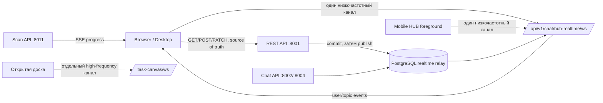

# План развития WebSocket и realtime в HUB-IT

Статус: первый вертикальный срез HUB-уведомлений развёрнут в production. Realtime-инвалидация задач, почты, Dashboard, документооборота/1С, presence задач и Scan SSE реализована и проверена локально, но новые изменения ещё не опубликованы и соответствующие процессы не перезапущены в production. Ручной authenticated smoke двумя пользователями, baseline/ADR и rollout-метрики ещё не завершены. Актуализирован: 2026-08-31.

## Главный вывод

WebSocket в HUB-IT реально нужен не только чату. Наибольшую пользу он даст там, где один пользователь должен почти сразу увидеть изменение, сделанное другим пользователем или фоновым процессом:

1. общие уведомления и счётчики;
2. задачи, чек-листы и комментарии;
3. новые письма и непрочитанные;
4. заявки поддержки, когда с ними одновременно работают несколько сотрудников;
5. присутствие пользователей.

Для Scan Center и длительных импортов правильнее использовать **SSE**, потому что данные идут в основном от сервера к браузеру. REST остаётся источником истины и способом выполнения обычных команд. WebSocket/SSE только доставляет событие или сигнал на точечное обновление.

На первом этапе отдельный процесс не нужен: общий realtime endpoint можно обслуживать существующими процессами `itinvent-chat` на портах `8002/8004`, используя действующий PostgreSQL relay. Высокочастотный канал доски задачи остаётся отдельным соединением, открытым только пока пользователь находится на доске.

## Состояние реализации

- Добавлен authenticated endpoint `/api/v1/chat/hub-realtime/ws`, не требующий `chat.read` и автоматически подписывающий пользователя только на его серверную комнату.
- Событие `hub.notification.created` планируется только после успешного commit; при rollback событие не отправляется.
- Split API публикует событие через существующий PostgreSQL relay без отдельного listener и без нового процесса.
- Browser/Desktop-клиент использует heartbeat, bounded send buffer, reconnect с exponential backoff и jitter, а после `4401` выполняет один refresh/reconnect.
- Событие является invalidation-сигналом: `MainLayout` немедленно запускает существующий REST poll. 20-секундный polling пока сохранён как fallback.
- Задачи публикуют события после commit только пользователям, проходящим действующую access policy; клиенты выполняют debounce REST-сверку списка и открытой карточки.
- Почта публикует события о новом письме и изменении состояния; счётчики и открытые представления сверяются через существующий REST API.
- Документооборот публикует адресное `docflow.task.changed` после назначения, действия и серверной сверки статуса; завершившаяся синхронизация каталога 1С публикует `integration.1c.sync.completed` или `integration.1c.sync.failed` пользователям с соответствующим разрешением.
- Dashboard web/Desktop и foreground Android выполняет тихую debounce-сверку затронутых REST-секций по realtime-инвалидации.
- Карточка задачи в web/Desktop и Android показывает доступный текстовый presence и аватары пользователей; подписка проверяет право просмотра задачи и восстанавливается после reconnect.
- Scan API предоставляет authenticated SSE `/api/v1/scan/events`: broker выполняет один компактный агрегатный запрос раз в 2 секунды только при наличии подписчиков. Web/Desktop отключает 3-секундный activity polling при подключённом SSE и автоматически возвращает его при разрыве; 30-секундная REST-сверка сохранена.
- Android использует тот же канал только в foreground, при уходе приложения в background соединение закрывается; native push остаётся каналом фоновой доставки.
- Клиентский rollback-флаг: собрать frontend с `VITE_HUB_REALTIME_ENABLED=0`; REST polling продолжит работать без изменения backend.
- Пройдены профильные backend/frontend тесты и production build; live `index.html` и realtime bundle совпали с локальной сборкой по SHA-256.
- Выполнен rolling restart Chat-узлов `8002/8004`; оба узла подтвердили PostgreSQL realtime, готовый subscriber и пойманный relay cursor. IIS ARR и WebSocket включены, unauthenticated handshake через оба локальных узла и публичный адрес возвращает ожидаемый `401`.
- Сразу после rolling restart на `chat-a` зарегистрирован краткий reconnect-всплеск: один WebSocket handshake `503` и два REST `500` из-за `APP_DB_POOL_SIZE=2`. Повторения в первичном наблюдении не было; клиенту добавлен случайный initial reconnect spread до 5 секунд. Состояние требует наблюдения по production-метрикам.
- Ручной authenticated smoke двумя реальными пользователями и измерение `DB commit → UI` пока не выполнены.

## Что уже есть

| Область | Текущее состояние | Ограничение |
|---|---|---|
| Chat | WebSocket `/api/v1/chat/ws`, комнаты, presence, heartbeat, bounded queues, rate limits, PostgreSQL relay | Endpoint требует `chat.read` и является доменно привязанным к Chat |
| Доска задачи | Отдельная комната `/api/v1/chat/task-canvas/ws`, курсоры и сцены в realtime, REST-сохранение с revision | Высокочастотный специальный канал, его не следует использовать для общих уведомлений |
| HUB-уведомления | WebSocket invalidation `/api/v1/chat/hub-realtime/ws` + REST polling `/hub/notifications/poll` каждые 20 секунд как fallback | До production smoke нельзя увеличивать интервал fallback polling |
| Почта | Realtime-инвалидация + REST-сверка web/Desktop/foreground Android реализована локально | Production rollout и authenticated smoke ещё не выполнены; закрытое мобильное приложение получает события через native push |
| Задачи | Realtime-инвалидация + REST-сверка списка и карточки web/Desktop/foreground Android реализована локально | Production rollout и authenticated smoke ещё не выполнены; доска использует отдельный high-frequency канал |
| Scan Center | SSE-инвалидация + REST snapshot web/Desktop реализована локально; при подключённом SSE 3-секундный activity polling отключён | Production rollout и authenticated smoke через IIS ещё не выполнены; native Android сохраняет REST polling |
| Dashboard | Realtime-инвалидация + тихая debounce REST-сверка web/Desktop/foreground Android реализована локально | Production rollout и проверка фактической задержки ещё не выполнены |
| Presence задачи | Общая WebSocket-комната задачи, peer sync и UI web/Desktop/foreground Android реализованы локально | Нужен authenticated smoke двумя пользователями и проверка reconnect между Chat-узлами |
| Документооборот/1С | Адресные события документооборота и permission-scoped результат синхронизации 1С реализованы локально | Событие отражает уже завершившуюся backend-синхронизацию и не ускоряет сам вызов 1С |

Фактические точки входа:

- [Chat WebSocket](../../WEB-itinvent/backend/api/v1/chat/ws.py);
- [общий realtime transport](../../WEB-itinvent/backend/chat/realtime.py);
- [доска задачи](../../WEB-itinvent/backend/api/v1/chat/task_canvas_ws.py);
- [polling уведомлений](../../WEB-itinvent/frontend/src/components/layout/MainLayout.jsx);
- [загрузка задач](../../WEB-itinvent/frontend/src/pages/tasks/hooks/useTasksListQuery.js);
- [polling Scan Center](../../WEB-itinvent/frontend/src/pages/scan-center/ScanCenterPage.jsx).

## Где realtime действительно поможет

| Приоритет | Область | Рекомендуемый транспорт | Реальная польза | Что передавать |
|---|---|---|---|---|
| P0 | HUB-уведомления и badge | Общий WebSocket | Убирает задержку до 20 секунд, уменьшает polling, синхронизирует браузер и Desktop | `notification.created`, `notification.read`, `unread.changed` |
| P0 | Задачи | Общий WebSocket + REST | Доска, календарь и карточка сразу отражают статус, срок, исполнителя, чек-лист и комментарии коллег | Событие с `task_id`, `revision`, видом изменения; полную карточку клиент при необходимости получает REST |
| P1 | Почта | Общий WebSocket | Мгновенный badge и уведомление после того, как backend обнаружил письмо; синхронизация прочитанного между вкладками | `mail.message.received`, `mail.unread.changed`, `mail.message.state_changed` |
| P1 | Заявки поддержки | Общий WebSocket | Очередь диспетчеров сразу видит создание, назначение, передачу и смену статуса | `support.case.created`, `assigned`, `status_changed`, `queue_changed` |
| P1 | Scan Center | SSE, не WebSocket | Заменяет 3-секундный polling активных заданий и ускоряет показ прогресса/инцидентов | `scan.task.progress`, `scan.task.completed`, `scan.incident.created`, `scan.agent.state_changed` |
| P2 | Присутствие | Общий WebSocket | Показывает, кто сейчас в задаче/чате, и помогает понять риск одновременного редактирования | `presence.updated`, агрегированное по пользователю и его соединениям |
| P2 | Dashboard | Событие-инвалидация через общий WebSocket | Обновляет только затронутый счётчик без полной перезагрузки dashboard | `dashboard.invalidate` с перечнем секций |
| P2 | Документооборот/1С | WebSocket или SSE после очередного sync | UI сразу отражает уже обнаруженное backend изменение, но не ускоряет саму 1С | `docflow.task.changed`, `sync.completed`, `sync.failed` |

## Где WebSocket не нужен

- Загрузка файлов: прогресс отправки уже известен браузеру через HTTP upload progress. Realtime нужен только для последующей серверной обработки.
- Обычное редактирование оборудования, справочников и настроек: REST с optimistic revision/ETag надёжнее; можно отправлять лишь событие-инвалидацию другим открытым клиентам.
- Команды Windows scan/inventory-агентам: текущая durable polling/outbox-модель лучше переживает офлайн. WebSocket нельзя делать единственным способом доставки команды агенту.
- Фоновые уведомления закрытому PWA/Android: их должен продолжать доставлять Web Push/native push. WebSocket работает только при живом приложении.
- Одноразовые отчёты и короткие запросы: обычный REST проще и дешевле.

## Целевая архитектура



### Один общий низкочастотный канал

Использовать `/api/v1/chat/hub-realtime/ws` в существующем Chat runtime. Он аутентифицирует любого активного пользователя, но не требует `chat.read`. Пользовательская комната назначается сервером; клиент не может указать чужой `user_id`.

Первоначальные topic-типы:

- `user:<current_user_id>` — персональные уведомления и badge, подписка автоматическая;
- `tasks:user:<current_user_id>` — доступные пользователю задачи;
- `task:<task_id>` — открытая карточка задачи после серверной проверки доступа;
- `mail:user:<current_user_id>` — только при `mail.read`;
- `support:queue:<queue_id>` — только для участников очереди.

Клиент не должен иметь возможность подписаться на чужой `user_id` простым указанием topic. Сервер сам вычисляет разрешённые аудитории.

### Отдельный канал доски

`task-canvas/ws` остаётся отдельным, потому что курсоры и сцены:

- передаются намного чаще обычных событий;
- имеют отдельные лимиты размера и частоты;
- могут отбрасываться или объединяться при backpressure;
- не должны задерживать уведомления, задачи и почту.

Отдельный **процесс** для доски пока не требуется — только отдельное соединение и отдельная очередь в существующем runtime.

### Формат сообщения

Для новых доменов использовать единый versioned envelope:

```json
{
  "version": 1,
  "event_id": "uuid",
  "type": "tasks.task.updated",
  "entity_id": "task-id",
  "revision": 17,
  "occurred_at": "2026-08-28T12:00:00Z",
  "payload": {
    "changed_fields": ["status", "assignee_user_id"]
  }
}
```

Правила:

- событие публикуется только после успешного commit;
- `event_id` используется для дедупликации;
- `revision` не позволяет применить устаревшее событие поверх нового состояния;
- payload остаётся небольшим и не содержит секретов или полного тяжёлого объекта;
- при неизвестной ревизии, пропуске события или reconnect клиент запрашивает актуальный snapshot через REST;
- cursor/presence/typing — volatile-события, их можно coalesce/drop;
- уведомления и бизнес-данные сначала сохраняются в БД, а WebSocket лишь ускоряет доставку.

### Совместимость и отказоустойчивость

- Существующий `/api/v1/chat/ws` сохраняется на период миграции.
- Новый frontend-клиент поддерживает heartbeat, exponential backoff с jitter, восстановление после `4401`, ограниченный буфер и полный resync после reconnect.
- На первом rollout REST polling остаётся fallback, но его интервал увеличивается до 2–5 минут после стабильного WebSocket-соединения.
- Адаптивный 2-минутный интервал подготовлен за `VITE_HUB_REALTIME_RELAX_POLLING=1`: он включается только после 5 секунд стабильного соединения и немедленно возвращает 20-секундный fallback при разрыве. До production smoke флаг остаётся `0`.
- При недоступном WebSocket все операции продолжают работать через REST.
- Межпроцессная доставка использует существующий PostgreSQL relay; Redis, Docker и новый broker не добавляются.
- Если `APP_DATABASE_URL` и `CHAT_DATABASE_URL` физически разделены, publisher работает после commit и не пытается создать общую SQL-транзакцию. Потерянный сигнал восстанавливается snapshot/refetch.

## Этапы реализации

### Этап 0. Baseline и общий realtime-контракт

1. Зафиксировать текущую частоту и нагрузку polling endpoints: запросы/минуту, p95, объём ответа.
2. Добавить ADR для общего gateway и границ Chat/realtime.
3. Выделить совместимую инфраструктуру в `backend/realtime/`, сохранив re-export для Chat.
4. Добавить `/api/v1/chat/hub-realtime/ws`, серверную user-room подписку и `hub.realtime.connected` с требованием REST snapshot.
5. Добавить `frontend/src/lib/hubRealtimeSocket.js` и глобальный bootstrap для web/Desktop.
6. Подготовить IIS WebSocket route к существующим `8002/8004` без нового PM2-процесса.

Готово, когда соединение восстанавливается после сна, сетевого разрыва, refresh токена и переключения между узлами без потери REST-функциональности.

### Этап 1. HUB-уведомления — первый вертикальный срез

1. После сохранения уведомления публиковать событие целевому пользователю.
2. Через тот же канал передавать изменение unread-счётчиков.
3. В `MainLayout` обновлять bell/badge точечно и дедуплицировать по `event_id`.
4. Сохранить 20-секундный polling как rollout fallback, затем увеличить его интервал после подтверждения стабильности.
5. Сопоставить все каналы: Hub toast, браузер/Desktop notification, Web Push и native push — одно событие не должно показываться дважды.

Это лучший первый срез: небольшая бизнес-логика, заметный пользовательский эффект и простой rollback на текущий polling.

### Этап 2. Задачи

Статус: реализовано и проверено локально; production rollout не выполнялся.

1. Публиковать `created/updated/deleted`, изменения статуса, срока, участников, чек-листа, файлов и комментариев.
2. Вычислять получателей по фактической task access policy, включая исполнителя, контролёра, наблюдателей и `tasks.manage_all` только там, где это разрешено.
3. В списке точечно patch/remove элемент, если изменение не влияет на фильтры.
4. Если изменение влияет на фильтры, пагинацию или права — debounce-инвалидация и REST refetch.
5. В открытой карточке применять только более новую `revision`; локальную незавершённую форму не перезаписывать молча.

WebSocket не заменяет REST-команды задачи и optimistic concurrency.

### Этап 3. Почта

Статус: реализовано и проверено локально; production rollout не выполнялся.

1. После обнаружения нового письма публиковать минимальное событие и новый unread count.
2. Синхронизировать read/unread между вкладками, браузером и Desktop.
3. Загружать тело письма и вложения только по REST при открытии.
4. Сохранять periodic reconciliation, потому что скорость события ограничена скоростью получения письма самим backend.

### Этап 4. Scan Center через SSE

Статус: реализовано и проверено локально для web/Desktop; production rollout и authenticated IIS smoke не выполнялись. Native Android пока использует существующую REST-сверку.

1. Добавить `/api/v1/scan/events` с авторизацией, heartbeat и фильтрацией по разрешённым событиям.
2. Публиковать только переходы статусов, прогресс, инциденты и online-state агентов.
3. Оставить REST для начального snapshot, таблиц, фильтров и действий оператора.
4. После стабильного соединения отключать 3-секундный activity polling; 30-секундный полный refresh заменить редкой сверкой.
5. При разрыве SSE автоматически возвращаться к существующему polling.

### Этап 5. Заявки поддержки, presence и dashboard

Статус: presence задач, Dashboard и события документооборота/1С реализованы и проверены локально; заявки поддержки остаются следующим отдельным срезом. Production rollout не выполнялся.

Используются уже созданные user/task topics без отдельного WebSocket-клиента для каждой страницы. Presence является volatile-состоянием, а бизнес-данные после события всегда сверяются через REST.

## Проверки и критерии приёмки

### Функциональные

- Два пользователя видят разрешённое изменение задачи без ручного refresh.
- Пользователь без доступа не может подписаться на task/queue и не получает событие.
- После reconnect клиент получает snapshot и исправляет пропущенное состояние.
- Дубликат `event_id` не создаёт повторный toast или повторную мутацию UI.
- Истёкший access token вызывает refresh и reconnect, а не постоянное состояние «недоступно».
- При отключённом WebSocket/SSE REST и fallback polling продолжают работать.

### Нагрузка и наблюдаемость

До rollout снять baseline и сравнивать одинаковые сценарии. Целевые показатели первого этапа:

- p95 `DB commit → UI event` не более 2 секунд внутри корпоративной сети;
- снижение количества запросов к notification polling минимум на 80% после стабилизации;
- отсутствие необработанных duplicate events в UI;
- reconnect p95 не более 10 секунд после краткого сетевого разрыва;
- отдельные метрики connections, reconnects, close codes, auth refresh failures, queue depth, dropped volatile events, slow-consumer disconnects, relay lag и payload bytes;
- Scan: снижение activity polling минимум на 80% при открытой странице активного задания.

### Тестовые слои

1. Backend unit/integration: permission routing, publish-after-commit, отсутствие publish после rollback.
2. Realtime transport: две ноды `8002/8004`, dedupe, ordering/revision, slow consumer и bounded queue.
3. Frontend: reconnect, `4401`, duplicate event, gap/resync, visibility/sleep, fallback polling.
4. Нагрузочный тест: массовые user-targeted события без global broadcast.
5. Ручной smoke: два разных авторизованных пользователя в Browser и Desktop; отдельно mobile при его подключении.

## Когда всё-таки понадобится отдельный процесс

Не создавать его заранее. Решение о `itinvent-realtime` принимать только по измерениям, если выполняется хотя бы одно условие:

- Chat и общие события требуют независимых релизов или SLA;
- нагрузка общих подписок заметно ухудшает chat send/ACK p95;
- растут event-loop lag, queue wait, slow-consumer disconnects или relay lag;
- общие подключения нужно масштабировать иначе, чем Chat.

До этого момента отдельный endpoint и очереди внутри существующего Chat runtime дают изоляцию без лишней инфраструктуры.

## Рекомендуемый следующий шаг

Следующий шаг после отдельного разрешения на production — опубликовать frontend, штатно перезапустить backend/Chat/Scan и выполнить authenticated smoke. Два пользователя должны проверить presence и изменения задачи в Browser/Desktop/Android; отдельно нужно проверить события документооборота/1С, обновление Dashboard, SSE через IIS, возврат к polling после разрыва и отсутствие доставки пользователю без права. Затем сравнить `DB commit → UI`, polling RPS, reconnect rate, `APP_DB` pool timeouts и ошибки; до этого fallback polling не увеличивать.
