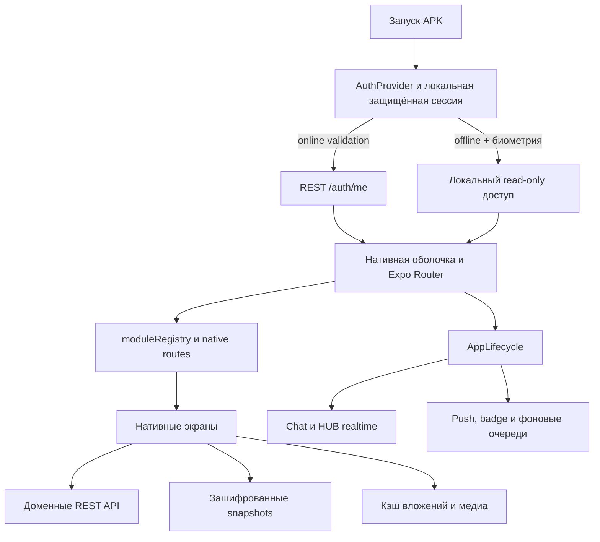

# Карта состояния и проблем mobile-hub APK

Дата аудита: 2026-09-04.

Статус: обновляемая карта актуального рабочего дерева. Последние закрытые срезы — sharded-хранение больших списков, полная пагинация 1С ДО, постоянные пользовательские копии ранее открытых вложений, persistent manifest покрытия offline с прогрессом по разделам и строгая проверка целостности обязательных снимков. Карта фиксирует текущее состояние производительности, offline и release-контура.

## Главный вывод

APK уже работает как нативное Expo React Native приложение без общего WebView-контейнера. Основные нативные экраны, offline-снимки почты, задач, чата, ленты, адресной книги, 1С ДО, Инвентаря, «Моих файлов» и структуры компании существуют, а автоматическая регрессия проходит полностью.

До статуса «полноценный offline и оптимизированный release» остаются системные разрывы:

1. физические p50/p95 cold start и перехода из push ещё не измерены на Android-устройстве;
2. `npm audit --omit=dev` сообщает 48 moderate-записей, но все они распространяются от одного транзитивного advisory `decode-uri-component`; входящие Android/system intent ограничены 4096 символами до URL-декодирования, а совместимое upstream-обновление React Navigation/Expo ещё ожидается;
3. нет физического Android-устройства для проверки cold start, памяти, FPS, клавиатуры, push и airplane mode.

## Архитектурная карта



Ключевые точки:

- запуск и auth: `mobile-hub/app/_layout.tsx`, `mobile-hub/src/auth/AuthContext.tsx`;
- жизненный цикл: `mobile-hub/src/lifecycle/AppLifecycle.tsx`;
- маршруты: `mobile-hub/src/navigation/moduleRegistry.ts`;
- кэш: `mobile-hub/src/cache/nativeSnapshotCache.ts`, `nativeSnapshotStorage.ts`, `nativeAddressBookSnapshot.ts`, `nativeEquipmentCatalogSnapshot.ts`;
- предварительная подготовка offline: `mobile-hub/src/offline/nativeOfflinePreparation.ts`;
- manifest покрытия и фоновое обновление: `mobile-hub/src/offline/nativeOfflineCoverage.ts`, `nativeOfflineBackgroundRefresh.ts`;
- состояние связи: `mobile-hub/src/components/layout/HubConnectionHeader.tsx`;
- счётчики: `mobile-hub/src/navigation/useNavUnreadCounts.ts`, `mobile-hub/src/notifications/notificationBadge.ts`, `mobile-hub/src/dashboard/DashboardScreen.tsx`.

## Карта экранов и offline

Обозначения:

- **полный** — есть локальная модель списка и открытых деталей;
- **частичный** — часть данных доступна, но не весь сценарий;
- **нет** — экран нативный, однако без сети показывает пустое или ошибочное состояние при отсутствии live-ответа.

| Модуль | Включён по умолчанию | Список offline | Открытая деталь offline | Offline-действия | Состояние |
|---|---:|---:|---:|---:|---|
| Главная | да | да | н/п | нет | частичный: карточки зависят от охвата других модулей |
| Уведомления | да | да | через целевой модуль | очередь только для поддержанных действий | частичный |
| Задачи | да | да | да, если открывалась | часть действий через очередь | полный для ранее открытых данных |
| Чат | да | да | да, если диалог открывался | исходящие используют локальную очередь | полный для текста; успешно открытые медиа сохраняются в app-private storage |
| Почта | да | да | письмо/цепочка, если открывались | сетевые команды не маскируются под успех | полный для ранее открытых писем; скачанные вложения сохраняются локально |
| Адресная книга | да | полная копия с автоматическим обновлением | локальная карточка | новый неизвестный чат требует сеть | полный после первой успешной автоматической или ручной синхронизации |
| 1С ДО | да | да | да, если открывалась | сетевые переходы честно ограничены | полный для ранее открытых данных |
| Лента | да | да, включая локальный поиск/фильтры | да, если открывалась; комментарии и загруженные ветки сохраняются | мутации блокируются offline | полный для ранее открытых данных |
| Инвентарь | да | да: полные каталоги всех доступных баз, локальный поиск | любая карточка из полного каталога; ранее открытые вкладки сохраняются дополнительно | QR и локальная навигация доступны, серверные изменения блокируются | полный read-only каталог после успешной фоновой/ручной подготовки |
| Мои файлы | да | да: список и квота | да для файлов с явным статусом «Офлайн»; временные preview остаются в cache | локальное открытие/отправка и удаление offline-копии доступны, серверные действия блокируются | полный для закреплённых файлов |
| Структура компании | да | да: полное дерево и локальный поиск | сотрудники ранее открытых подразделений | навигация локальная, изменения блокируются | полный для ранее открытых данных |
| Пароли | да | нет | нет | нет | нативный vault включён; offline-кэш секретов не создаётся |
| МФУ | да | нет | нет | нет | нативный список и read-only детали включены; требуется сеть |
| Scan Center, компьютеры, группы, склад 1С | canary, обычно нет | нет | нет | нет | добавлять после основных модулей |

Важное ограничение: метаданные письма или сообщения сами по себе не означают, что связанный файл уже скачан. После успешного открытия вложения Chat, Mail, Tasks, 1С ДО, Feed или Инвентаря рабочая копия сохраняется в пользовательском app-private каталоге до явной очистки кэша файлов или logout. Физическую сохранность после перезапуска процесса и нехватки места ещё нужно подтвердить на Android.

## Карта настроек пользователя

### До реализации среза 1A

```text
Профиль
  -> Помощники и заместители
  -> Роль и доступ
  -> Общая кнопка сохранения
```

### Реализовано 2026-09-01

```text
Профиль
  -> Роль и права доступа
       -> итоговая роль
       -> источник аутентификации
       -> базовые права
       -> персональный набор прав по группам
  -> Помощники и заместители
       -> уже назначенные
       -> поиск и назначение
  -> сохранение с отдельным статусом каждого блока
```

Перенос выполнен: сначала определяется, что пользователь может делать, затем — кому делегируются его задачи. Добавлена компактная сводка «Права роли»/«Персональный набор», а текст явно сообщает, что персональный набор заменяет шаблон роли.

### Закрыто в срезе 1A

Нативный экран больше не вызывает полный `authUserAdminApi.listUsers()`. Новый обратносуместимый `GET /auth/users/search` выполняет поиск и фильтрацию на уровне app DB, возвращает основную страницу максимум по 50 строк и результаты назначения максимум по 30 строк. Для уже назначенных ID используется bounded-запрос, а legacy `/auth/users` сохранён для web-клиента.

Регрессия подтверждает: при справочнике 5000 записей legacy JSON-путь возвращает только запрошенные 30; app DB поиск не вызывает полный `_load_users()`. Старый async `/auth/users` переведён в threadpool, чтобы его legacy-вызов не блокировал event loop.

## Карта производительности

| Контур | Текущее поведение | Риск | Приоритет |
|---|---|---|---:|
| Cold start / auth | известный Android offline сразу открывает защищённый gate; `/auth/me`, refresh и transport-retry делят единый бюджет 5 с | физический p95 ещё не измерен | закрыто кодом, device-check ожидается |
| HUB-индикатор | успешная auth/REST-сессия означает «На связи», realtime-сбой показывается отдельно | физическая смена состояний ещё не проверена | закрыто кодом, device-check ожидается |
| Непрочитанное | nav, Android badge и Dashboard делят один snapshot; Chat использует `/chat/unread-summary` | стартовый контур сокращён с 7 до 4 HTTP-запросов | закрыто кодом |
| Пользователи админки | bounded `/auth/users/search`, страницы 50/30 | физический p95 ещё не измерен | закрыто кодом, device-check ожидается |
| Адресная книга | один permission-filtered `/address-book/snapshot`; legacy-пагинация только при `404/405`; полная копия автоматически revalidate после входа/возврата сети/foreground и Android BackgroundTask; split записи отдаёт event loop после 128 записей или 256 КиБ | физический p95, память и полный production-объём ещё не измерены | CPU/network-blocking закрыт кодом, device-check ожидается |
| Медиа чата | однопроходный cleanup не чаще 5 минут/16 МиБ; одновременно загружаются максимум 3 preview | физический p95 первого preview ещё не измерен | закрыто кодом, device-check ожидается |
| Списки | Chat inbox, Address Book, 1С ДО, Tasks, Feed, Инвентарь, Компьютеры, «Мои файлы», Пароли, МФУ, Центр уведомлений, Структура компании и «Доступ к папкам» не перерисовывают видимые строки при локальном вводе/spinner; Mail виртуализирован и защищён render-count регрессией | физический FPS ещё не измерен | P2, device-check ожидается |
| APK | две ABI; native libraries занимают основную долю | больший файл и время загрузки | P2 |

## Карта APK

Проверенный локальный артефакт: `mobile-hub/dist/hubit-mobile-preview.apk`.

- версия: `1.1.24`, `versionCode 26`, package `ru.zsgp.hubit.mobile`;
- размер: 61,97 МиБ (64 983 188 байт);
- `arm64-v8a`: 24,29 МиБ native libraries;
- `armeabi-v7a`: 16,55 МиБ native libraries;
- DEX: 8,72 МиБ в архиве;
- JS bundle: 5,57 МиБ;
- resources/assets без JS bundle: около 6,07 МиБ;
- Hermes, New Architecture, release minify и resource shrinking включены;
- x86 ABI отсутствуют;
- Android v2-подпись валидна, но текущая сборка подписана `debug-preview`: stable-публикация запрещена до настройки постоянного release keystore.

Отдельная arm64-сборка теоретически убирает около 16,49 МиБ из текущего APK, но решение нельзя принимать без проверки парка устройств. Build-скрипт уже поддерживает выбор архитектуры, поэтому новая инфраструктура не нужна.

## Найденные недостатки

### P0 — мешают обещать полноценный offline или быстрый вход

Закрытых P0 по коду нет; перед обещанием production-готовности остаётся физическая Android-приёмка.

### P1 — заметные UX и нагрузочные дефекты

Cache cleanup медиа чата закрыт кодом: повторный cache-hit сокращён с четырёх обходов каталога до одного первого прохода, а дальнейшее обслуживание ограничено интервалом и приростом размера.

1. Dependency-аудит сокращён с 54 propagated-записей от двух корневых advisory до 48 записей от одного: уязвимая `uuid`-цепочка `xcode` закрыта точечным override на `11.1.1`; оставшийся `decode-uri-component` защищён лимитом внешнего intent, но не может быть безопасно заменён несовместимым major override внутри текущего Expo/React Navigation. Дополнительная propagated-запись появилась вместе с необходимым `expo-video`, нового корневого advisory нет.
2. README и часть старых mobile-документов содержат несовместимые версии и WebView-era сведения.
3. Повторная сортировка полной адресной книги закрыта новым атомарным `/address-book/snapshot`: локальный harness на 15 000 записей сократил median service-подготовки с `3186,7` до `67,3 мс` и чтения кэша с `75` до `1`. JSON-кодирование вынесено из event loop, клиент отвергает неполную ревизию и сохраняет legacy fallback для старого backend.

### P2 — улучшения после измерений

1. Настроить большие FlatList только по профилю реального устройства; render-count Chat inbox сокращён с `22/11` до `0/0`, Address Book, 1С ДО, Feed, Инвентаря, Компьютеров, Паролей и МФУ — с `10/10` до `0/0`, «Мои файлы» — с `10` до `0` при refresh-spinner, Tasks — с `9/9` до `0/0` для локального ввода и spinner-state каждого экрана, Центра уведомлений — с `9` до `0` при refresh-spinner.
2. Перенести сериализацию больших snapshot из критического UI-состояния либо выполнять её порционно.
3. Решить, нужен ли отдельный arm64 release или две архитектуры в одном APK.
4. Добавить метрики cold/warm start, route TTI, JS/UI FPS, PSS и HTTP request count.

## Что уже сделано правильно

- основные маршруты ведут на нативные экраны;
- общий portal/WebView fallback удалён;
- HTML-письмо и отдельные media/export сценарии изолированы и не превращают приложение в WebView-shell;
- Hermes, New Architecture, minify и shrink уже включены;
- snapshots шифруются, очищаются при logout и не раскрывают cached identity до защищённого unlock;
- адресная книга получила атомарный manifest и зашифрованные shards;
- большие коллекции Chat, Tasks, Mail, Feed, 1С ДО и Инвентаря автоматически переходят на атомарные AES-shards, а прерванная замена не уничтожает предыдущую читаемую ревизию;
- persistent offline-coverage manifest хранит по разделам `complete/partial/failed`, количество загруженных объектов, общее количество, время последней попытки и безопасную причину ошибки;
- Chat и Mail используют виртуализированные списки и single-flight для одинаковой загрузки медиа;
- обслуживание cache медиа чата использует один снимок каталога, не повторяется на каждом hit и не блокирует готовое медиа при временной ошибке файловой системы; очередь ограничивает preview-загрузки тремя и удаляет отменённые до старта запросы;
- inline-ответ обновляет тот же Android notification identifier/tag на стадиях «Отправка» и «Отправлен», поэтому RemoteInput закрывается без гонки с отдельным dismiss; зависший REST-вызов через 8 с переводится в повторяемую очередь, badge/cleanup не блокируют завершение;
- каталоги эмодзи/стикеров используют bounded `FlatList`, миниатюры не запускают анимацию, а сообщения и большой preview воспроизводят TGS через Lottie и WebM через Expo Video с учётом reduced motion; legacy-вложения распознаются также по `format` и расширению файла при общем MIME;
- «Мой диск» хранит явные offline-копии в постоянном app-private каталоге пользователя, зашифрованный manifest проверяет размер и срок хранения; копии очищаются при logout;
- cold start с сохранённой сессией выполняет ограниченную общим бюджетом 5 с проверку `/auth/me`, даже если Android ошибочно не подтвердил корпоративную сеть; недавний успешный ответ HUB в течение 30 с имеет приоритет над кратким ложным offline-событием;
- фоновые push/badge/offline-queue синхронизации ждут первого idle-периода и не конкурируют с начальной навигацией;
- HUB показывает рабочую REST-сессию сразу, а недоступный realtime обозначает как отсутствие мгновенных обновлений, а не как общий offline;
- nav, Dashboard и Android badge используют общий короткий unread snapshot; событийные refresh обходят cache, локальное чтение письма сразу обновляет системный badge;
- готовность offline вычисляется по всем доступным пользователю обязательным модулям; настройки показывают сохранённые и недостающие разделы;
- готовность обязательных снимков проверяет их фактический payload-контракт; пустой или повреждённый файл больше не считается подготовленным, а Инвентарь требует корректный стартовый список и полный каталог каждой доступной базы;
- подготовка offline включает список и папки Chat, единый центр уведомлений HUB/Mail и проверяет, что ограниченные сервером страницы не выдаются за полный снимок;
- списки Chat, Tasks, Feed и Mail сохраняют объединённые уже открытые страницы, поэтому пагинация не затирает первую offline-страницу последующей;
- адресная книга входит в готовность только после успешного чтения manifest и каждого зашифрованного shard;
- обычные зашифрованные snapshots заменяются через проверенный `.pending` и резервную копию; прерванная запись не уничтожает предыдущую рабочую версию;
- разбиение полной адресной книги больше не монополизирует JS-поток: между порциями до 128 записей/256 КиБ event loop получает управление, а предыдущая полная ревизия сохраняется до атомарного commit новой;
- адресная книга и Инвентарь автоматически обновляются local-first после входа, при возврате сети/foreground и через зарегистрированный Android BackgroundTask; частота тяжёлой загрузки ограничена шестью часами;
- лёгкое фоновое обновление Chat и Центра уведомлений выполняется раньше тяжёлых снимков адресной книги и Инвентаря и также ограничено шестью часами;
- Инвентарь загружает все страницы каждой доступной базы по 200 записей, проверяет полноту, сохраняет каталог атомарными зашифрованными shards и открывает из него список, поиск, QR и карточку без API;
- 1С ДО загружает следующие страницы по `offset/next_offset` до `has_more=false`; усечённый или незавершённый ответ остаётся `partial`, а не выдаётся за полный offline-снимок;
- подготовка offline сохраняет стандартную ленту, а открытые публикации — вместе с комментариями и загруженными ветками;
- зависимости выровнены штатным Expo CLI в пределах SDK 57 без major/minor-перехода; новые runtime-пакеты ограничены подтверждённой задачей нативных TGS/WebM-стикеров;
- `@noble/hashes` обновлён до поддерживаемого ESM API, поэтому Android Metro больше не использует fallback к неэкспортируемому `crypto.js`; `uuid` внутри build-only `xcode` закреплён на исправленной версии, а Jest явно преобразует обе ESM-зависимости;
- автоматическая регрессия всего `mobile-hub` зелёная.

## Фактические проверки

- `npm run lint` — успешно;
- `npm test -- --runInBand --silent` — 235/235 suites, 1208/1208 tests;
- `npx expo-doctor` — 21/21 checks;
- `CI=1 npx expo install --check` — dependencies are up to date;
- `npx expo export --platform android` — успешно; HBC bundle 7 069 731 байт, 2066 модулей, 48 assets, маршруты `/passwords` и `/mfu` присутствуют, предупреждение `@noble/hashes/crypto.js` отсутствует;
- чистая `assembleRelease` preview-сборка — успешно, 681 задача, Lottie codegen/native autolinking и `expo.modules.video.VideoModule` подтверждены generated package lists;
- `aapt`/`apksigner`/audit — package, версия, SDK 24–36, две ABI, SHA-256 и v2-подпись подтверждены; signing=`debug-preview`;
- preview 1.1.24 опубликован атомарно; локальный и публичный manifest/APK подтверждают versionCode 26, MIME, размер 64 983 188 байт и SHA-256 `aa0308fe2560ed72bdb9299dbdbef0609d2c01f4e673f538f9fac44fe96369a7`; rollback manifest указывает на 1.1.23;
- `npm audit --omit=dev --json` — 48 moderate propagated-записей, один корневой advisory `decode-uri-component`; до среза было 54 записи от двух advisory;
- address-book API/service и связанные backend-потребители — 119/119 тестов; mobile snapshot/offline/screen — 19/19 тестов;
- Address Book render-count regression — один символ до debounce и sync-spinner: `10/10→0/0` повторных render для 10 смонтированных строк;
- 1С ДО render-count regression — один символ черновика поиска и refresh-spinner: `10/10→0/0` повторных render для 10 смонтированных карточек;
- Tasks render-count regression — один символ поиска и refresh-spinner: `9/9→0/0` повторных render для 9 смонтированных карточек;
- Feed render-count regression — один символ поиска и refresh-spinner: `10/10→0/0` повторных render для 10 смонтированных карточек;
- Инвентарь / оборудование render-count regression — один символ поиска и refresh-spinner: `10/10→0/0` повторных render для 10 смонтированных карточек;
- Инвентарь / расходники render-count regression — один символ поиска и refresh-spinner: `10/10→0/0` повторных render для 10 смонтированных строк;
- Инвентарь / акты render-count regression — один символ поиска и refresh-spinner: `10/10→0/0` повторных render для 10 смонтированных карточек; два немедленных нажатия запускают один download;
- Chat inbox render-count regression — один символ поиска и refresh-spinner: `22/11→0/0` повторных render для смонтированных строк; открытие, долгое нажатие и mute/archive-свайпы сохраняют item-callback контракт;
- Компьютеры render-count regression — один символ черновика поиска и refresh-spinner: `10/10→0/0` повторных render для 10 смонтированных карточек; переход по MAC и пагинация сохраняют прежний контракт;
- «Мои файлы» render-count regression — включение refresh-spinner: `10→0` повторных render для 10 смонтированных карточек; открытие, preview, офлайн-копии, sharing, удаление и загрузка сохраняют item-callback контракт;
- Пароли render-count regression — один символ черновика поиска и refresh-spinner: `10/10→0/0` повторных render для 10 смонтированных карточек; fail-closed screen-capture gate и очистка метаданных при offline сохранены;
- МФУ render-count regression — локальный поиск и refresh-spinner: `10/10→0/0` повторных render для 10 смонтированных карточек; поиск по полному IP и открытие нативных деталей сохранены;
- Центр уведомлений render-count regression — включение refresh-spinner: `9→0` повторных render для девяти смонтированных строк; переход, read-state и offline-поведение сохраняют прежний контракт;
- Mail inbox render-count regression — включение refresh-spinner сохраняет `0` повторных render уже смонтированных строк писем;
- Структура компании render-count regression — включение refresh-spinner: `11→0` повторных render смонтированных карточек подразделений; переход и открытие сотрудников используют стабильные item-callbacks с ID подразделения;
- «Доступ к папкам» render-count regression — включение refresh-spinner: `20→0` повторных render для двадцати смонтированных карточек;
- offline-каталоги — тестами подтверждены полная постраничная загрузка всех доступных баз, атомарное сохранение каталога больше одного snapshot, отказ от замены целой версии при ошибке, локальное открытие списка/поиска/QR/карточки без API и фоновое обновление адресной книги;
- offline/cache/auth-регрессии подтверждают атомарную замену снимка, сохранение объединённой пагинации Chat, подготовку Chat/уведомлений и приоритет недавнего успешного HUB API над ложным Android-offline;
- загрузки вложений идут во временный `.part` и попадают в постоянный пользовательский app-private каталог только после проверки существования и ненулевого размера; старый корректный файл сохраняется при сетевой ошибке;
- worker уведомлений 1С ДО циклически обходит кандидатов между запусками вместо постоянной обработки только первых 50 пользователей;
- Android inline-reply — 22/22 профильных теста: один identifier на промежуточном/финальном статусе, 8-секундный REST deadline, offline retry и неблокирующий cleanup;
- Chat sticker/rendering — 70/70 профильных тестов: TGS/WebM, legacy generic MIME, picker virtualization и экран чата;
- одинаковый CPU-harness `/address-book/search` pages против `/address-book/snapshot`: median `12,2→3,5 мс` (1000), `369,8→18,8 мс` (5000), `3186,7→67,3 мс` (15000); чтения кэша `5/25/75→1`;
- статический аудит маршрутов, cache scopes, auth, lifecycle, счётчиков, настроек, списков, медиа и Android release config;
- локальный APK разобран по размеру и ABI.

Не проверено: физический Android, cold/warm p50/p95, PSS, JS/UI FPS, TalkBack, клавиатура, push/deep link, 20 циклов offline/online и реальная полнота production-адресной книги.
