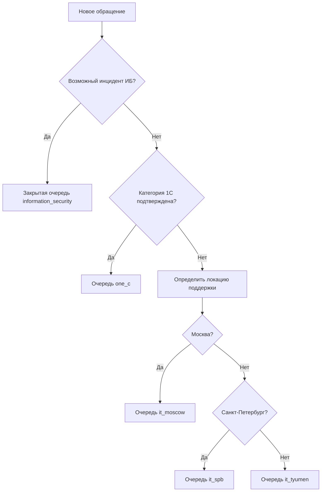

# Архитектура чата технической поддержки HUB-IT

> - Статус: **Draft / обсуждение**
> - Дата: **2026-08-11**
> - Владелец продукта: требует назначения
> - Область: WEB-itinvent, существующий корпоративный чат, Inventory, ITINVENT, адресная книга 1С/ZUP

## Краткое решение

В существующем `/chat` появляется закреплённый вход **«Поддержка»**. Создание обращения состоит из двух коротких шагов: пользователь выбирает **1С**, **Техническая поддержка**, **Информационная безопасность** или **Не знаю / другое**, затем описывает проблему обычным сообщением и при необходимости добавляет файлы. Только отправка описания создаёт приватное **обращение поддержки**: это уже полноценная рабочая единица с очередью, исполнителем, статусом, сроками и результатом, а не предварительный чат перед созданием другой задачи.

Специалист работает с обращением прямо в чате. Рядом с перепиской HUB-IT показывает source-labelled контекст пользователя: контакты, подразделение, найденные Inventory host, данные inventory-agent и связанную карточку Equipment catalog (ITINVENT). По компьютеру можно сразу перейти в существующую карточку раздела «Компьютеры» с возможностью вернуться в обращение.

Маршрут определяется направлением обращения, внутренней классификацией и городом сотрудника из его карточки 1С/ZUP. Явный выбор ИБ или выявленный правилами признак угрозы направляет возможный инцидент в закрытую очередь информационной безопасности, **1С** — в очередь отдела 1С, а обычная техническая поддержка распределяется по городам: Москва → московская поддержка, Санкт-Петербург → поддержка Санкт-Петербурга, Тюмень и все остальные/неопределённые города → тюменская поддержка.

## Проблема

Сейчас пользователь может написать конкретному специалисту, но у команды нет единой очереди, гарантированного владельца обращения и прозрачного состояния «никто не взял». Специалисту приходится отдельно искать компьютер, филиал, контакты и закреплённое оборудование пользователя. При большом числе сообщений часть работы может потеряться, а выполненная работа не образует достоверную историю для будущей отчётности.

> «Если я взял обращение, решил проблему и закрыл его, это должно считаться выполненной мной работой».

## Термины и границы домена

| Термин | Значение |
|---|---|
| **Обращение поддержки** (`SupportCase`) | Рабочая единица технической поддержки: автор, очередь, исполнитель, статус, переписка, компьютер, таймлайн и результат. |
| **Диалог поддержки** | `ChatConversation` с `kind=support`, связанный ровно с одним обращением. Сообщения и файлы остаются в chat domain. |
| **Очередь поддержки** (`SupportQueue`) | Команда, которая видит невзятые обращения и может назначать исполнителя. |
| **Направление обращения** (`request_type`) | Простой выбор пользователя: `one_c`, `technical_support`, `security` или `unknown`; это входной сигнал, а не окончательная внутренняя категория. |
| **Классификация обращения** | Внутренние категория и подкатегория с источником, уверенностью и версией правил; может быть исправлена специалистом без создания нового обращения. |
| **Перевод обращения** (`QueueTransfer`) | Аудируемая смена текущей очереди с обязательной причиной; история, переписка и автор обращения сохраняются. |
| **Возможный инцидент ИБ** | Сообщение о подозрительном событии, которое должна проверить информационная безопасность; инцидентом оно становится только после валидации. |
| **Исполнитель** | Специалист, атомарно взявший обращение в работу. Закрытие учитывается за ним. |
| **Hub task** | Существующая задача HUB с отдельным workflow `new → in_progress → review → done`. Не является обращением поддержки. |
| **Inventory host** | Runtime-снимок компьютера от inventory-agent: MAC, hostname, Windows login, IP, last seen и payload. |
| **Equipment record** | Карточка техники в Equipment catalog (ITINVENT): инвентарный номер, владелец, ITINVENT branch, статус. |
| **Локация поддержки** | Нормализованный код `moscow`, `spb`, `tyumen` или `other`, используемый только для маршрутизации поддержки. Не подменяет ITINVENT branch, Network branch или Scan branch label. |

Обращение поддержки само является задачей специалиста. Создание отдельного Hub task не требуется для обычного ответа, настройки или ремонта. Связанный Hub task допускается только для отдельной длительной работы, например закупки или проекта, и не должен дублировать исходное обращение.

## Цели и не-цели

### Цели

- дать каждому сотруднику единый и простой вход в техническую поддержку внутри текущего чата;
- исключить общий чат, в котором пользователи видят чужие проблемы;
- дать специалистам общую очередь, индивидуальное назначение и историю состояний;
- автоматически маршрутизировать обращения по локации и отдельно в отдел 1С;
- принимать и изолированно обрабатывать возможные инциденты информационной безопасности;
- позволять безопасно переводить обращения между очередями без потери истории;
- показать специалисту контакты, компьютеры и оборудование без ручного поиска по нескольким разделам;
- сохранять времена и события, необходимые для последующей аналитики;
- устойчиво работать при большом числе новых и невзятых обращений.

### Не-цели первого этапа

- отдельный мессенджер или новый chat runtime;
- автоматическое создание Hub task для каждого вопроса;
- AI-классификация как обязательная часть маршрутизации;
- автоматические ответы пользователю, сценарии бота и база готовых решений — отдельный последующий этап;
- полноценная аналитическая панель и утверждённые SLA — они обсуждаются отдельно;
- изменение данных в 1С или ITINVENT из обращения;
- показ специалистам паролей, содержимого пользовательских файлов или избыточных персональных данных.

## Пользовательский сценарий

1. Пользователь открывает закреплённый пункт **«Поддержка»** в `/chat` и нажимает **«Новое обращение»**.
2. HUB-IT показывает четыре крупные кнопки: **1С**, **Техническая поддержка**, **Информационная безопасность**, **Не знаю / другое**. Внутренние подкатегории пользователю не показываются.
3. После выбора появляется подсказка **«Опишите, что произошло»**, обычный composer чата, вложения и кнопка отправки. Выбор кнопки сам по себе не создаёт пустое обращение.
4. HUB-IT показывает город из карточки сотрудника 1С/ZUP и предполагаемый компьютер. Если компьютеров несколько, пользователь может выбрать нужный; также можно сообщить hostname текстом.
5. Отправка описания создаёт `SupportCase`, `ChatConversation(kind=support)` и первое сообщение с единым `client_request_id`; при раздельных App DB и Chat DB это выполняется идемпотентной сагой через outbox, а не недостижимой общей SQL-транзакцией.
6. Пользователь видит номер обращения, понятное направление, время создания и текущий статус. Внутренний код очереди и технические причины маршрутизации ему не показываются.
7. После назначения отображается имя специалиста. Пользователь продолжает обычную переписку и прикладывает файлы через существующий chat upload pipeline.
8. После решения пользователь может подтвердить **«Всё решено»** или вернуть обращение в работу действием **«Проблема осталась»**.

Пользователь может иметь несколько параллельных активных обращений: проблема 1С не должна блокировать отдельную проблему с компьютером. Каждое нажатие **«Новое обращение»** запускает новый intake, а активные и закрытые обращения доступны отдельным списком.

## Сценарий специалиста

В существующей странице чата у специалиста появляется верхний переключатель режимов **«Чаты / Поддержка»**. Это не четвёртая папка рядом с «Личные / Беседы / Задачи»: в узкой левой колонке для неё уже нет устойчивого места, а пользовательские папки должны остаться отдельной сущностью.

```text
Поддержка
├── Новые                 24
├── Мои                    6
├── Ожидают пользователя   3
├── Просроченные            5
└── Решённые
```

Карточка невзятого обращения показывает:

- номер, автора, локацию и очередь;
- категорию и краткий preview первого сообщения;
- точное время создания и прошедшее время без исполнителя;
- наличие файлов и найденного компьютера;
- приоритет и предупреждение о превышении порога;
- основное действие **«Взять в работу»**.

После нажатия **«Взять в работу»**:

- один специалист становится исполнителем;
- обращение переходит из «Новые» в «Мои» и получает статус `in_progress`;
- все остальные специалисты видят, кто работает с обращением;
- пользователь получает системное сообщение о назначении;
- последующие уведомления идут исполнителю и явно подключённым участникам, а не всей очереди.

Специалист может ответить, уточнить классификацию, перевести в ожидание пользователя, передать в другую очередь/другому специалисту, подключить коллегу, решить или закрыть обращение. Закрытие требует краткого результата и сохраняется как выполненная работа исполнителя. Перевод не создаёт новую задачу и не сбрасывает автора, переписку, время первоначального обращения или историю исполнителей.

## Компоновка интерфейса

### Desktop

Левая колонка переиспользуется, а не расширяется ещё одной строкой папок:

```text
┌───────────────────────────────────────┐
│ [ Чаты ] [ Поддержка 24 ]        ＋  │  ← режим страницы
│                                       │
│ Чаты:      Личные · Беседы · Задачи  │
│ Поддержка: Новые · Мои · Все     ⋯   │  ← контекстная строка
│ Поиск / фильтры                       │
│ Список диалогов или обращений         │
└───────────────────────────────────────┘
```

В режиме «Поддержка» сохранённые представления **«Ожидают пользователя»**, **«Просроченные»** и **«Решённые»** доступны через меню/фильтр, поэтому не занимают постоянную ширину. При сжатии контейнера режимы становятся компактными иконками с tooltip, доступным названием и badge; решение принимается по ширине самой sidebar, а не только окна.

```text
┌────────────────┬─────────────────────────────┬────────────────────────┐
│ Очереди        │ Диалог обращения           │ Контекст пользователя  │
│ Новые / Мои   │ Сообщения и файлы          │ Контакты               │
│ Фильтры       │ Статус и действия          │ Компьютеры             │
│ Список        │ Composer                    │ Оборудование / история │
└────────────────┴─────────────────────────────┴────────────────────────┘
```

Чат остаётся главным содержимым. В правой панели сразу видны только ФИО, подразделение, рабочие контакты и наиболее вероятный активный компьютер. Остальные компьютеры, оборудование и история обращений раскрываются отдельно. Для этого нужен отдельный `SupportContextPanel`, использующий существующую трёхпанельную компоновку; перегружать универсальный `ChatContextPanel` поддержкой не следует.

Обычный пользователь не видит очереди специалистов. У него в режиме чатов закреплён сервис **«Поддержка»**, внутри которого доступны кнопка нового обращения, активное обращение и история собственных обращений.

### Mobile / узкий контейнер

- список очереди и диалог используют существующую мобильную навигацию чата;
- контекст открывается кнопкой **«Данные пользователя»** в шапке как drawer/bottom sheet;
- основные действия со статусом остаются в доступной sticky-зоне и не перекрываются клавиатурой;
- переход к компьютеру сохраняет ссылку возврата в обращение.

## Очереди и маршрутизация

### Начальный набор очередей

| Код | Название | Назначение |
|---|---|---|
| `one_c` | Отдел 1С | Все обращения с подтверждённой категорией `one_c`, независимо от города. |
| `information_security` | Информационная безопасность | Возможные инциденты ИБ; закрытая очередь с отдельной ACL и приоритизацией по риску. |
| `it_moscow` | Техподдержка — Москва | Обычные IT-обращения пользователей Москвы. |
| `it_spb` | Техподдержка — Санкт-Петербург | Обычные IT-обращения пользователей Санкт-Петербурга. |
| `it_tyumen` | Техподдержка — Тюмень и регионы | Тюмень, остальные города и fallback при неопределённой локации. |

Состав очередей не должен определяться глобальной ролью `admin` или `operator`. Он хранится отдельно: активное членство пользователя в конкретной очереди плюс право `support.handle`.

### Управление составом очередей администратором

В существующих настройках HUB-IT появляется раздел **«Техническая поддержка»** с вкладкой **«Специалисты и очереди»**:

- Москва, Санкт-Петербург, Тюмень, отдел 1С и информационная безопасность отображаются отдельными очередями;
- администратор ищет сотрудника и добавляет его в одну или несколько очередей;
- для каждого членства задаётся роль `agent` или `lead`, активность и при необходимости признак основной очереди;
- специалист видит только назначенные ему очереди; lead может управлять обращениями своей очереди в пределах разрешённой политики;
- удаление специалиста из очереди не удаляет его историю и выполненные обращения;
- перед деактивацией последнего активного специалиста интерфейс показывает блокирующее предупреждение, чтобы новые обращения не попадали в очередь без получателя.

Город автора обращения администратор в HUB не назначает: он приходит из карточки сотрудника 1С/ZUP. В этом же разделе можно показать read-only диагностику маршрута — найденного сотрудника 1С, исходный город, нормализованную очередь и дату обновления данных. Если город неверный, исправляется источник в 1С; новое значение применяется к новым обращениям после обновления cache.

Все изменения состава очередей сохраняют автора, время, старое и новое значение.

### Приоритет правил



Таким образом, сообщение о фишинге от пользователя из Москвы направляется информационной безопасности, обращение по 1С — в отдел 1С, а обычная проблема того же пользователя с компьютером — московской техподдержке. При конфликте сигнал безопасности имеет самый высокий приоритет, но обращение пока называется возможным инцидентом, а не подтверждённым инцидентом ИБ.

### Классификация без сложной формы

Нужно разнести три независимых понятия:

1. `request_type` — что нажал пользователь;
2. `category` / `subcategory` — внутренняя классификация проблемы;
3. `queue_id` — какая команда отвечает за обращение сейчас.

Это позволяет исправить классификацию или перевести обращение, не меняя первоначальный выбор пользователя и не создавая дубликат. Для каждого решения сохраняются `classification_source` (`user`, `rule`, `model`, `agent`), `classification_confidence`, `classifier_version` и безопасные `reason_codes`.

MVP работает без обязательной нейросети:

- явный выбор пользователя — основной сигнал;
- детерминированные версионируемые правила предлагают подкатегорию по тексту;
- выбор **«Не знаю / другое»** и низкая уверенность получают `needs_triage=true` и идут в региональную IT-очередь по городу;
- специалист подтверждает или исправляет категорию; ручное решение включает `routing_locked_at/by`, поэтому фоновая классификация не отправляет обращение обратно;
- AI-классификатор можно добавить позже только как предложение или как auto-route для заранее разрешённых несекретных категорий.

Начальная внутренняя таксономия технической поддержки может включать `workstation`, `software`, `access`, `network`, `peripheral`, `account`, `other`; для 1С — отдельные подкатегории, которые должен утвердить отдел 1С. Эти значения выдаются frontend через API справочника, а не зашиваются независимо в нескольких компонентах.

### Информационная безопасность

Кнопка **«Информационная безопасность»** предназначена для подозрений: фишинг/социальная инженерия, вредоносное ПО или шифровальщик, компрометация учётной записи, утечка данных, подозрительная сетевая активность, потерянное/украденное устройство и другое. После первичной проверки ИБ устанавливает отдельное состояние `security_incident_state`: `suspected`, `validated` или `dismissed`. Общий жизненный цикл `new/in_progress/...` при этом не меняется.

Для этой очереди действуют дополнительные инварианты:

- содержание, вложения и расширенный контекст доступны только активным участникам `information_security` с явным restricted-допуском; обычного `support.manage` недостаточно;
- глобальный обход permissions ролью `admin` не должен автоматически давать чтение закрытого содержания; администратор может управлять составом очереди и видеть технические метаданные без текста и вложений;
- после перевода в закрытую очередь прежняя команда теряет доступ к содержанию, если её специалист не подключён явно; пользователю показывается нейтральное системное сообщение «Передано профильной команде»;
- raw-текст и вложения возможного инцидента не отправляются во внешний LLM/OpenRouter без отдельного согласования ИБ и предусмотренной редактуры;
- приоритет определяется не только возрастом: учитываются критичность актива, влияние на работу/данные, распространение и срочность реагирования;
- журнал и записи ИБ требуют строгой конфиденциальности, целостности и аудита доступа.

Это важно реализовать отдельным `SupportAccessPolicy`, а не только существующим `ensure_user_permission()`: текущий код автоматически пропускает роль `admin` через обычные permission checks.

### Перевод между очередями

Перевод требует целевую очередь и причину. Одна транзакция в app domain:

1. проверяет `row_version`, право на исходную и целевую очередь;
2. меняет `queue_id`, обновляет `queued_at`, ставит `routing_source=manual` и блокирует повторную автомаршрутизацию;
3. снимает исполнителя, если он не состоит в целевой очереди; сохранить его можно только явно и при наличии допуска;
4. пишет append-only событие с исходной/целевой очередью, автором, причиной и предыдущей классификацией;
5. после commit синхронизирует chat membership, счётчики и уведомления идемпотентными событиями.

Повторные переводы не стираются. После нескольких переводов UI предупреждает о цикле, а аналитика считает долю ручных исправлений маршрута — это обратная связь для правил классификации.

### Определение категории 1С

Надёжный MVP использует явный выбор **«1С»** одним нажатием. Текстовый анализ может только предложить смену категории: «Похоже, вопрос связан с 1С — направить в отдел 1С?». Автоматически менять очередь по одному ключевому слову без подтверждения нельзя.

Специалист любой IT-очереди может передать ошибочно направленное обращение в `one_c`; сотрудник 1С — вернуть в региональную IT-очередь. Каждая передача фиксируется событием с автором, временем, старой/новой очередью и причиной.

### Определение локации

Нужен отдельный `SupportLocationResolver`. Текущий `classify_department_location()` адресной книги различает только `office/object` и не подходит для маршрутизации Москва/СПб/Тюмень. Источником города является `department_location` однозначно найденного сотрудника 1С/ZUP.

Алгоритм:

1. связать HUB user с карточкой сотрудника 1С/ZUP по подтверждённому employee code; fallback — точный корпоративный email, затем только уникальное полное ФИО;
2. прочитать исходный `department_location` из найденной карточки;
3. нормализовать варианты написания Москвы, Санкт-Петербурга и Тюмени;
4. Москва направляется в `it_moscow`, Санкт-Петербург — в `it_spb`, Тюмень — в `it_tyumen`;
5. любой другой город, отсутствие карточки, пустая или неоднозначная локация направляются в `it_tyumen` с `fallback_used=true`.

В текущем `app.users` нет стабильного ZUP employee code. Поле `ticket_employees.zup_employee_code` относится только к логистическому модулю Tickets и не должно становиться скрытым общим справочником. Поэтому до автоматической маршрутизации нужен общий подтверждаемый mapping HUB user ↔ ZUP employee (`app.user_external_identities`): `user_id`, `source=zup`, `external_id=employee_code`, `match_method`, `match_status`, `verified_at/by`. Сопоставление по ФИО на каждом новом обращении недостаточно надёжно.

Для результата сохраняются:

- нормализованный `location_code`;
- исходная строка локации;
- `location_source` (`zup` или `tyumen_fallback`);
- стабильный идентификатор найденного сотрудника 1С;
- `location_match_status` (`matched`, `ambiguous`, `not_found`, `empty`);
- время определения;
- признак `fallback_used`.

Inventory host, Inventory SQL context и ITINVENT branch используются для технической карточки компьютера, но не переопределяют город сотрудника из 1С. Компьютер может физически относиться к другому филиалу или быть временным устройством. Специалист может вручную передать ошибочно попавшее обращение в другую очередь; автоматический resolver не должен возвращать его обратно. Изменение города в 1С влияет только на новые обращения.

## Объединённый контекст пользователя и компьютера

### Источники

| Источник | Что используем | Как показываем |
|---|---|---|
| `app.users` | user id, username, ФИО, department, job title, корпоративный email | `HUB account` |
| Адресная книга 1С/ZUP | employee code, подразделение, площадка, должность, рабочие/личные телефоны и email | `1С/ZUP`, время обновления cache |
| `app.inventory_hosts` | MAC, hostname, Windows login, ФИО, IP, last seen, payload agent | `Inventory Agent`, давность отчёта |
| `app.inventory_host_sql_contexts` | ITINVENT database, branch, location, inventory context | `Inventory ↔ ITINVENT cache` |
| Equipment catalog (ITINVENT) | инв. №, серийный номер, владелец, статус, филиал | `ITINVENT`, выбранная база |

Frontend не должен самостоятельно склеивать пять источников. Новый backend `SupportContextService` выполняет разрешение идентичности, применяет права, возвращает source-labelled данные и явный `match_status`. Это отдельный ограниченный facade: специалисту не следует выдавать широкое `computers.read_all` только для просмотра компьютера автора доступного ему обращения.

### Правила сопоставления

1. HUB user id является корнем контекста.
2. Inventory host ищется по нормализованному точному Windows login (`DOMAIN\\login`, `login@domain` → `login`).
3. При запуске через HUB Desktop доступный Windows username повышает уверенность, но не заменяет серверную проверку.
4. Связь Agent snapshot ↔ ITINVENT выполняется сначала по точному нормализованному MAC, затем по точному hostname.
5. Адресная книга связывается по стабильному employee code, если mapping подтверждён; fallback — точный корпоративный email, затем только уникальное полное ФИО.
6. Частичное ФИО и первый результат поиска не считаются подтверждённой связью.

Допустимые состояния каждого источника:

- `matched` — однозначная проверенная связь;
- `ambiguous` — найдено несколько подходящих записей;
- `not_found` — записи нет;
- `stale` — связь известна, но данные просрочены;
- `unavailable` — источник временно недоступен.

Нельзя молча показывать данные другого сотрудника. При `ambiguous` специалист видит кандидатов и выбирает вручную; выбор и метод сопоставления сохраняются в обращении.

### Выбор компьютера

- если найден один недавно активный host, он отображается первым как **«Вероятно, текущий»**, а не как подтверждённый факт;
- если hosts несколько, сортировка идёт по `last_seen_at`, но пользователь или специалист выбирает нужный;
- если пользователь сообщил hostname, выполняется точный case-insensitive поиск и предлагается подтверждение;
- выбранный host фиксируется стабильным ключом (предпочтительно MAC) и snapshot hostname;
- специалист может заменить выбранный компьютер с записью события;
- отсутствие host не блокирует создание обращения.

### Переход к компьютеру

Нажатие на карточку компьютера должно открыть существующую детальную карточку раздела `/computers`, а не дублировать её внутри поддержки. Переход передаёт стабильный host key и `returnTo` текущего обращения. После возврата сохраняются выбранная очередь, обращение и позиция диалога.

В контекстной панели остаётся компактная сводка:

- hostname и статус online/stale/offline;
- IP и Windows login;
- last seen inventory-agent;
- модель/ОС — если они присутствуют в разрешённом payload;
- связанная база ITINVENT, инвентарный номер, владелец и филиал;
- действия **«Открыть компьютер»** и **«Выбрать другой»**.

### Контакты и персональные данные

Рабочие контакты доступны сотруднику поддержки в рамках его очереди. Личный телефон и личный email возвращаются только при наличии существующих разрешений `address_book.personal_phone.read` и `address_book.personal_email.read`. Секреты, пароли, содержимое документов, история браузера, Telegram/Max probe и Outlook paths не входят в SupportContext.

## Жизненный цикл обращения

```text
new → in_progress → waiting_requester → in_progress → resolved → closed
              └───────────────────────────────→ resolved
resolved → in_progress  (пользователь: «Проблема осталась»)
```

| Статус | Смысл | Исполнитель |
|---|---|---|
| `new` | Обращение находится в целевой очереди и никем не взято. | `NULL` |
| `in_progress` | Специалист принял ответственность и работает. | обязателен |
| `waiting_requester` | Для продолжения нужен ответ пользователя. | сохраняется |
| `resolved` | Решение предоставлено; пользователь может подтвердить или вернуть. | сохраняется |
| `closed` | Работа окончательно завершена и учитывается за исполнителем. | сохраняется |

Закрытие должно требовать `resolution_summary` и категории выполненной работы. Удаление обращения не используется как штатный сценарий: история и связи сохраняются.

## Время обращения и будущая аналитика

Аналитический интерфейс проектируется позже, но данные необходимо собирать с первого релиза.

Обязательные времена:

- `created_at` — первое обращение пользователя;
- `queued_at` — попадание в текущую очередь;
- `claimed_at` — первое успешное взятие в работу;
- `first_support_response_at` — первый фактический ответ специалиста;
- `waiting_since` — начало текущего ожидания пользователя;
- `resolved_at`;
- `closed_at`;
- `last_requester_message_at` и `last_support_message_at`;
- время каждой смены статуса, очереди, исполнителя и компьютера в event log.

В UI всегда показываются абсолютное время и возраст, например: **«Создано 11.08.2026 в 10:15 · без исполнителя 42 минуты»**. Время хранится в UTC и отображается в локальной timezone HUB-IT.

Пороги предупреждения и критического ожидания задаются для очереди (`warning_after_minutes`, `critical_after_minutes`) и пока остаются без числовых значений. Рабочие часы, выходные и правила паузы SLA также требуют отдельного согласования.

## Большое число невзятых обращений

Система не должна добавлять всех сотрудников очереди в `chat_members` каждого обращения: это создаст тысячи диалогов, непрочитанных сообщений и push-уведомлений. Очередь и участие в диалоге разделяются:

- все активные участники `SupportQueue` видят server-side список обращений своей очереди;
- членом конкретного диалога специалист становится при claim/open с проверкой права;
- после назначения уведомления идут исполнителю, подключённым участникам и руководителю по правилам эскалации;
- счётчики очереди обновляются отдельными realtime events, а не полным refetch всех чатов.

Требования к списку:

- cursor pagination и server-side filters по очереди, статусу, исполнителю, категории, локации и возрасту;
- отдельные дешёвые агрегаты для badge counts;
- сортировка невзятых: критические по возрасту, затем приоритет, затем самые старые;
- сохранённые фильтры «Новые», «Мои», «Ожидают», «Просроченные»;
- bulk-операции только для руководителя и с аудитом;
- эскалация невзятого обращения через существующий worker/outbox без обязательного нового брокера.

Минимальные индексы:

- `(queue_id, status, created_at)`;
- `(queue_id, assignee_user_id, status, updated_at)`;
- `(requester_user_id, status, created_at)`;
- `(status, priority, created_at)`;
- `chat_conversations.support_case_id` unique;
- event log `(support_case_id, created_at)`.

## Конкурентность и надёжность

- Claim выполняется одной условной записью: назначить исполнителя только если `status='new'` и `assignee_user_id IS NULL`; второй специалист получает актуального исполнителя, а не перезаписывает его.
- Создание обращения и первого сообщения идемпотентно по `client_request_id`/`client_message_id`.
- `APP_DATABASE_URL` и `CHAT_DATABASE_URL` могут указывать на разные физические базы, поэтому общей SQL-транзакции между `app.support_cases` и `chat.chat_conversations/messages` нет. В app-транзакции создаются case и integration-outbox запись; обработчик идемпотентно создаёт диалог/первое сообщение в Chat DB и помечает case активным. До завершения UI показывает состояние `creating`, а повтор безопасно продолжает ту же операцию.
- Смена очереди и статуса использует ожидаемую версию (`row_version`) или compare-and-set, чтобы исключить lost update.
- Realtime и push являются побочными эффектами после commit и не держат транзакцию.
- Повторная доставка событий не должна создавать второе обращение, второго участника или повторное уведомление.
- Недоступность 1С/ZUP или ITINVENT не блокирует создание обращения; context возвращает `unavailable`, а разрешение можно повторить позже.

## Модель данных

Новые business tables принадлежат app-owned PostgreSQL. Chat messages и conversations остаются в логической схеме `chat`.

### `app.support_queues`

`id`, `code`, `name`, `is_active`, `is_restricted`, `warning_after_minutes`, `critical_after_minutes`, timestamps.

### `app.support_queue_members`

`queue_id`, `user_id`, `member_role` (`agent`/`lead`), `is_primary`, `is_active`, timestamps. Уникальность `(queue_id, user_id)`.

### `app.support_routing_rules`

Версионируемое приоритетное правило: `request_type`, `category`, `subcategory`, `location_code`, `target_queue_id`, `priority`, `is_active`, timestamps. Начальные правила соответствуют таблице выше, но не должны быть размазаны по frontend.

### `app.support_categories`

Справочник внутренних категорий: `code`, `parent_code`, `display_name`, `request_type`, `is_security_sensitive`, `sort_order`, `is_active`, timestamps. Верхнеуровневые кнопки и внутренние подкатегории остаются разными слоями.

### `app.user_external_identities`

Общая связь HUB user с внешним справочником: `user_id`, `source`, `external_id`, `match_method`, `match_status`, `verified_at`, `verified_by_user_id`, timestamps. Для маршрутизации используется только однозначный активный mapping `source=zup`.

### `app.support_cases`

Основные поля:

- `id`, `requester_user_id`, `queue_id`, `assignee_user_id`;
- `request_type`, `category`, `subcategory`, `priority`, `status`, `subject`, `resolution_summary`;
- `classification_source`, `classification_confidence`, `classifier_version`, `classification_reason_codes_json`, `needs_triage`;
- `routing_source`, `routing_locked_at`, `routing_locked_by_user_id`, `security_incident_state`, `confidentiality_level`;
- `location_code`, `location_raw`, `location_source`, `location_match_status`, `location_fallback_used`, `zup_employee_code`;
- `provisioning_status`, `chat_conversation_id`, `created_at`, `queued_at`, `claimed_at`, `first_support_response_at`, `waiting_since`, `resolved_at`, `closed_at`, `updated_at`;
- `last_requester_message_at`, `last_support_message_at`;
- `client_request_id` unique и `row_version`.

### `app.support_case_computers`

`support_case_id`, `inventory_host_key`, `mac_address`, `hostname_snapshot`, `equipment_db_id`, `inventory_no`, `match_method`, `match_status`, `is_primary`, `selected_by_user_id`, `selected_at`.

### `app.support_case_events`

Append-only журнал: `support_case_id`, `event_type`, `actor_user_id`, `from_value`, `to_value`, `metadata_json` без секретов, `created_at`.

### `app.support_integration_outbox`

Надёжная граница App DB → Chat DB: `event_id`, `support_case_id`, `event_type`, `payload_json`, `dedupe_key`, `status`, `attempts`, `available_at`, `processed_at`, `last_error_redacted`, timestamps. Используется для provision conversation, синхронизации членства и обязательных системных событий; новый брокер для этого не требуется.

### Изменение `chat.chat_conversations`

- разрешить `kind=support` в модели, Pydantic schemas и frontend discriminators;
- добавить nullable unique/indexed `support_case_id` по образцу связи task discussion;
- добавить idempotent lookup/create по `support_case_id` и `client_message_id`, чтобы повтор outbox не создавал второй диалог или сообщение;
- запретить обычное удаление/ручное изменение участников support-диалога в generic group API.

Фактическая runtime-схема Chat (`chat.*` или legacy `public.chat_*`) проверяется перед миграцией; cross-schema FK нельзя добавлять вслепую. Источник связи — уникальный `support_case_id` и проверка целостности сервисом/миграцией.

## Сервисные границы и API

Новая бизнес-логика не помещается в `api/v1/chat/*` и не раздувает `ChatService`.

```text
api/v1/support/*             thin HTTP routes
SupportCaseService           create / claim / status / transfer / close
SupportClassificationService request type + rules → category suggestion
SupportRoutingService        classification + location → queue
SupportAccessPolicy          queue ACL + restricted InfoSec ACL
SupportContextService        HUB + ZUP + Agent + ITINVENT aggregation
SupportCaseReadStore         queue list, counts, filters, history
SupportProvisioningWorker    App DB outbox → Chat DB conversation/message
chat/message_persistence     existing messages and attachments
chat/realtime_publisher      conversation events
support event publisher      queue counts and case state events
```

Предполагаемые операции API:

- получить intake bootstrap: доступные направления, пользовательская локация, кандидаты компьютера;
- создать обращение из `request_type`, текста, вложений и выбранного компьютера с `client_request_id`;
- получить историю собственных обращений;
- список и counts доступных очередей;
- claim, transfer с обязательной причиной, add participant;
- предложить/подтвердить/исправить классификацию и снять `needs_triage`;
- изменить статус, resolve, close, reopen;
- получить/обновить SupportContext и выбрать компьютер;
- открыть связанный chat conversation;
- получить audit timeline.

Frontend API размещается отдельным доменным модулем `src/api/supportCases.js`, а не в legacy `client.js`.

## Права доступа

Предлагаемые права:

| Permission | Назначение |
|---|---|
| `support.create` | Создавать и читать собственные обращения. Можно включить всем активным пользователям чата. |
| `support.handle` | Читать очередь, брать обращения и отвечать при наличии queue membership. |
| `support.manage` | Настраивать очереди и их участников, передавать обращения и выполнять bulk/admin actions. |
| `support.security.handle` | Кандидат на доступ к закрытой очереди ИБ; дополнительно требуется активное restricted-членство. |
| `support.analytics.read` | Будущая аналитика; не входит в первый экран. |

`support.handle` без членства в очереди не даёт доступ к её обращениям. Для обычных очередей администратор может управлять составом через централизованные permissions. Для `information_security` чтение текста, файлов и контекста проверяет отдельная deny-by-default политика, которая не использует автоматический admin bypass. Доступ к личным контактам во всех очередях дополнительно проверяется существующими разрешениями адресной книги.

## Уведомления и realtime

- новое обращение: обновить badge целевой очереди и уведомить её активных специалистов по настраиваемой политике;
- claim: обновить карточку у всех наблюдающих очередь, уведомить пользователя;
- сообщение пользователя после claim: уведомить исполнителя и подключённых участников;
- ответ специалиста: уведомить пользователя;
- превышение порога невзятого обращения: эскалация lead очереди, с dedupe;
- transfer: убрать обращение из старой очереди, добавить в новую и уведомить нового исполнителя/очередь;
- status/close/reopen: системное сообщение в диалоге и обновление queue counts.

Нельзя отправлять push каждому специалисту на каждое сообщение каждого обращения. Для высокой нагрузки используются badge counts, dedupe и агрегированные уведомления; ACK сообщения не ждёт необязательные уведомления.

## Автоматические ответы — спроектировать сейчас, включать позже

Классификация и автоматический ответ — разные механизмы. Будущий `SupportAutomationRule` строится как **триггер → условия → действия**:

- триггеры: `case_created`, `classification_confirmed`, `case_transferred`, `after_hours`, `waiting_reminder`;
- условия: очередь, категория, локация, приоритет, рабочее время;
- действия: отправить утверждённый шаблон, изменить разрешённое поле, создать уведомление;
- каждая отправка имеет idempotency key, `automation_rule_id`, версию и `is_automated=true`, выполняется через outbox;
- автоматическое подтверждение получения не заполняет `first_support_response_at` и не считается человеческим ответом в отчётности;
- правила выключены по умолчанию, имеют preview/test и историю изменений;
- для ИБ разрешены только проверенные безопасные шаблоны, без передачи содержания внешней модели.

В первый этап автоматические ответы не входят. Но отделение automation от classification сейчас предотвратит скрытые автоответы и двойную отправку при повторной доставке событий.

## Что уже есть в коде и чего не хватает

| Область | Уже можно переиспользовать | Не хватает для полной реализации |
|---|---|---|
| Chat domain | сообщения, вложения, realtime, unread, `ChatMember`, идемпотентный `client_message_id` | `kind=support`, `support_case_id`, support ACL и безопасная синхронизация участников |
| Связь бизнес-сущности с чатом | `task_discussion.py` создаёт отдельный task conversation | support-specific provisioning между потенциально разными App/Chat DB |
| Экран чата | двух-/трёхпанельная desktop-компоновка, мобильная навигация, folders | переключатель «Чаты / Поддержка», список очереди, intake, `SupportContextPanel` |
| Задачи | Hub task уже учитывает назначение и выполнение | не следует создавать Hub task для каждого обращения: `SupportCase` сам является выполненной работой |
| `/tickets` | отдельный работающий модуль | это заявки на билеты/логистику с другими полями и статусами; переиспользовать его как техподдержку нельзя |
| Permissions | централизованная permission map и custom permissions | support permissions, queue membership и deny-by-default ACL ИБ без admin bypass |
| 1С/ZUP | employee code, `department_location`, подразделение и контакты в адресной книге | стабильный HUB user ↔ ZUP mapping и городской `SupportLocationResolver`; текущий classifier знает только office/object |
| Inventory/ITINVENT | host по MAC/hostname/login, last seen и SQL context | ограниченный `SupportContextService`, resolver неоднозначностей, snapshot связи с case и deep link/return |
| Масштабирование | chat event/push outbox, workers и пагинация conversations | cursor pagination и дешёвые counts support-очередей, app→chat integration outbox, load baseline |
| Классификация/automation | AI action cards существуют для AI chat | отдельные support rules и intake; AI action cards нельзя использовать как скрытый workflow поддержки |

## Внешние ориентиры

- Jira Service Management разделяет понятный пользователю request type и рабочее представление для специалиста; очереди организуют работу, а не являются папками пользователя: [requests and work items](https://support.atlassian.com/jira-service-management-cloud/docs/what-are-issues-and-requests/) и [request type groups](https://support.atlassian.com/jira-service-management-cloud/docs/using-request-type-groups-to-categorize-your-request-types/).
- Zendesk использует очереди и маршрутизацию как отдельный слой от полей классификации: [queues and routing](https://support.zendesk.com/hc/en-us/articles/6712096584090-Understanding-how-omnichannel-routing-uses-queues-to-route-work-to-agents) и [custom ticket fields](https://support.zendesk.com/hc/en-us/articles/4408883152794-Adding-custom-ticket-fields-to-your-tickets-and-forms).
- Для будущих автоответов подходит прозрачная модель trigger/condition/action: [Atlassian automation](https://support.atlassian.com/jira-service-management-cloud/docs/how-do-when-if-and-then-statements-work-for-automation/) и [Zendesk trigger reference](https://support.zendesk.com/hc/en-us/articles/4408893545882-Ticket-trigger-conditions-and-actions-reference).
- NIST SP 800-61r3 рекомендует сначала валидировать и приоритизировать возможное событие, учитывать контекст активов и строго защищать записи инцидента; это обосновывает состояние «возможный инцидент», risk-based priority и закрытую ACL: [NIST SP 800-61r3](https://nvlpubs.nist.gov/nistpubs/SpecialPublications/NIST.SP.800-61r3.pdf).

## Будущая аналитика: что сохранить сейчас

Отдельный дизайн аналитики будет согласован позже. Уже сейчас модель должна позволять честно посчитать:

- создано, взято и закрыто обращений по очереди/категории/локации;
- выполнено каждым специалистом;
- время до claim и первого ответа;
- полное время решения и время в `waiting_requester`;
- количество и возраст невзятых обращений;
- перенаправления между очередями и долю ошибочной маршрутизации;
- обращения по пользователю, компьютеру и Equipment record;
- повторные открытия.

Нельзя вычислять эти показатели только по текущему состоянию строки; необходим append-only `support_case_events`.

## Метрики успеха

Числовые цели будут утверждены после baseline на реальном потоке.

| Метрика | Цель первого этапа | Измерение |
|---|---|---|
| Потерянные обращения | Ни одно обращение не исчезает из очереди до назначения/закрытия | сверка case state и event log |
| Ошибочное раскрытие данных | 0 чужих профилей/компьютеров при ambiguous match | ACL и resolver tests |
| Двойное назначение | 0 случаев двух исполнителей после конкурентного claim | concurrency test |
| Наблюдаемость ожидания | Для каждого open case доступны created_at и elapsed unclaimed time | API/UI contract |
| Производительность очереди | Target определяется после baseline p95/p99 на согласованном объёме | API metrics и load test |

## Этапы реализации

### Этап 0 — согласование

- утвердить состав пяти очередей и их leads, включая restricted-состав информационной безопасности;
- утвердить внутренние подкатегории 1С, технической поддержки и ИБ; четыре пользовательские кнопки уже определены;
- проверить фактические значения `department_location` в ZUP;
- определить пороги и рабочие часы;
- подтвердить, нужны ли продуктовые лимиты/защита от спама при нескольких параллельных обращениях пользователя.

### Этап 1 — домен и данные

- Alembic migrations для support tables, user↔ZUP mapping, integration outbox и `support_case_id` в chat conversation;
- permissions, queue membership и отдельная restricted ACL ИБ;
- case lifecycle, classification, routing, transfer, audit events и atomic claim;
- идемпотентное provisioning обращения между App DB и Chat DB;
- backend tests, включая ACL ИБ, маршрутизацию, перевод, повторы outbox и конкурентность.

### Этап 2 — чат и очереди

- закреплённый вход поддержки и двухшаговый intake для пользователя;
- переключатель режимов «Чаты / Поддержка», очередь специалиста, counts, filters и pagination;
- статусы, transfer, resolve/close/reopen;
- realtime, unread и системные сообщения.

### Этап 3 — объединённый контекст

- `SupportContextService`;
- ZUP/location resolver;
- Agent ↔ Inventory ↔ ITINVENT resolution;
- выбор компьютера, переход в `/computers` и возврат;
- desktop/mobile UI и состояния matched/ambiguous/not_found/stale/unavailable.

### Этап 4 — эксплуатационная устойчивость

- baseline и load test больших очередей;
- индексы по фактическим планам запросов;
- escalation/dedupe и нагрузочная проверка outbox;
- observability и runbook;
- поэтапное включение очередей feature flag-ом.

### Отдельный последующий этап — аналитика

Дашборды, SLA-отчёты, оценки пользователей, выгрузки и управленческие показатели проектируются после появления baseline. Сырые события и timestamps собираются с этапа 1.

### Отдельный последующий этап — автоматические ответы

Только после стабилизации классификации: редактор `SupportAutomationRule`, preview/test, идемпотентная отправка шаблонов, after-hours acknowledgement и напоминания. Автоматический текст не считается ответом специалиста.

## Критерии готовности MVP

- пользователь выбирает одно из четырёх направлений, описывает проблему и создаёт приватное обращение из `/chat`, не видя чужих обращений;
- администратор назначает специалистов в Москва/СПб/Тюмень/1С/ИБ, а город автора автоматически берётся из однозначно связанной карточки 1С/ZUP;
- возможный инцидент ИБ попадает в закрытую `information_security`, обращение 1С — в `one_c`, обычное обращение — по утверждённой матрице городов;
- пользователь с глобальной ролью admin без restricted-членства ИБ не может читать текст и вложения возможного инцидента;
- специалист переводит обращение между очередями с причиной без потери переписки, исходного времени и истории;
- невзятое обращение остаётся в очереди с точным временем и возрастом;
- конкурентный claim назначает ровно одного исполнителя;
- специалист закрывает обращение с результатом, и работа числится за ним;
- context показывает источники и не выдаёт ambiguous match за подтверждённый;
- по клику открывается правильный компьютер и работает возврат в обращение;
- недоступность ZUP/ITINVENT не мешает переписке;
- очередь использует pagination/filtering и не добавляет всех специалистов в каждый chat conversation;
- desktop и mobile сохраняют доступ к чату, действиям и контексту;
- раздельные App DB и Chat DB не создают дубли при повторе provisioning;
- все обязательные события и времена присутствуют для будущей аналитики, а автоматические сообщения не считаются человеческим ответом.

## Открытые решения

1. Кто из текущих сотрудников первоначально входит в `it_moscow`, `it_spb`, `it_tyumen`, `one_c` и restricted `information_security`; кто является lead каждой очереди и кто выдаёт допуск ИБ?
2. Какие точные значения `department_location` приходят из 1С/ZUP для Москвы, Санкт-Петербурга, Тюмени и остальных городов?
3. Какие пороги warning/critical и какие рабочие часы применяются к каждой очереди?
4. Может ли исполнитель закрыть обращение без подтверждения пользователя и через сколько `resolved` автоматически становится `closed`?
5. Какие внутренние подкатегории нужны отделам 1С, технической поддержки и ИБ; какие из них разрешено автоматически маршрутизировать?
6. Нужно ли пользователю показывать внутреннее название очереди и причину fallback в Тюмень?
7. Нужны ли внутренние заметки специалистов, невидимые пользователю? Если да, они требуют отдельного message kind и строгой ACL-защиты.
8. Какие рабочие контакты обязательны и кому разрешены личные контакты?
9. По каким критериям ИБ переводит `suspected` в `validated`/`dismissed` и какие уровни риска используются?
10. Какие разумные rate limits защищают от случайного/массового создания обращений, не блокируя реальные параллельные проблемы?

## Проверенные опорные места текущего кода

- `WEB-itinvent/backend/chat/models.py` — conversations, members, messages;
- `WEB-itinvent/backend/chat/task_discussion.py` — образец связи business entity с отдельным chat conversation и синхронизации участников;
- `WEB-itinvent/backend/chat/message_persistence.py` — транзакции сообщений;
- `WEB-itinvent/backend/chat/realtime_publisher.py` — realtime publication;
- `WEB-itinvent/backend/chat/chat_membership.py` — каждый открывающий диалог обязан быть активным `ChatMember`;
- `WEB-itinvent/backend/api/deps.py` и `services/authorization_service.py` — централизованные permissions и существующий admin bypass, непригодный как единственная защита ИБ;
- `WEB-itinvent/backend/appdb/models.py` — `AppUser`, `AppInventoryHost`, `AppInventoryHostSqlContext`;
- `WEB-itinvent/backend/appdb/tickets_models.py` и `services/tickets_service.py` — `/tickets` является логистикой/покупкой билетов, а не технической поддержкой;
- `agent.py` — `user_login`, `user_full_name`, hostname и runtime snapshot;
- `WEB-itinvent/backend/api/v1/inventory.py` — поиск и enrichment компьютеров;
- `WEB-itinvent/backend/services/address_book_service.py` — ZUP, `department_location`, контакты и их классификация;
- `WEB-itinvent/backend/database/queries.py` — Equipment catalog (ITINVENT), owner и связь по MAC/hostname;
- `documentation/technical/CHAT_BACKEND_ARCHITECTURE.md` — правила расширения chat backend;
- `WEB-itinvent/frontend/src/components/chat/ChatFolderTabs.jsx`, `chatFolderUtils.js`, `ChatSidebar.jsx` — текущая строка «Личные / Беседы / Задачи» и пользовательские папки;
- `WEB-itinvent/frontend/src/pages/chat/ChatPageDesktopLayout.jsx` — готовая схема sidebar + chat + правая панель;
- `WEB-itinvent/frontend/src/components/chat/ChatBubble.jsx` и backend `ai_chat/action_cards.py` — AI action cards, которые не следует переиспользовать как state machine support intake;
- `CONTEXT.md` — различие Inventory host, Equipment record, ITINVENT branch, Network branch и Scan branch label.
