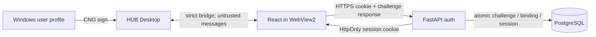

# Threat model: HUB Desktop device-bound reauthentication

Статус: design gate для `0.3.0`, 2026-08-11. Область ограничена входом Desktop после первой обычной HUB-аутентификации. Kerberos SSO не входит в текущую реализацию.

## 1. Executive summary

HUB-сервер не входит в `zsgp.corp`, поэтому локальное имя Windows и domain join нельзя использовать как удостоверение личности. Предлагаемый поток привязывает уже подтверждённый HUB `user_id` к отдельному публичному ключу конкретного Windows-профиля. Последующие входы требуют подписи одноразового серверного challenge; обычные session TTL, отзыв, active-user check и 2FA policy остаются обязательными.

Наиболее опасны: доверие к переданному клиентом имени, повтор подписи, ошибка привязки ключа к другому пользователю, извлечение software-backed ключа и обход отзыва. Реализацию нельзя выпускать, пока challenge не извлекается атомарно, ключ не привязан к точным user/device/purpose, а удаление/блокировка пользователя не прекращает повторный вход.

## 2. Scope and assumptions

В области:

- WPF/.NET 8 HUB Desktop, WebView2 и версионированный Desktop bridge;
- первый обычный login/2FA в React/FastAPI;
- локальная проверка `zsgp.corp`, Windows username и SID;
- создание и использование CNG private key;
- регистрация public key, challenge-response, выпуск обычной HUB-сессии и отзыв привязки;
- PostgreSQL runtime для auth state, audit и replay protection.

Вне области:

- Kerberos/Negotiate, AD FS, Entra ID и доменный identity gateway;
- безопасность контроллера домена и физическая защита ПК;
- защита от полностью скомпрометированного Windows kernel/local administrator во время активного входа;
- изменение действующей парольной, 2FA, WebAuthn/passkey и сетевой политики HUB.

Предположения:

- production origin — только `https://hubit.zsgp.ru/` с валидным TLS;
- часть устройств domain-joined к `zsgp.corp`, часть — нет;
- Windows login обычно совпадает с существующим HUB `username`, но это совпадение только разрешает регистрацию;
- private key по возможности TPM-backed и неэкспортируемый; software KSP — явно видимый fallback;
- backend и PostgreSQL являются доверенной зоной, Desktop/React/сеть — недоверенные входы;
- любой локальный процесс того же пользователя потенциально может управлять WebView/UI; владение ключом снижает, но не устраняет endpoint compromise.

## 3. System model

### Primary components

- `desktop/Hub.Desktop/Interop/DesktopBridgeHost.cs` — принимает сообщения только от разрешённого origin и выдаёт ограниченные native capabilities.
- `desktop/Hub.Desktop/Interop/DesktopBridgeProtocol.cs` — строгие bridge-схемы; текущее `windowsUsername` является подсказкой, а не auth proof.
- будущий `WindowsDomainIdentityService` — читает domain join, Windows account/SID локально.
- будущий `DesktopDeviceKeyService` — создаёт/открывает CNG key и подписывает только canonical challenge payload.
- `WEB-itinvent/frontend/src/contexts/AuthContext.jsx` и login UI — используют существующую cookie-сессию, инициируют регистрацию/повторный вход.
- `WEB-itinvent/backend/api/v1/auth.py` — существующие login, 2FA, trusted-device, refresh/logout и будущие desktop-device endpoints.
- `WEB-itinvent/backend/services/auth_security_service.py` — выпускает access/refresh pair и создаёт session record.
- `WEB-itinvent/backend/services/session_service.py` — проверяет active/absolute/idle expiry, переиспользует client device session и применяет лимиты.
- `WEB-itinvent/backend/api/deps.py` — на каждом API/WS пути проверяет token revocation, active session и active user.
- PostgreSQL auth runtime — хранит public keys, bindings, one-time challenges, revocation и audit metadata.

### Data flows and trust boundaries

Границы доверия:

1. Windows profile/CNG ↔ Desktop process: локальные процессы и local admin рассматриваются как атакующие.
2. Native host ↔ WebView JavaScript: допустимы только точный origin, версия, тип сообщения и строгая схема.
3. Client ↔ HTTPS origin: все client-provided identity/domain/device поля недоверенные до server-side проверки подписи и binding.
4. FastAPI ↔ PostgreSQL: challenge consume, credential counter/state и отзыв должны быть одной атомарной серверной операцией.

## 4. Assets and security objectives

| Asset | Objective |
|---|---|
| HUB-профиль и его permissions | Ни имя Windows, ни device id не должны дать доступ без доказательства владения зарегистрированным ключом. |
| CNG private key | Не покидает Windows KSP, не экспортируется в JS, логи, support bundle или backup. |
| Public-key binding | Однозначно связан с одним active `user_id`, устройством, Windows SID hash, protocol version и состоянием revocation. |
| One-time challenge | Непредсказуемый, короткоживущий, purpose/audience-bound и атомарно однократный. |
| HUB session/cookies | Выпускаются только существующим auth pipeline; сохраняют TTL, idle, limits, logout и server-side revocation. |
| 2FA/network policy | Не ослабляется фактом domain join или запуска Desktop. |
| Audit trail | Фиксирует регистрацию, успешный вход, отказ и отзыв без private material, полного SID и токенов. |

## 5. Attacker model

Возможности:

- отправлять произвольные HTTP и bridge payloads, device ids, usernames, domain names и подписи;
- перехватывать собственные client payloads и пытаться повторить ранее успешный ответ;
- запускать недоменный ПК с похожими именами пользователя/домена;
- скопировать WebView2 profile или файлы приложения;
- получить доступ к обычной Windows-сессии пользователя либо malware того же integrity level;
- эксплуатировать XSS/скомпрометированный frontend dependency на разрешённом origin;
- использовать потерянный ПК до server-side отзыва;
- вызывать гонки параллельными register/auth/refresh/logout запросами.

Ограничения базовой модели:

- атакующий не контролирует FastAPI/PostgreSQL и не имеет release signing key;
- TLS private key и production origin не скомпрометированы;
- TPM/CNG и Windows kernel работают согласно платформенному контракту;
- отдельный local administrator/kernel attacker может действовать от имени текущего пользователя; полная защита от него не обещается.

## 6. Entry points and attack surfaces

| Surface | Risk | Existing/proposed control | Evidence |
|---|---|---|---|
| Desktop bridge handshake/messages | XSS просит native host подписать произвольные данные | Pinned origin, allowlisted type/schema, host constructs canonical payload | `desktop/Hub.Desktop/Interop/DesktopBridgeHost.cs`, `DesktopBridgeProtocol.cs` |
| `windowsUsername` hint | Подмена имени превращается в вход другого пользователя | Никогда не использовать как proof; binding создаётся из current authenticated `user_id` | `DesktopBridgeProtocol.CreateHostReadyMessage`, ADR-0004/0005 |
| Password/2FA login | Credential stuffing или обход 2FA до enrollment | Существующие rate limit, login challenge, network-zone policy | `backend/api/v1/auth.py::login`, `auth_security_service.py::create_login_challenge` |
| Device registration endpoints | Привязка ключа атакующего к чужому профилю | Active HUB session, exact origin/CSRF posture, username eligibility, reauthentication for sensitive enrollment | proposed `/auth/desktop-device/register/*` |
| Device auth options/verify | Enumeration, replay, cross-device/purpose response | Opaque id, uniform errors, 60 s challenge, atomic pop, exact purpose/device/origin/version | proposed `/auth/desktop-device/auth/*` |
| CNG key storage | Extraction or signing by malware | TPM-backed non-exportable key preferred; current-user scope; software fallback disclosed | `WINDOWS_SSO_FUTURE.md` |
| Session issuance/refresh | Bypass expiry or active session limit | Reuse existing token/session pipeline and server-side active checks | `auth_security_service.py::issue_tokens`, `session_service.py::create_session`, `api/deps.py` |
| Device list/revoke | IDOR revokes/reads another user's devices | Current user scope; admin permission for cross-user operations; opaque IDs | existing trusted-device endpoint pattern in `auth.py` |
| Logs/support bundle | SID, username, challenge or key disclosure | Redaction; no token/signature/private key/full SID; diagnostic status only | Desktop diagnostics/redaction tests; proposed auth audit |

## 7. Top abuse paths

1. **Spoofed Windows identity:** attacker sends `windowsUsername=admin` → backend trusts it → admin session. Mitigation: backend never accepts that field as identity; registration derives `user_id` from current HUB session and future auth derives it only from public-key binding.
2. **Replay of signed response:** attacker records `{challenge, signature}` → submits it again → receives repeated sessions. Mitigation: random 256-bit challenge, `jti`, expiry ≤60 s, atomic consume before session issuance, transaction rollback that cannot restore a consumed challenge into validity.
3. **Cross-purpose signature:** malicious origin asks Desktop to sign attacker-controlled bytes → uses signature for login or registration. Mitigation: native host builds versioned canonical payload containing purpose, origin, device id, challenge and expiry; it never signs raw JavaScript strings.
4. **Key substitution during enrollment:** XSS starts registration using attacker public key while victim is logged in. Mitigation: native registration command returns attested/generated public key directly for the same server challenge; sensitive enrollment requires recent primary/2FA authentication and clear user confirmation.
5. **Copied WebView2 profile:** attacker copies cookies/profile to another PC → continues session. Existing server device/session checks limit use; device reauth additionally fails because CNG private key is absent. Cookies still require normal TTL and explicit revocation.
6. **Software key theft:** malware in the same Windows profile invokes or extracts a software-backed key → authenticates remotely. Mitigation: prefer TPM KSP, non-exportable flag, endpoint protection, audit/provider status, remote revoke; treat software fallback as lower assurance.
7. **Stale access after account disable:** admin deactivates user, but registered device silently obtains a new session. Mitigation: verify active user and binding state after signature and immediately before session creation; `api/deps.py` continues active-user checks on later requests.
8. **Domain-lookalike machine:** workgroup/domain named `zsgp.corp` and matching local username attempts enrollment. Local join is not proof; without a valid authenticated HUB session and newly generated registered key no access is granted. Domain eligibility is convenience policy only.
9. **Session-policy downgrade:** device flow marks all requests internal/trusted and bypasses 2FA/admin IP restrictions. Mitigation: network zone remains derived by backend from trusted proxy/network context; auth method metadata does not override zone or authorization.
10. **Concurrent revoke/auth race:** one request revokes device while another verifies challenge. Mitigation: lock/check binding and consume challenge in one transaction; re-check active binding/user immediately before issuing tokens.

## 8. Threat model table

| ID | Threat | Preconditions | Impact | Priority | Required mitigation | Verification |
|---|---|---|---|---|---|---|
| TM-001 | Backend trusts username/domain/SID supplied by Desktop | Client can craft request/bridge message | Account takeover | Critical | Identity only from authenticated session during bind and stored public-key binding during reauth | Negative API tests with forged identity fields; schema forbids extra fields |
| TM-002 | Replay of challenge response | Capture one successful response | Unauthorized fresh sessions | Critical | 256-bit nonce, ≤60 s TTL, one-time atomic consume, exact purpose/device/origin/version | Same response concurrently submitted N times; exactly one success |
| TM-003 | Public key bound to wrong HUB user | XSS, CSRF or confused session during enrollment | Persistent account takeover | Critical | Recent authenticated action, current `user_id` only, explicit confirmation, exact bridge origin | Enrollment from unauthenticated/expired/other-user session fails |
| TM-004 | Native host signs arbitrary attacker payload | XSS on allowed origin or protocol confusion | Signature becomes general oracle | High | Host constructs canonical payload; allowlisted commands and bounded fields; no raw-sign API | Bridge fuzz tests and cross-purpose/cross-version signatures fail |
| TM-005 | Revoked/disabled identity can reauthenticate | Stale binding or auth/revoke race | Continued unauthorized access | High | Transactional active user/device check immediately before issue; security reset bulk revoke policy | Concurrent revoke/verify integration test; inactive-user test |
| TM-006 | Software-backed key stolen/used by malware | Compromised current Windows user | Account access until revoke | High | TPM preference, non-exportable key, provider telemetry, remote revoke, bounded inactivity/absolute policy | TPM/software matrix; export attempt; revoke from second device |
| TM-007 | Domain status treated as authorization | Lookalike workgroup/domain or local tampering | Policy/identity bypass | High | Domain state is eligibility only; never sets user/role/network zone | Non-domain/lookalike tests still require normal authenticated bind |
| TM-008 | Device endpoint permits enumeration | Guess username/device id | Privacy leak and targeted attacks | Medium | Opaque random IDs, uniform options/errors, per-IP/device rate limit | Response/timing comparison and rate-limit tests |
| TM-009 | Session created outside current policy | Device signature succeeds | Bypass active-session limit, idle/absolute expiry or admin IP policy | High | Call existing `auth_security_service`/`session_service`; no alternate cookie format | Regression tests for session limit, refresh, WS and admin allowlist |
| TM-010 | Secrets/identifiers leak to logs or support bundle | Error/diagnostic collection | Enables replay, targeting or privacy leak | Medium | Never log cookies, tokens, challenge response, private key, full SID; hash opaque identifiers | Redaction unit tests with seeded canaries |
| TM-011 | Lost machine continues silent login | Device not revoked | Unauthorized access | High | Self/admin remote revoke, last-used/provider display, security reset policy, audit alert | Revoke then auth challenge/verify both fail |
| TM-012 | Algorithm/key downgrade | Crafted registration metadata | Weak or unverifiable authentication | High | Fixed protocol v1 and ECDSA P-256/SHA-256 (or explicitly approved fixed suite); reject client-selected algorithm | Unsupported algorithm, curve and malformed key tests |

## 9. Criticality calibration

- **Critical:** удалённый или локальный недоверенный клиент может получить сессию другого пользователя без его действующего proof/consent. TM-001..003 блокируют выпуск.
- **High:** требует endpoint compromise, race либо украденное устройство, но приводит к длительному доступу или обходу auth policy. TM-004..007, TM-009, TM-011..012 должны быть закрыты до pilot.
- **Medium:** преимущественно раскрывает metadata, облегчает атаки или ухудшает аудит. Закрывается до stable rollout и не должен silently fail open.
- **Low:** косметические/availability-only проблемы без раскрытия или повышения прав; в текущей модели отдельно не выделены.

Принятие software-KSP fallback является явным остаточным риском: оно допустимо только для ограниченного пилота, если UI/diagnostics отличают его от TPM-backed хранения и устройство можно немедленно отозвать.

## 10. Focus paths for security review

При реализации review в первую очередь охватывает:

1. `desktop/Hub.Desktop/Interop/DesktopBridgeHost.cs` и `DesktopBridgeProtocol.cs` — origin check, exact schema, отсутствие signing oracle.
2. будущие `WindowsDomainIdentityService` и `DesktopDeviceKeyService` — domain normalization, SID handling, CNG provider/key flags, canonical signature.
3. `WEB-itinvent/backend/api/v1/auth.py` — auth dependencies, rate limits, uniform errors, atomic challenge use.
4. будущий backend desktop-device service/model/migration — uniqueness, transaction/row locks, active/revoked state, audit retention.
5. `WEB-itinvent/backend/services/auth_security_service.py::_complete_login` и `issue_tokens` — единственный session issuance path.
6. `WEB-itinvent/backend/services/session_service.py::create_session` и `is_session_active` — limit, expiry, reuse and revoke races.
7. `WEB-itinvent/backend/api/deps.py` — active session/user enforcement for HTTP and WebSocket after device login.
8. frontend login flow — no private material/local SID in JS storage; safe fallback when native capability is absent.
9. diagnostics/support bundle — canary-based redaction tests for challenge, signature, SID, device id and cookies.

Security acceptance requires unit, concurrent integration and real Windows tests for every Critical/High row, plus manual loss/revoke/recovery scenarios on TPM and non-TPM devices.

