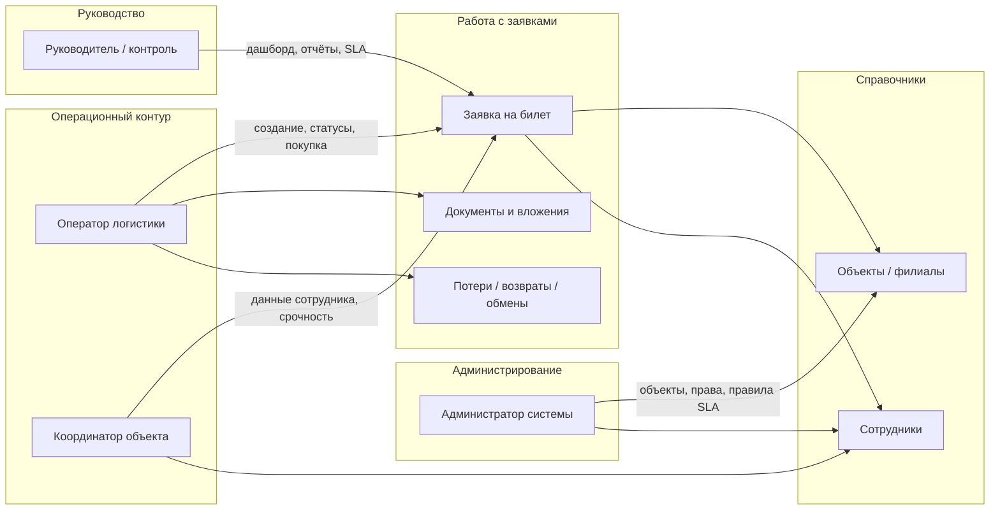
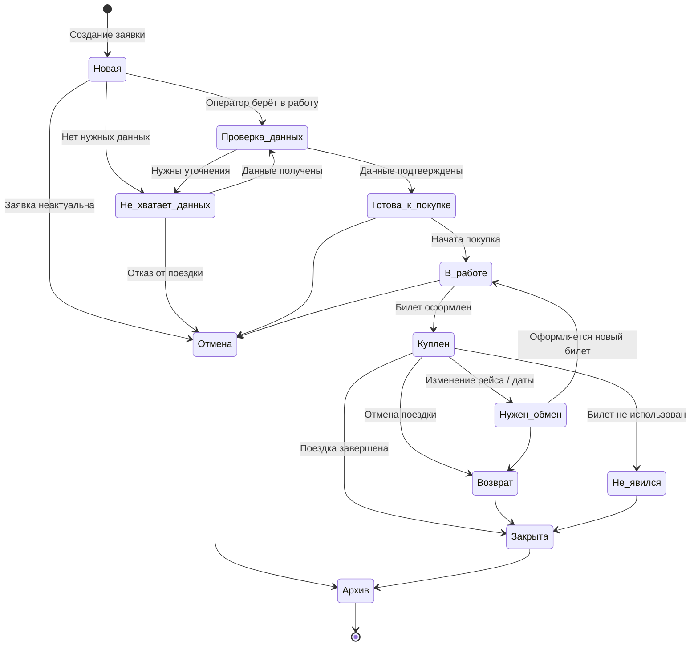
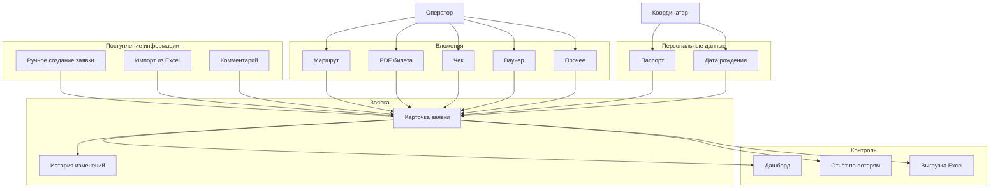
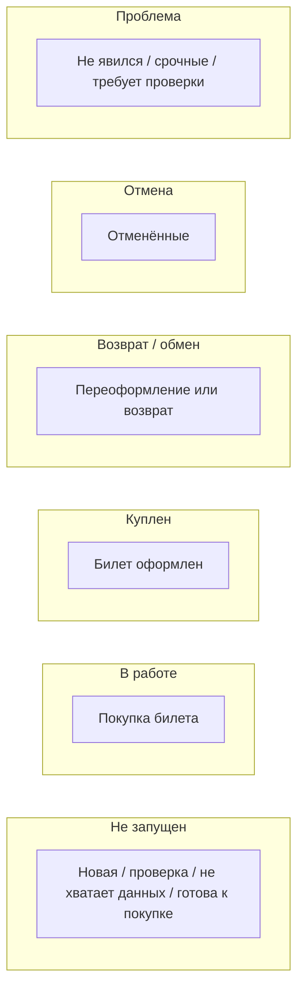
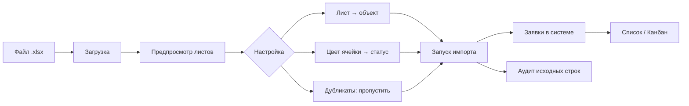
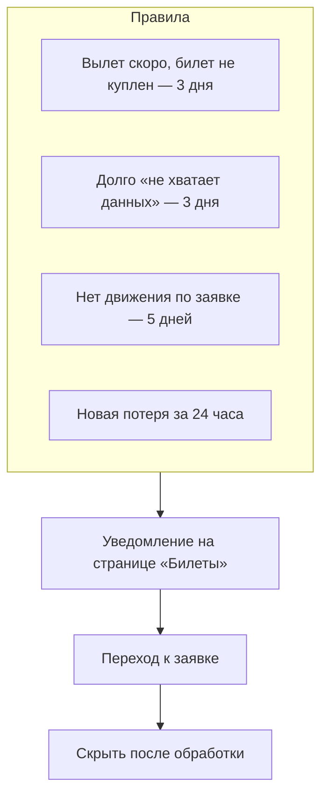

# Модуль «Билеты / Логистика» — руководство для руководства

**Аудитория:** руководители, координаторы, операторы логистики — без знания программирования.
**Система:** веб-платформа HUB-IT (раздел **«Билеты»**).
**Адрес в системе:** меню → **Билеты** (`/tickets`).

---

## 1. Зачем нужен этот модуль

Модуль **«Билеты / Логистика»** предназначен для централизованного учёта **заявок на проезд** сотрудников (авиа, ж/д, автобус) по **объектам** (филиалы, площадки, регионы).

Система позволяет:

- фиксировать, **кто**, **куда** и **когда** должен выехать;
- вести заявку от поступления до покупки билета и закрытия;
- хранить **документы** (маршрут, PDF билета, чеки);
- учитывать **потери, возвраты и обмены**;
- **импортировать** накопленные Excel-таблицы;
- **контролировать сроки** через дашборд, канбан и SLA-уведомления.

> **Важно:** это отдельный контур, **не связанный** с разделом «Задачи» (Hub Tasks) и **не связанный** с Telegram-ботом IT-invent. Билеты ведутся только в веб-интерфейсе HUB-IT.

---

## 2. Кто пользователи и за что отвечает каждый

| Роль | Что делает в системе | Типичные задачи |
|------|----------------------|-----------------|
| **Руководитель / контролёр** | Смотрит сводку, отчёты, просрочки | Дашборд, отчёт по потерям, SLA-уведомления |
| **Оператор логистики** | Ведёт заявки от проверки до покупки | Смена статусов, вложения, комментарии, финансовые операции |
| **Координатор объекта** | Передаёт данные по сотрудникам и поездкам | Создание заявок, срочные пометки, уточнение маршрута |
| **Администратор системы** | Настраивает справочники и правила | Объекты, права доступа, правила SLA |

### Схема ролей

Исходники диаграмм: [assets/tickets/diagram-01-roles.mmd](assets/tickets/diagram-01-roles.mmd)

---

## 3. Права доступа (кто что видит)

Права выдаёт администратор в настройках учётной записи:

| Право | Что даёт |
|-------|----------|
| **Билеты: просмотр** | Доступ к разделу, списку, дашборду, отчётам |
| **Билеты: создание и изменения** | Создание заявок, смена статусов, вложения, импорт, финансовые операции |
| **Билеты: персональные данные** | Просмотр паспортных данных и даты рождения сотрудника (без этого права данные скрыты) |

Без права **просмотр** раздел «Билеты» в меню не отображается.

---

## 4. Основные понятия (словарь)

| Термин | Простыми словами |
|--------|------------------|
| **Объект** | Филиал / площадка / регион, к которому относится заявка |
| **Сотрудник** | Человек, для которого покупается билет (отдельный справочник в модуле билетов) |
| **Заявка** | Главный «документ» — одна поездка или один запрос на билет |
| **Статус** | Этап обработки заявки (новая → проверка → покупка → закрыта) |
| **Исполнитель** | Пользователь системы, который ведёт заявку |
| **Вложение** | Прикреплённый файл: маршрут, PDF билета, чек, ваучер |
| **Финансовая операция** | Потеря, возврат или обмен денег по билету |
| **SLA-уведомление** | Автоматическое предупреждение о просрочке или риске |

---

## 5. Бизнес-процесс: путь заявки

Ниже — типовой сценарий от появления заявки до архива.

### Таблица статусов

| Статус в системе | Название на экране | Смысл для бизнеса |
|----------------|-------------------|-------------------|
| `new` | Новая | Заявка поступила, ещё не обработана |
| `data_check` | Проверка данных | Оператор сверяет ФИО, даты, маршрут, документы |
| `missing_data` | Не хватает данных | Ждём информацию от координатора / сотрудника |
| `ready_to_buy` | Готова к покупке | Все данные есть, можно покупать билет |
| `in_progress` | В работе | Идёт покупка у перевозчика / агентства |
| `purchased` | Куплен | Билет оформлен, можно прикрепить PDF |
| `exchange_needed` | Нужен обмен | Требуется переоформление |
| `refund` | Возврат | Оформляется возврат средств |
| `cancelled` | Отмена | Поездка отменена до покупки или без возврата |
| `no_show` | Не явился | Сотрудник не воспользовался билетом |
| `closed` | Закрыта | Случай завершён |
| `archive` | Архив | Убрано из активной работы |

**Правило системы:** оператор может переводить заявку только по **разрешённым переходам**. Администратор может обходить ограничения при необходимости.

Исходник: [assets/tickets/diagram-02-request-lifecycle.mmd](assets/tickets/diagram-02-request-lifecycle.mmd)

---

## 6. Документы и данные: что куда попадает

### Типы вложений

| Тип | Когда прикрепляют |
|-----|-------------------|
| Маршрут | После согласования маршрута |
| PDF билета | После покупки |
| Чек / квитанция | После оплаты |
| Ваучер | При бронировании через агентство |
| Прочее | Любые дополнительные материалы |

**Ограничения:** до 10 файлов на заявку, размер одного файла — до 20 МБ. Форматы: PDF, JPG, PNG, DOC, DOCX, XLS, XLSX.

**Персональные данные** (паспорт, дата рождения) хранятся в зашифрованном виде. Просмотр и ввод — только у пользователей с правом **«Билеты: персональные данные»**; для сохранения также нужно право **«Билеты: запись»**.

Исходник: [assets/tickets/diagram-03-documents.mmd](assets/tickets/diagram-03-documents.mmd)

---

## 7. Как пользоваться: обзор экрана

После входа в раздел **«Билеты»** доступны **7 вкладок**:

| Вкладка | Для кого | Назначение |
|---------|----------|------------|
| **Список** | Все с правом просмотра | Таблица заявок + карточка выбранной заявки |
| **Канбан** | Операторы, руководство | Наглядная доска по этапам |
| **Дашборд** | Руководство | Сводные цифры и «горящие» показатели |
| **Отчёты** | Руководство, бухгалтерия | Потери, возвраты, обмены |
| **Импорт** | Операторы | Загрузка Excel-реестров |
| **Справочники** | Администратор, координаторы | Объекты и сотрудники |
| **Правила SLA** | Администратор | Настройка контрольных сроков |

В верхней части страницы отображаются **активные SLA-уведомления** (если есть).

---

## 8. Пошаговые сценарии

### 8.1. Координатор: создать новую заявку

1. Открыть **Билеты** → кнопка **«Создать заявку»**.
2. Выбрать **сотрудника** из справочника или ввести **ФИО нового** (система создаст запись).
3. Выбрать **объект** (филиал).
4. Указать **даты вылета и прибытия**, **маршрут**, **стоимость** (если известна).
5. При срочности — включить **«Срочная заявка»**.
6. Нажать **«Создать»**.

Заявка появится в статусе **«Новая»** в списке и на канбане.

### 8.2. Оператор: обработать заявку

1. Открыть вкладку **«Список»** или **«Канбан»**.
2. Выбрать заявку → откроется **карточка** внизу (список) или перейти в список по клику (канбан).
3. Проверить данные сотрудника и маршрут.
4. Нажать **«Сменить статус»** → выбрать следующий этап (например, «Проверка данных» → «Готова к покупке»).
5. При необходимости добавить **комментарий** (тип: обычный / проблема / уточнение).
6. После покупки — прикрепить **PDF билета** и **чек**.
7. Перевести в статус **«Куплен»**, затем **«Закрыта»** после поездки.

Все изменения фиксируются во вкладке **«История»** карточки заявки.

### 8.3. Оператор: если не хватает данных

1. Перевести заявку в **«Не хватает данных»**.
2. Оставить комментарий с перечнем того, что нужно (паспорт, дата, маршрут).
3. Координатор дополняет данные в справочнике сотрудников (см. п. 8.7) или в заявке.
4. После получения данных — вернуть в **«Проверка данных»**.

Если заявка долго остаётся в этом статусе, сработает **SLA-уведомление** (по умолчанию — 3 дня).

### 8.4. Оператор: возврат, обмен или потеря

**Через статус заявки:**
- **«Нужен обмен»** → снова **«В работе»** → **«Куплен»**
- **«Возврат»** → **«Закрыта»**

**Через финансовые операции** (вкладка **«Отчёты»**):
- Зафиксировать **потерю**, **возврат** или **обмен** с суммой, объектом и причиной.
- Новая **потеря** за сутки попадает в SLA-уведомления для руководства.

### 8.5. Руководитель: ежедневный контроль

1. Открыть **«Дашборд»**:
   - сколько активных заявок;
   - сколько вылетов сегодня / завтра / в ближайшие 3 дня;
   - проблемные объекты и загруженность исполнителей.
2. Просмотреть **SLA-уведомления** в шапке страницы.
3. При необходимости — **«Отчёты»** → отчёт по потерям за период → **выгрузка в Excel**.

### 8.6. Администратор: настроить объекты

1. Вкладка **«Справочники»** → блок **объектов**.
2. Создать объект: **код**, **название**, **регион**.
3. При необходимости — **отключить** неактуальный объект (старые заявки сохраняются).

> Создание объектов доступно **только администратору**.

### 8.7. Координатор / администратор: внести паспортные данные сотрудника

1. Открыть **Билеты** → вкладка **«Справочники»**.
2. В таблице сотрудников **кликнуть по строке** нужного человека (или создать нового через поля ФИО / телефон / email).
3. В карточке ниже заполнить блок **«Паспортные данные»**:
   - дата рождения;
   - серия и номер паспорта;
   - дата выдачи;
   - кем выдан;
   - адрес регистрации.
4. Нажать **«Сохранить»**.

Паспорт можно указать **сразу при создании** сотрудника (блок «Паспортные данные при создании» над таблицей) — это необязательно.

**Права:** без **«Билеты: персональные данные»** поля паспорта скрыты (в API отображаются как `** **** ******`). С правом просмотра, но без **«Билеты: запись»** — данные видны, но не редактируются.

---

## 9. Канбан: как читать доску

Канбан группирует заявки в **6 колонок** — это операционная «карта» загрузки:

На канбане можно фильтровать по **объекту** и **исполнителю**. Клик по карточке открывает заявку в списке.

Исходник: [assets/tickets/diagram-05-kanban.mmd](assets/tickets/diagram-05-kanban.mmd)

---

## 10. Импорт из Excel

Модуль поддерживает перенос накопленных таблиц — типичный сценарий при запуске или миграции с Excel-учёта.

**Шаги для оператора:**

1. Вкладка **«Импорт»** → **«Загрузить .xlsx»** (до 50 МБ).
2. Проверить **предпросмотр**: какие листы распознаны, сколько строк.
3. Для каждого листа указать **объект** (филиал).
4. При необходимости скорректировать **соответствие цветов** и статусов.
5. Выбрать стратегию **дубликатов** (обычно «пропустить»).
6. Нажать **«Запустить импорт»**.

**Типовые цвета ячеек при импорте:**

| Цвет в Excel | Статус в системе |
|--------------|------------------|
| Белый | Новая |
| Зелёный | Куплен |
| Жёлтый | В работе |
| Красный | Отмена |
| Оранжевый | Нужен обмен |
| Голубой | Проверка данных |
| Серый | Закрыта |

Исходник: [assets/tickets/diagram-04-import.mmd](assets/tickets/diagram-04-import.mmd)

---

## 11. SLA и автоматический контроль

Система сама подсвечивает риски — **без ручного мониторинга каждой строки Excel**.

| Правило | Что означает для руководства |
|---------|------------------------------|
| **Вылет скоро** | Риск сорванной поездки — билет ещё не куплен, вылет через N дней |
| **Не хватает данных** | Заявка «зависла» — никто не довёл данные до покупки |
| **Нет движения** | Заявка не меняла статус слишком долго |
| **Новая потеря** | Зафиксирован финансовый ущерб — нужна реакция |

Пороги (3 / 5 дней) настраиваются администратором на вкладке **«Правила SLA»**.

Исходник: [assets/tickets/diagram-06-sla.mmd](assets/tickets/diagram-06-sla.mmd)

---

## 12. Отчёты для руководства

### Дашборд

- общее число **активных** заявок;
- разбивка по статусам (новые, в работе, купленные, проблемные);
- **вылеты** сегодня / завтра / в ближайшие 3 дня;
- **топ объектов** с наибольшим числом проблем;
- **топ исполнителей** по нагрузке.

### Отчёт по потерям

- фильтр по **периоду**, **объекту**, **типу операции**;
- итоговые суммы;
- **выгрузка в Excel** для бухгалтерии или анализа.

### Экспорт заявок

- из **списка заявок** — выгрузка отфильтрованного реестра в Excel (нужно право на изменения).

---

## 13. Типовой рабочий день (сводка)

| Время | Координатор | Оператор | Руководитель |
|-------|-------------|----------|--------------|
| Утро | Создаёт новые заявки, помечает срочные | Проверяет SLA-уведомления, берёт «новые» в работу | Смотрит дашборд и вылеты на сегодня |
| День | Дополняет данные по запросу оператора | Покупает билеты, меняет статусы, прикрепляет PDF | Контролирует «проблемную» колонку канбана |
| Вечер | — | Закрывает завершённые поездки | При необходимости — отчёт по потерям за период |

---

## 14. Что модуль не делает

| Ожидание | Реальность |
|----------|------------|
| Покупка билета прямо в системе | **Нет** — покупка у перевозчика/агентства вне системы; здесь только учёт |
| Интеграция с Telegram-ботом | **Нет** — билеты только в веб-интерфейсе |
| Связь с разделом «Задачи» (Hub) | **Нет** — отдельный контур |
| Автоматическая рассылка email/SMS | **Нет** — уведомления показываются **внутри** раздела «Билеты» |

---

## 15. Где хранятся данные

- Заявки, справочники, история — в **корпоративной базе данных** платформы HUB-IT (PostgreSQL).
- Файлы-вложения — на **сервере** в каталоге загрузок (`uploads/tickets/`).
- Паспортные данные — **в зашифрованном виде**.

Это **не** та же база, что legacy ITINVENT (инвентаризация оборудования в SQL Server).

---

## 16. Краткая памятка

1. **Заявка** — центральный объект; всё крутится вокруг неё.
2. **Статус** — отражает этап; меняет в основном **оператор**.
3. **Документы** — прикрепляются к заявке после покупки.
4. **Канбан и дашборд** — для руководства и оперативного контроля.
5. **SLA** — страховка от «забытых» заявок.
6. **Импорт** — для перехода с Excel, не для ежедневной рутины (лучше создавать заявки вручную).

---

## Связанные материалы

- Версия для печати и рассылки: [tickets-logistics-guide.docx](tickets-logistics-guide.docx)
- Техническая схема таблиц: [POSTGRES_APP_SCHEMA.md](../technical/POSTGRES_APP_SCHEMA.md) (раздел Tickets)
- Исходные диаграммы: [assets/tickets/](assets/tickets/)
- Генерация DOCX: `python scripts/docs/render_tickets_assets.py` затем `python scripts/docs/build_tickets_logistics_guide_docx.py`

---

*Документ подготовлен по фактической реализации модуля в HUB-IT (веб-раздел «Билеты / Логистика»).*
